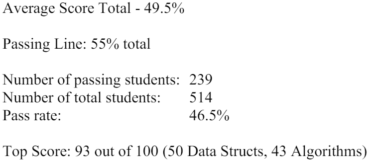
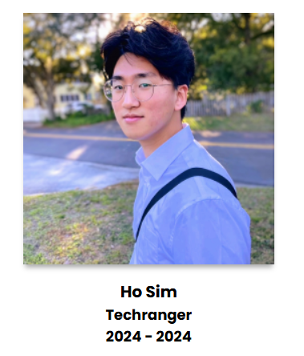
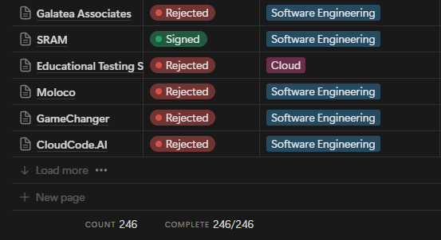
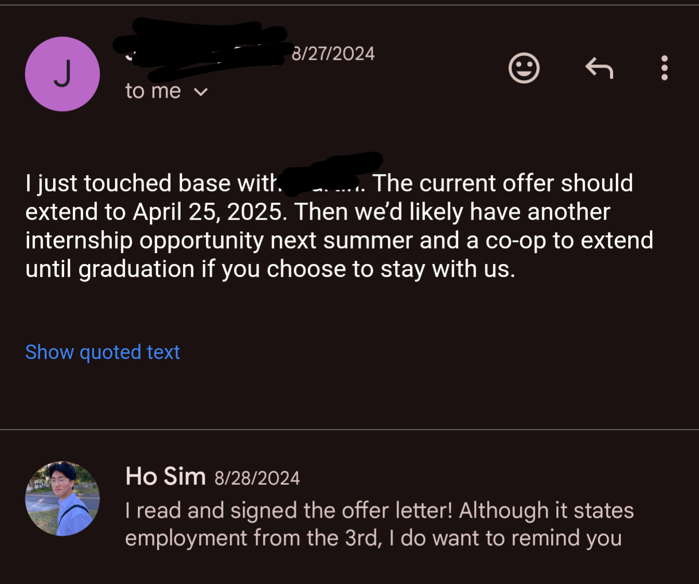
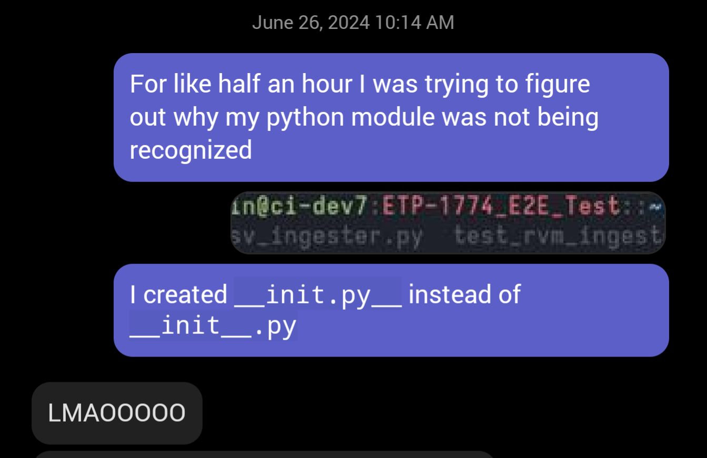
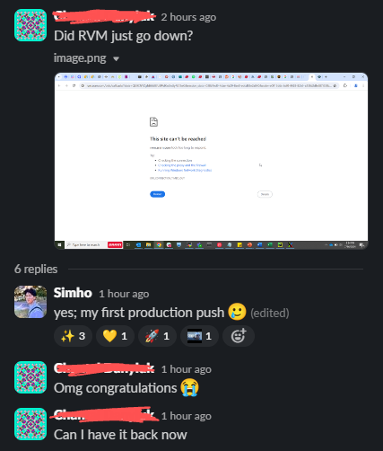
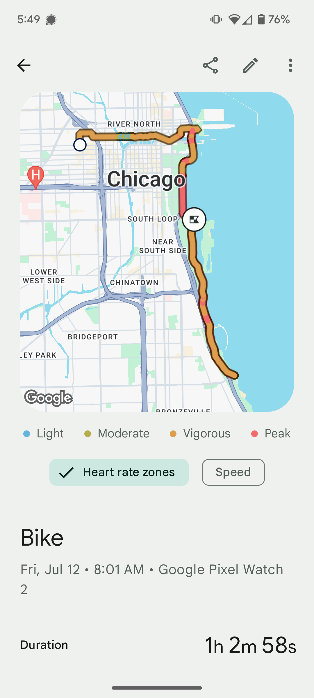
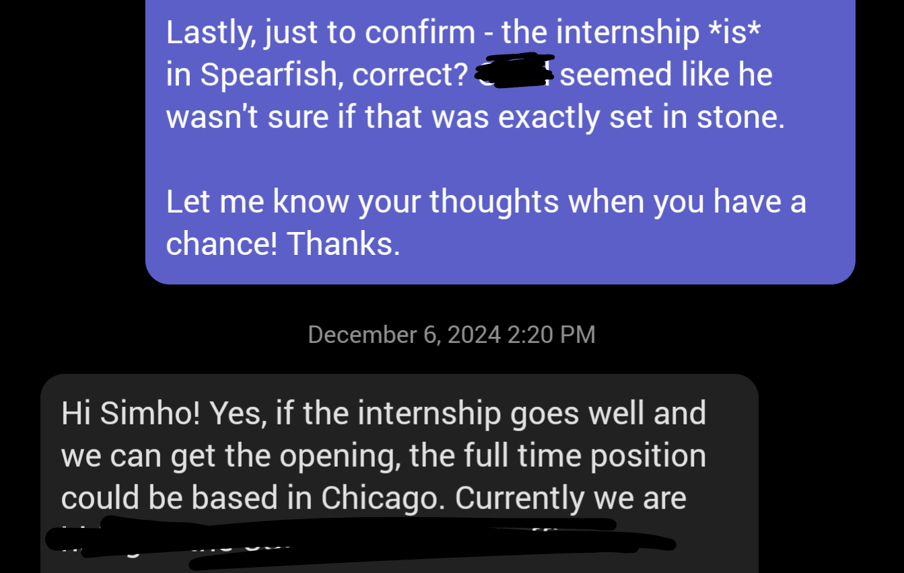
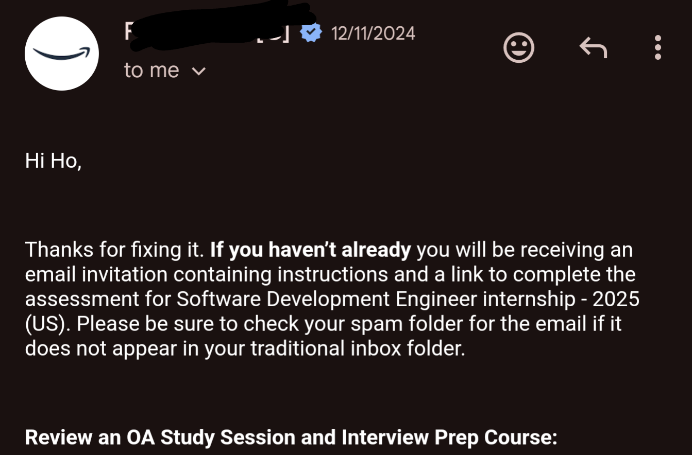

> [!Note]
> Even though I am publishing this 3 months into 2025, this post ONLY reflects my experiences and feelings up to the end of 2024. Things may have changed already.
> I am also going to avoid detailing activities to focus the post on my feelings and experiences. This means some claims will be missing justification.

First, I'd like to make it clear that I hate overly positive posts such as those on LinkedIn. They sound fake as hell - I bet at least half of them are. Everyone sounds like they are forcing a smile to look good to their future employer. It irks me so much that I feel the need to express it explicitly.

However, this year _has_ been one of the most successful years of my life. I thought 2023 was great, but 2024 beat it like it's nothing. Here are my brutally honest feelings and thoughts about the main events of the year.

Going in chronological order...

## Foundation Exam

In the University of Central Florida, Computer Science students must pass **the Foundation Exam** to progress through the degree. It's considered to be a challenging exam - around half the examinees fail the test on average. You get maximum of three tries, and after that, you're forced to drop the program. I've met a handful of students who switched to IT or Computer Engineering for that reason, so naturally, I got a little nervous about it.

Instead of waiting until the last day to study, I gave myself about 2 weeks to solve two older exam papers. Then I scored 92 out of 100.

The test statistics. 46.5% was an all-time low, meaning we either had the hardest exam, or we are the dumbest set of students to have taken the exam.

Our Associate Dean gave me a smile of approval when I brought this up in a meeting with him, so I think it's safe to be proud of myself. Not to brag, but I genuinely didn't think the exam was that hard. The DSA course I took before it was harder.

## Biggest Failure

Last year, [I shared that I joined a research lab to do volunteer software development](2023%20Reflection%20&%202024%20Goals.md#Team%20Software%20Development). It was quite a frustrating experience that ultimately led to failure due to terrible team dynamics. Having taken the leading role for the project's development, I learned that it's easy to provide support, but challenging to inspire motivation. No matter what I offered, it didn't matter if no one cared to take them. My efforts to ensure everyone learns something from this experience ultimately delayed progress significantly.

Near the end of the project, the professor overseeing the project recognized this issue and cut the team to just the previous lead and me. But by then, I was too busy with my new job to continue contributing.

Oh yeah, I got a new job.

## My Very First Software Development Job

Rewinding to 2023 briefly - before my first semester in UCF, I applied for a position called **Techranger**, a part-time software developer role for students at UCF's Center for Distributed Learning. Some of their work involves building apps and extensions for the school's learning management system, and maintaining several digital systems that support the school's diverse set of students and instructors. Frankly, I didn't understand what any of that meant back then and just applied so I can make some money with code, especially since [I had lost my only source of income at this time](2023%20Reflection%20&%202024%20Goals.md#Unexpected%20loss).

https://techrangers.cdl.ucf.edu/past-techrangers.html

I was rejected back then, but this year, I got it! This was my first experience working with people who are actually paid to do software development, not some unmotivated students looking to gain contribution points with minimal effort. The team was a gathering of talented people who truly cared about making education more accessible and seamless for all kinds of students.

I had a wonderful experience there, and even now, I wish I could've continued working with them. The people were super friendly and fun to talk to, all with diverse experiences to learn from. I know this sounds fake, but it's true. My only complaint is that both the students and full-time employees are not paid enough.

## My Very First Corporate Job

Strap in, this is going to be a long one.

Thanks to a friend I made through [previous Hackathons](2023%20Reflection%20&%202024%20Goals.md#Hackathons), I was referred to a software engineering internship at SRAM for the Summer. This was the level up I was looking for, even before securing my position as a Techranger. Unlike LS&T - which functions under a non-profit public school and doesn't directly generate revenue - SRAM is a financially driven organization of a much bigger size. I was very curious of the kind of work environment that entailed from such a difference.

Nearly 250 rejections/no response

I was already looking for an internship before this referral. I applied for pretty much any software engineering position that was open since 1. I need a god damn internship 2. I wasn't completely sure what position I'd enjoy professionally. But what I knew for certain was my competency in web application development. I'm pretty comfortable with every frontend and backend tools, understand the complexities behind most of them, and can casually mock a system design for any web project. I've mentored with confidence and really enjoy working with web technologies.

Interestingly, my position in SRAM was a DevOps-adjacent role, which was quite different from the skills I boasted throughout my interviews. There was _a lot_ to learn and I felt like I was back to square-one in terms of technical competency. CI/CD pipelines? That's something Vercel/Netlify does to deploy my website, right? Docker? I saw a Fireship video about it, kind of. NGINX? Unit testing? Database system management? Cloud configurations? Ah, I didn't know _SHIT_ for this job. I was no longer the cracked guy I was in my school.

I suffered Impostor Syndrome throughout the summer. I knew that I would. The best medicine was to actively ask for feedback and get the most accurate representation of my performance. When my mentor helped me debug a problem, I'd ask more questions to make sure I absorb his debugging _process_ rather than the answer he got at the end. Sometimes it was the lack of knowledge that stopped me, and sometimes it was my lack of experience as a software engineer. Critical thinking is hard, it turns out, but fortunately, it can be learned.

Despite my worries, I was evaluated very positively throughout the summer. I was told that it was impressive of me to jump into a large codebase and learn to work with it faster than expected. I was even told that less than 10% of Comp Sci students would be capable of what I achieved within my time. I remember these compliments to this day, because I always prided myself in learning technical concepts fast and being comfortable with any software development environment, and whether these are objectively true or not, it reinforced my confidence.

On top of all that, they extended the offer till next year!

At the same time, compliments didn't help me figure out how to be a better software dev and didn't address some issues. I still don't know the best timing to ask for help. Sometimes find myself zoning out and applying quick, meaningless attempts at debugging rather than taking a step back and approaching the problem surgically. I still struggle to understand some explanations without granular, dumbed down examples paired with them. I'm still hesitant to bother others while knowing I shouldn't be struggling on my own too much. I'm told active communication and extensive experience is the only solution, and that's true. It's unfortunate I can't rush them.

The language I mainly used in SRAM is Python, and I really want to talk about it because my _god_, I hate this language. I mean, okay, there are things to like about it, to be clear. I appreciate the simplicity and genuinely think every language could benefit from list comprehension. Django is also one of the most feature-rich, robust backend frameworks I've worked with. But weak, dynamically typed languages should be deleted from the universe. The type hint system is far behind TypeScript, and barely supported by popular libraries! Debugging is a nightmare with this language. The development environment is a joke as well: you need venv to isolate python environments, then you need pipx for some random packages, but you should really use Pipenv for all of this, or Poetry for PEP compliance, or uv if you feel like all this isn't utter chaos already!

peak python dev

And as for the work experience - I didn't find DevOps to be the most exciting thing. The way I like to describe the job to non-technical people is by using a concert as an analogy: There are people who perform, and there are people who set up the stage for the performance. DevOps is like, making sure the stadium is rented out and delivering the necessary supplies on time.

That's not an accurate analogy, but it gets my main point delivered: I felt that my work was _foundational_, but not **critical**. I make other employees work better, but my work isn't what customers spend money on. I find it more interesting to think about problems and make decisions on things that directly affect customers (_do you see me, Amazon? I'm customer-obsessed!_), and in a company like SRAM, such challenges were for the firmware engineers, mobile devs, and mechanical engineers. After all, what we sell is a physical piece of bike component, not lines of code.

This made me realize that I actually prefer to do frontend development or at the very least, work close to the software solutions used by the public. Funny thing is, this made it a little challenging when SRAM offered me to continue working for them part-time remotely. I asked myself, should I continue working with Techrangers, where I can continue to grow my web development skills and work on interesting, impactful projects? Or should I continue with SRAM, who would not only improve my career opportunities in the long term, but was also offering near **double** the pay? Remember, this was the only source on income for me at the time. I chose the latter, because despite my feelings about DevOps, I believed I hadn't spent enough time to write it off already.

To be clear - we quickly found out this was NOT my fault :)

None of this is to say my experience at SRAM was bad. _Oh no_, not at all. This internship - now a co-op - has made me more of a full stack developer than I ever was (if that title is still relevant). Despite my complaints, I still enjoy the fundamental responsibilities of a software engineer. I love gathering to discuss technical challenges and giving input that actually mattered. I respect the high standards of code quality and appreciate learning to do things better. I enjoy watching software evolve as I put hours of work into it and making a meaningful impact to our team. I still think back to how much fun it was hanging out with other interns and biking around the lake.

## Health

Then we also had to go back

I've been skinny my entire life, but there have been two instances where I put on a healthy amount of weight along with some muscle. The first was in the army - this is the second year. Pairing high calorie, protein rich food with daily weight lifting session throughout the summer was the key. I'm happy about the result, but I still have ways to go and need to be consistent.

I also started caring about nutrients a bit more. I never had a sweet tooth, but I took extra steps to avoid sugar, like sticking to diet/zero variants of soda. I started taking Omega-3, magnesium, and multi vitamins supplements. Healthy balanced meals are still challenging to me, but I started following YouTube content relevant to healthy living so I can remind myselfof the quality I should be treating my body. It's important to know healthy habits shouldn't start when you're sick, but when you're healthy.

## Family

I've only discussed personal and career growth throughout my reflection posts. Perhaps this is a sign that I'm getting old?

My siblings visited me in the U.S. and had an awesome time together. This was my sister, Subin's first visit to America (second for my brother, John), and sharing this experience with them brought us closer as a family. Having lived apart for so long, this trip was a reminder of the importance of nurturing family bonds, especially considering the frequency we see each other. The Twenty One Pilots concert was unforgettable. It was great to see my family so excited and happy.

## Nedon

My goal was to complete Nedon by the end of the year, but I still haven’t finished it. Balancing time between this project and other priorities, like grinding Leetcode, school assignments, and part-time internship, has been difficult. Sometimes, I wonder if I’m just slow at building features, fixing bugs, or if the project is genuinely complex.

The biggest takeaway here is recognizing my struggle to distribute effort across everything I want and need to do. I learned that I need to build a habit of scheduling my tasks, sticking to that schedule, and regularly reflecting on my progress. This is something I still need to work on.

## 2025 Plans & Goals

Unlike before, I not only have goals, but relevant plans for the coming year.

First, I'm going to stay consistent in improving my health. I need to start quantifying my health with measurements and set some targets, but currently, I want to focus on improving my cardiovascular health. I want to lower my resting heart rate and be able to maintain peak heart rate for longer.

Second, progressing my professional career. I have an internship lined up with SRAM for the Summer again, but this time, it'll be as a mobile application developer. This is in a completely separate team, and - at least for the internship - a different office in a different state! As I said, I prefer to work closer to the product, and this role reflects that desire closer than my current role. Plus, the manager sounded relatively positive about reserving a full-time position if I perform well. I'll be honest - that's what I need more than anything.

With my graduation planned for August, I'll have to start searching for other new grad positions pretty soon. The SRAM offer is great, but I should secure multiple offers for negotiating power and increase the likelihood of doing what I really like to do. I want to do frontend development, but I can't be picky until I have some guarantee.

Since I have no concrete idea of where I'll be, I don't really have a plan for the last quarter of the year. I may be job searching or have settled down somewhere and adapting to my new life. We'll see.

---

Little side note - Amazon invited me to take their Online Assessment. It feels like an achievement because this is the first time I’m hearing back after all the applications I’ve been submitting to them in the past 2 years. It feels like I'm finally recognized for my experiences. But at the same time, I’ve solved several OAs from many companies with perfect/near-perfect score, only to be told that I’m somehow a great candidate yet not the best fit at this very moment.

Even if I do get through it and get an interview, it'll most likely end up being a really good learning experience, knowing my Leetcode skills and limited interview experience. I don't mean to be pessimistic - I just know where I stand. I'll still keep climbing.
