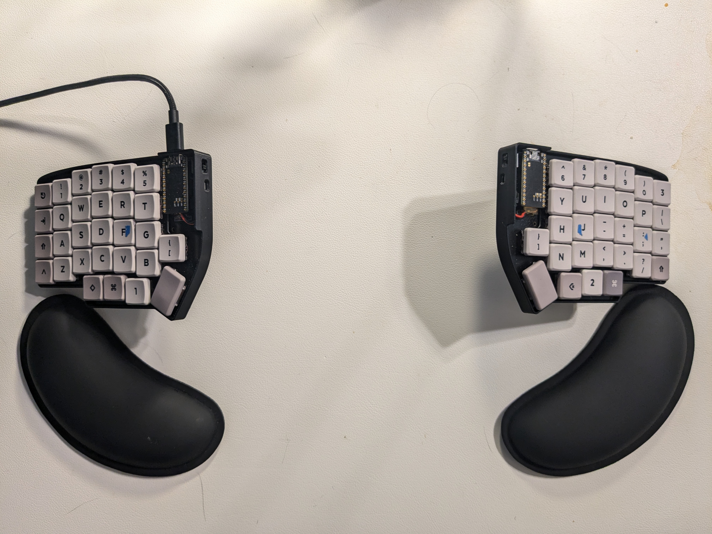
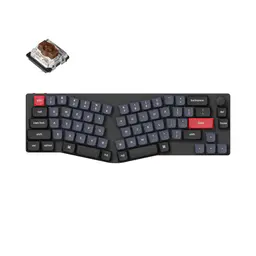
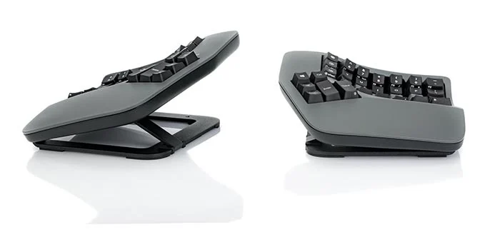

My journey with the Lily58 has been a wild one.

## First - why?

I care about desk ergonomics. My monitor is distanced and vertically positioned perfectly to my eye level. My chair is one of the best budget ergonomic office chair (though there are a TON of better, more expensive chairs). I frequently get out of it and stand, thanks to my motorized desk. I use Logitech's ergonomic mouse to protect my wrist, and oh, I use neovim btw.

The only thing missing here was an ergonomic keyboard, and I've been tempted to get one for a long time. It just seemed to make so much sense in the long term. But the thing is, I didn't _need_ it. My monitor arm improved neck pain; my motorized desk helps with back and glute pain, and my vertical mouse fixed the wrist pain caused by DSO 2, but I had no discomfort caused by my keyboard yet.

Then I saw two people using ergonomic keyboards at my internship and that was enough to tip me over.

## Features I considered

So what exactly was I looking for in an ergonomic keyboard?

**Mechanical key switches**: Obviously the superior choice. They're more repairable and feel more responsive than the alternatives.

Keychron K11 Pro

**Split/Alice layout**: This layout curves and spaces the board slightly to lessen shoulder curvature when typing. This reduces shoulder, back, and neck strain.

**True split**: If my keyboard is actually in two separate pieces, I could space them out far enough to avoid shoulder strain entirely!

Kinesis Advantage360 Split Keyboard [source](https://kinesis-ergo.com/split-keyboards/)

**Tenting**: Traditional keyboards strain wrists from pronation, contributing to the development of carpal tunnel for many office workers. Tenting, as seen above, prevents and alleviates such strain and damage. It is naturally the most ergonomic upgrade for a keyboard and, naturally, is a no-brainer requirement as someone who uses an ergonomic mouse.

**Ortholinear layout**: Most don't consider how traditional keyboards have a _staggered_ layout, meaning keys aren't straight/uniformly aligned across their rows and columns. It's strange if you think about it - why should my fingers move along a slight diagonal instead of a simple vertical motion?^[staggered] Ortholinear layout changes that, _theoretically_ reducing finger travel distance, improving typing accuracy and efficiency, and promoting a more natural, ergonomic typing posture. Does it matter in practice? Probably not.

**Wireless connectivity**: Whether its via a dongle or Bluetooth, I wanted some kind of wireless connectivity so I can carry it between home, school, and work easily without spending time connecting/disconnecting wires together.

**Multipoint connectivity**: With Bluetooth keyboards, it's important that I can switch between my home computer and my work laptop super easily without having to unpair and pair them on each device.

**Low profile**: As mentioned before, this keyboard has to be portable.

## Initial considerations

All costs shown are as of time of writing this post.

### All ZSA products

I almost bought the Moonlander. When compared to how much Lily58 cost me (I'll get into that later), it didn't seem like a bad deal. Its mechanical, true split, ortholinear... even has additional fluff, such as backlit, hot swappable key switches. It also comes with a nice carrying case and folderable wrist rests?! That's exactly what I want-

_Ah, it doesn't have wireless connectivity._

That alone isn't a massive dealbreaker on portability. But then I learned

### Keychron K11 Pro

hat's shorter than my shoulder length and saw how things could be more ergonomic if I got a split keyboard. where I questioned my financial decision in following the hype of ergonomic keyboards. In fact, I started feeling wrist pains I never had before switching to this keyboard. Above all, this journey has more so taught me that I did not follow touch typing perfectly until now - for example, I found out that I always used my right index to press 'B', as opposed to my left index. I never realized how many keys my right pinky is supposed to be responsible for.

### Glove80

No compromise, probably the choice. Still $400

### Dygma Defy

It's fucking $540

**Kinesis**: Not portable
