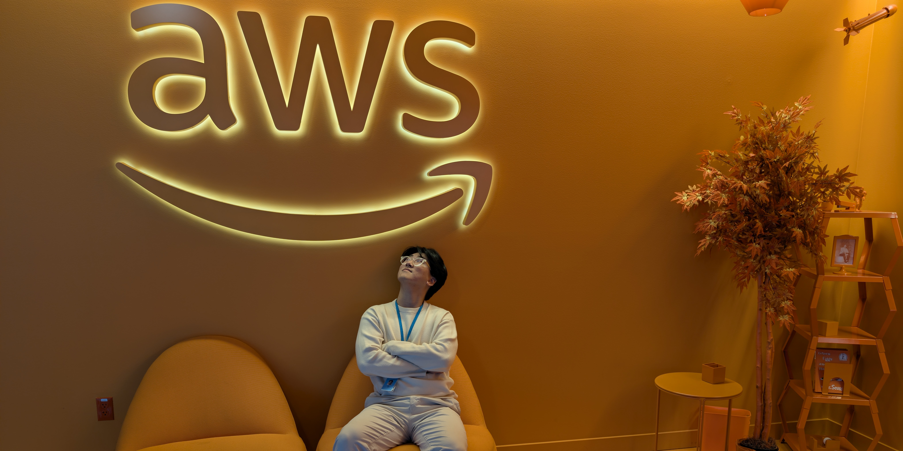
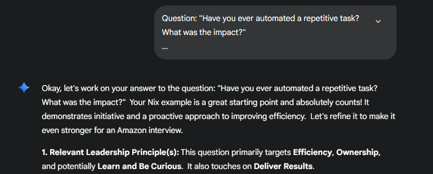
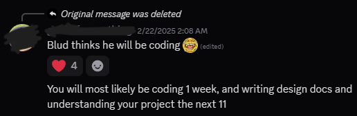
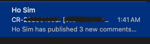
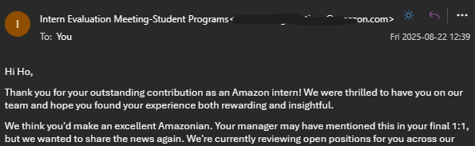
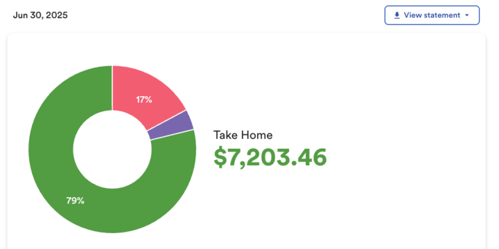
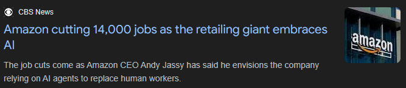

## The Hunt

I applied online on October 19th, took the OA on December 18th, interviewed on February 7th, and got the offer on the 13th.

This was the 4th application I submitted to Amazon throughout my college. In fact, I put another one in November, not expecting much to come out of it. It was just one of many applications I submitted over the Fall semester in hopes of landing something.

I didn't think much of it when I took the OA as well. I was pleasantly surprised to see a recruiter's name attached to the communication, but that didn't necessarily mean they weren't auto-generated read-only emails like the rest. Tons of companies have sent out an OA only to never contact me again.

It was only when I was offered to schedule an interview near the end of January that I freaked out. This was (and still is) the only interview I landed for a software engineering role that wasn't an in-campus position or via referral. I had solved fewer than 20 LeetCode questions in my entire life, let alone gone through a technical interview. I didn't know what the STAR method was and never looked into Amazon's Leadership Principles.

I spent the week or so before the interview with LeetCode, Gemini, and ChatGPT. I didn't have anyone to help me with mock interviews, but my family was there to hear my doom and gloom, whining about how I wasn’t going to make it and fail the biggest opportunity. I mean, how was I possibly going to pass the technical portion just having solved **35** LeetCode questions and near-zero experience with interviews? After a few meltdowns, I started thinking that, at the very least, I was going to gain valuable experience and understand how Big Tech conducts interviews.

When I finally had my interview, I was shocked at not how difficult it was, but how I absolutely nailed it. It couldn't have gone smoother! Sure, the experiences I shared weren't extraordinary, and I didn't notice a typo on a variable until the interviewer mentioned it, but there was nothing that obviously stood out as a reason for failure. Now I was worried that _if_ I didn't get the offer, I would have no idea why.

I waited about 5 days, then sent them a "I have a competing offer, send one now" email, and got one within a few hours.

## The Design Doc

Accurate depiction of the internship

The internship has a few phases that are _mostly_ the same across all software engineering teams in AWS. It starts with onboarding and a design document, where you spend weeks learning the foundations of working in AWS and the tools your team uses, while writing a document about how you are going to build your solution. The depth and difficulty of the document differ by team and project. Some teams expect multiple low-level designs (LLDs), detailing class diagrams and how they interact with the system. Some want a single high-level design (HLD), where you determine the overall architecture without describing exactly how they will be implemented. Regardless of the level, you are expected to justify every decision - address alternative approaches, outline limitations, approximate impact, and even plan how to identify failures while minimizing operational overhead.

How much of a kickstart you get for the project differs between teams as well. Many interns I knew had their design document written ahead of time and would either be expected to write LLDs or start writing code right away. As for me, I wasn't presented with any doc. I was simply told that the platform our team used to serve other internal teams was not scaling to our needs and that we wanted to move out of it. That was it. I didn't know what the problems actually were, what was relevant to me, what I could actually solve within my internship, not even a path to solve them. In fact, not even the SDEs in my team really understood this project - it was a thing my manager was ideating while talking with customer teams.

This was quite a positively unique experience. I felt fully responsible for how my project was going to look. I felt ownership as I shaped it into something tangible that my team could understand. It felt weird putting meeting schedules on other people's calendars and leading them as a mere intern, and that feeling honestly never went away. However, the support from my team always made it so worth it.

My team was incredibly helpful throughout the planning. They made sure to understand my pitch as well as I did, so they could provide meaningful insights and criticisms. And oh, did they have a lot of questions and feedback. I had new alternatives, and areas that were already addressed required elaboration. I also had to plan for things I never had to consider in any other projects, like handling permissions, metrics, alerts, etc. Personally, I would rather figure these things out as I'm working on the project, as they don't actually impact the development of the core piece. On the other hand, I understand it's an area the team wants to see as soon as possible to evaluate the operational overhead.

As I iterated my design document, I was told that I eventually had to put my foot down and go with a plan, even if there were hanging comments. This wasn't because I was slow, but because pursuing a perfect plan is a waste of time, compared to just implementing something decent and improving along the way. This is where I felt that the purpose of my plan wasn't necessarily to get approval, but as somewhat of a structured announcement as to what I'll be doing. Again, it was clear that I was responsible for when and how the project would be built.

## Actually Building

Even after weeks of writing my design doc, I was slow and careful about how I wrote my code. This was because my project involved building on an existing codebase with an established architectural pattern and layers of abstraction. I learned it in parts, guessing which were important for moving forward and which weren't immediately relevant. Like before, my team was very helpful here.

The biggest challenge was with handling unknowns that appeared throughout my project. There were features that were more complex to implement than expected. New hurdles appeared as I further understood the platform I was working to replace. Some features just couldn't be done with the limitations I was working with. I never really got stuck throughout development, but these challenges had me skip a few lunches and/or work overtime so I can deliver (see what I did there) as scheduled.

I rarely worked late, but when I did...

Code reviews were one of the most valuable means of learning throughout the internship. My team always left useful comments to help improve the scalability and observability of my code. When I rarely had better insight to argue otherwise, my team never treated me like I didn't know any better and genuinely considered them. These weeks of receiving such high-quality feedback loop seriously made me feel like I was leveling up as a software engineer.

It was interesting to learn how many things AWS built from the ground up for their specific use cases. I do not want to potentially get into trouble for sharing any of them myself, but [there's a blog post that shares two of its internal tools](https://www.dolthub.com/blog/2024-10-18-git-at-amazon/), if you're interested. Some have equivalent tools off the shelf, but have only existed after AWS built its own. Some were made because AWS would rather own the entire development process instead of working off a fork. And some of them - I don't really understand why they exist. In the end, these tools create/accommodate workflows very custom to AWS's development cycle. I found the vertical integration of tools very effective, but at the same time, left a small concern at the back of my head as to whether it prevents knowledge from being transferable. Learning these tools isn't helpful outside of the organization because nobody else uses them, let alone be able to. It made me wonder if AWS would benefit from using more universal tools.

Of course, there were many public technologies used that I just never bothered to work with before. Java was the biggest one. I never touched it since my Object Oriented Programming class in my sophomore year. Before that, [I learned C#](Software%20Dev%20Log%205.md) as I explored game development at one point, so OOP concepts weren't foreign to me. Or so I thought, until I learned new patterns like the strategy pattern and dependency injection. I later realized I frequently used these patterns in functional programming, just never understood how they would be implemented in object-oriented languages. It made me think about how being inexperienced in an area can make it difficult to identify the use of knowledge I already know.

## Side quest

I was surprised at my first meeting with my manager when I heard that AWS preferred building with DynamoDB over relational databases. The tech community I've been around always hailed PostgreSQL and clowned on how pointless NoSQL is. Schools don't teach them as much either. All these database startups like Turso, PlanetScale, Neon, and CockroachDB are all SQL. It must be because of their enterprise-level reliability, scalability, and popularity, no? No one is starting the next MongoDB!

And personally, I hate the lack of schema validation on non-relational databases. I'm forced to filter queried data on the application layer, which is inherently slower, and foreign key relations between tables _just make sense_.

So I took on a little side quest to understand why DynamoDB was better than PostgreSQL for AWS. It started with a handful of 1-on-1s with my mentor. I watched videos on database architectures based on recommendations and made some progress chatting with AI chatbots. It was when I spoke with engineers who worked in DynamoDB and Aurora (AWS' relational DB) that things finally clicked together. I'm not sharing this to tell you what I learned ( that would be its own blog post), but _how_ I was able to learn through proactively reaching out to the talented people within the organization. That's not something I've done before, but the environment I was in made it so much easier for me to do so. I really appreciated that.

## Evaluations

There are two formal feedback sessions: the midpoint and final. The timings are self-explanatory. For the midpoint, I heard many interns had an informal session like I did; no real structure, just letting me know where they would like to see improvements, which areas I've been doing great in. I wasn't really told an area for improvement, and instead got a big thumbs up. "It feels like you're already part of the team" was one of the best things to hear from my manager.

That wasn't the only place I sought feedback. Throughout the internship, I frequently checked in to understand what my expectations are and if I'm meeting them. My manager was transparent and helped me come up with a rough timeline for when things should be done by, with an asterisk, in case something doesn't go as planned. Same with my mentor. They didn't always agree with my manager and pushed me to move faster, but they were never unreasonable and simply wanted me to perform my best.

On the final evaluation, all managers formally let their intern know if they are "inclined" to hire them. This is pretty much how you know if you've been successful with the internship. It doesn't mean you're hired, just that they are willing to put the request in HR. I'm happy to share that I received the "inclined" vote at the end of the internship.

## The Benefits

can't complain about money

The most important benefit is the money, they say, and I agree. I tried to keep spending low to survive the remainder of this year, but I also bought the majority of meals out instead of cooking to save time for more meaningful activities. I was essentially buying time, and **for the first time, it was sustainable**. So many inconveniences could be bought away; which is something I already knew, but this time, I got a 12-week trial of such reality. Money may not buy happiness, but it absolutely buys more room for it.

I also enjoyed being able to get anywhere within the city for free. Our ORCA cards were paid for, and we could expense $230 a month to Lime subscriptions and Lyft rides. The scooters are pretty fun to ride around.

There weren't really any other benefits from that. Big Tech doesn't seem to give out free food anymore - they're in other Fortune 500 companies that are actually competing to get top talent. No snacks or budget for team meals. We did get one free coffee a day from the cafes in our building and free bananas from the banana stands spread across the city.

There was one intern event inviting everyone in Seattle, and I couldn't make it because there were only so many interns that they could fit into a building without violating the fire code. Then there was another intern event for my organization and I couldn't make that as well, because it happened *AFTER* my internship. I instead made a video to be displayed during the event, though I don't know if they actually played it or not. Overall, it was underwhelming compared to the events in [my previous internship](My%20Experience%20as%20a%20SWE%20Intern%20at%20SRAM.md).

## The People

You may have noticed how often I've praised my team members here. This isn't some circus I'm putting on to beg them to have me back. I genuinely think my team was amazing, and that's not something to take for granted. There are always assholes in workplaces, no matter how high the ceiling is to be in a position. I know an intern who struggled throughout their 12 weeks because their team couldn't be bothered to give them a project. I know a handful of interns who didn't get the "inclined" vote, which is strange to me because my team gave me all the opportunities to make me successful. I read about interns who had to deal with opaque communication with their manager, felt left out, discriminated against, or were just asked for more than they thought was reasonable. I can't verify any of these claims and am aware there are interns who are simply incapable of doing well enough here. But what's clear is that my experience was much better than theirs, and I really thank my team for that.

hiking with interns (Lake Serene)

Being in such a massive organization, it was impossible to find people who *didn't* share a similar interest. I was into Chess at the time, and of course, there is a group for that. There were Neovim users who maintained wikis and unofficial tools to improve the experience of using it within AWS. There was also the largest Korean community I've been a part of since moving to the US three years ago. I still find it challenging to actually form deep connections with people over the internet, but already being part of the community has lowered the barrier to communication. I can see myself being more active in these communities if I were to return.

## The Company

There are things I would criticize about the org, though. Look, I'm just a guy who sat in one corner in one of many Amazon offices around the US for 12 weeks. The internship was nowhere close to being long enough to learn everything my team and organization had to offer, but I could see how the work could become boring at some point. Teams are naturally soft-locked to a tech stack for the sake of maximizing compounding technical expertise while minimizing maintenance overhead. But that simply means the team's skill set has a soft limit as well. It's challenging to suggest building a service using Go instead of Java, or even Kotlin, or hell, Java 21 instead of 17, without sufficiently persuading people several levels above your pay grade. If I want to keep things exciting for myself, I shouldn't expect a single team to be my long-term answer.

And that leads to another issue I noticed - the company desires for engineers to keep up with the world, but at the same time gives too little time to experiment and fail. Increasing expectations to meet deadlines and improve metrics force engineers to lean on tried & tested tools instead of trying something new. I think Amazon knows this - but instead of fixing this potential "talent rot", they seem to prefer cutting low-performing engineers and replacing them with fresh blood. Somewhat unrelated - but I even saw multiple teams dissolve in an instant. I was not a fan of seeing how hard everyone was working while being well aware their job wasn't secure. I doubt this is an AWS-specific issue, though. The tech industry as a whole feels like it's in a constant chase of optimization.

## I'll always greed for more

I like working on things that make a difference. My project definitely did. My manager helped me calculate the potential impact of my changes, and it was estimated to drop customers' time spent on our service by half. I don't remember the exact time saved, but across ~300 services, it was definitely in the hundreds of hours per week. The savings also came with massive improvements to the developer experience.

Still, it was missing the thrill of fighting within a competitive market and the impact of an externally-facing service. And I kind of wish I had gotten to do frontend web development. I think there's just something very exciting about working with browsers and the web's rapidly evolving ecosystem.

This is something I felt last summer, too, but man, there's a certain gloom over the idea of investing a majority of the day in an office. After a gym session and making dinner, there's _maybe_ 2 ~ 3 hours to do something meaningful before going to sleep and repeating the cycle. Don't get me wrong - I'm someone who would work on a project without sleep - I just much rather work on something that resonates with [my soul](/me). I'm reminded once more that this isn't the end goal and I need to keep working hard to earn my ideal life.

I'll keep climbing.