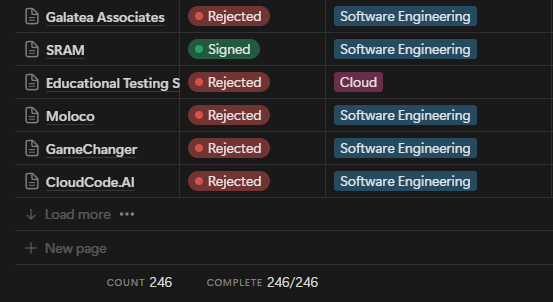
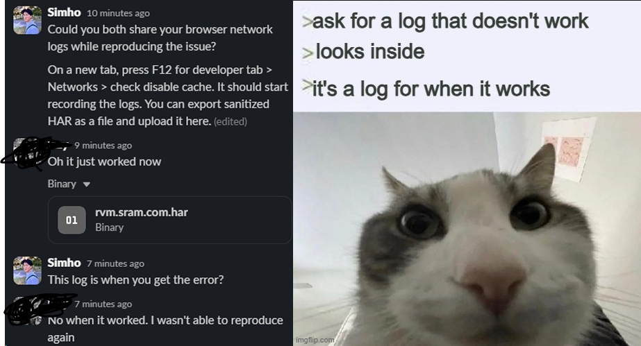
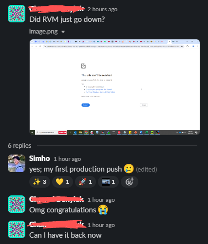
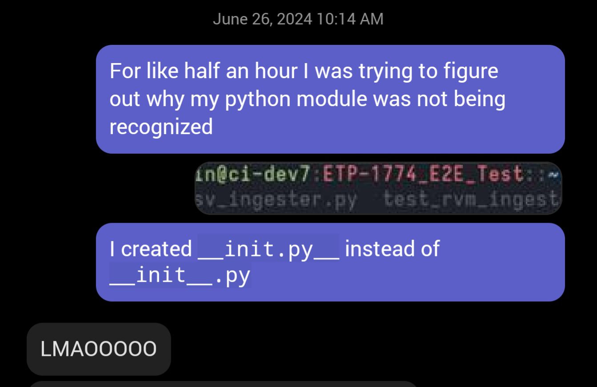
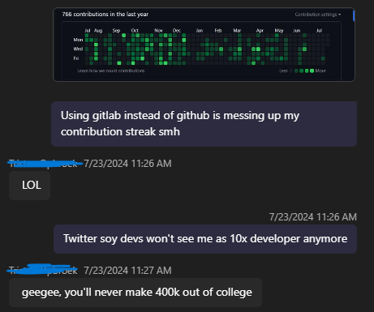
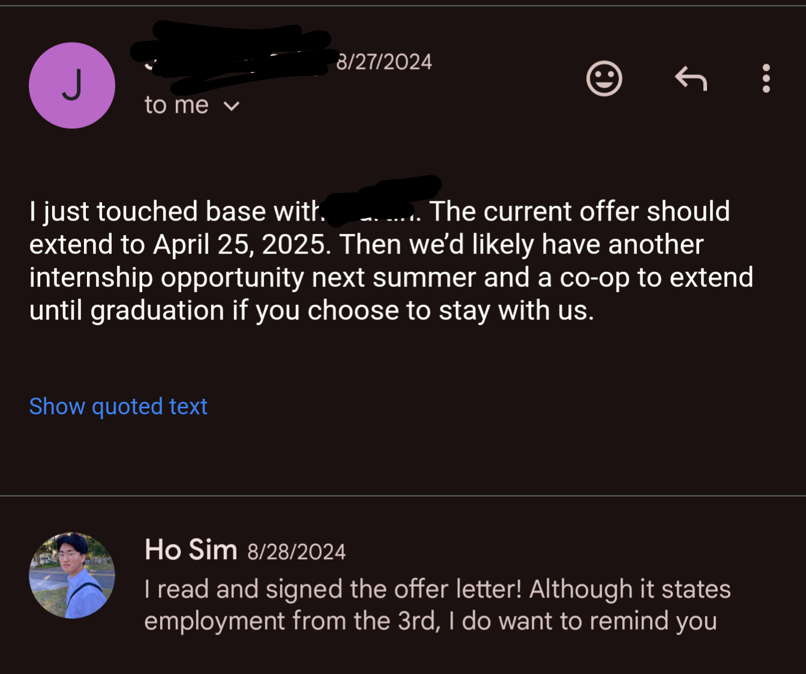

> This posts only describes the summer internship. It does not include the co-op extension that followed.

I initially had this as a part of [2024 Reflection & 2025 Goals](Reviews&Planning/2024%20Reflection%20&%202025%20Goals.md), but I decided it was too long to not be its own blog post.

## The Hunt

Like every Computer Science student, I was on the hunt for a software engineering experience to put on my resume. I participated in two hackathons, went to career fairs, and submitted _hundreds_ of resumes across the United States. Despite all that, all I got back was a handful of fruitless OAs (TikTok is insane), 1 phone screening interview, and 1 in-person interview with Walmart. And that wasn't even a software engineering position!

But life is a mix of luck and effort. A friend I made through the [previous Hackathon](Reviews&Planning/2023%20Reflection%20&%202024%20Goals.md#Hackathons) referred me to an internship opportunity with SRAM. He felt that I was the best fit, considering how much the team liked the projects we built together.

After a few emails and video calls with the recruiter and employees, I was set to join the Electrical and Software Engineering team for the summer as a Software Engineer in Test intern! While they didn't pay for my flight to their headquarters in Chicago, they did provide us a great place to stay. It was right in the middle of downtown Chicago, being a 10 minute walk from The Bean and a 20-minute bike ride to the office.

## The Work

I'm going to be honest - the moment I heard SRAM, I thought of static random access memory. Is that even a thing? I always had a bike throughout my childhood, but I never made it a hobby, let alone an obsession. I quickly learned that SRAM's target market is not only the enthusiasts, but _rich_ enthusiasts. I also learned that they are not some small unknown company. They have offices across the globe with over thousands of employees and revenue estimates going over half a billion dollars. They were at the top when it comes to professional bicycle components.

But the real question was: what did a bike company have to do with software engineering? My guesses were something related to maintaining manufacturing processes or customer data analysis.

I wasn't assigned to build a new project. Instead, my goal was to improve the test infrastructure and maintainability of an existing internal tool called rearviewmirror. It is a web-based data query and visualization platform engineers use to track and analyze data collected from every test benches deployed across offices and manufacturing facilities. Testing is an integral part of ensuring high quality products; this tool was what allowed engineers to identify issues, if there was any.

This tool had grown to a state where initial decisions were no longer scaling well for the future. Its architecture made it difficult to isolate issues and build new features safely. There was no easy way to create a development clone of the tool, pushing devs to literally test in prod. Most importantly, there were barely any automation for tests, let alone a foundation to support them. There were countless other improvements to be made, and my job was to make as many as I could.

memes

Okay - I don't want to sound negative, because this was a fun experience in the end - but I also want to be honest about my first impression: this sounded boring as hell. I mean, every software engineer knows writing tests isn't fun. That's exactly why this tool is lacking it! I was being tasked to do the annoying part. What kind of impact was I going to make by the end of the internship? "_Hey, the tool does exactly the same thing, but now we're more likely to know when it breaks that it's, in fact, broken"_ was not what I wanted my accomplishment to be.

Another thing I dreaded was with how many new things I had to learn. CI/CD pipelines? That's something Vercel/Netlify does to deploy my website, right? Docker? I saw a Fireship video about it, kind of. NGINX? Unit testing? Database system management? Cloud configurations? Ah, I didn't know _SHIT_ for this job. Why did they pick someone with mostly web dev experience for the job? I know growing as a software engineer means to expand my comfort zone constantly, but I felt like I was back to square one in terms of technical competency.

But despite my initial feelings, I felt pretty good about every improvement I brought. In fact, by the end of the internship, I only wished I could've done them faster and get more done. I made various improvements to the tool to make it more consistent, scalable, polished, and MUCH easier to work with. I made it easier to clone sections of the production database to be used in even outside of the project. I implemented fallback behaviors and clarified dependencies between major components, reducing unnecessary failures and enabling frontend development without the database and vice versa. I'm especially happy about building CI/CD pipelines that can identify exactly when new docker images should be built before the tests and how it uses images built from previous runs, reducing time in pipeline significantly.

To be clear - we quickly found out this was NOT my fault :)

Each task were more challenging than I expected. While building the database clone tool, I found discrepancies in that database schema between prod and what's defined in the repository. The server also processed data in indeterministic fashion, which worked perfectly fine for production environment, but not for getting consistent output on test reruns. Finding that out was rough

The language I mainly used is Python, and my _god_, I hate it. I mean, okay, there are things to like about it, to be clear. I appreciate its simplicity and genuinely think every language could benefit from syntaxes like list comprehension. Django is also one of the most feature-rich, robust backend frameworks I've worked with. But there's only so much DX in a weak, dynamically typed language. The lack of interfaces, generics, and `unknown` type really hurts as someone coming from TypeScript land, which itself doesn't even come close to the DX of strongly typed languages. Debugging is a nightmare when I have no IDEA WHAT TYPE MY OBJECT IS. I need my program to stop acting too smart and performing data type conversions only to mess up somewhere down the line. The development environment is a joke as well: you need venv to isolate python environments, then you need pipx for some random packages, but you should really use Pipenv for all of this, or Poetry for PEP compliance, or uv if you feel like all this isn't utter chaos already!

peak python dev

And as for the work experience - I didn't find DevOps to be the most exciting thing. In fact, it made me realize that I might prefer frontend development, or at the very least, work close to software-centric solutions used by the public. The way I like to describe DevOps to non-technical people is by using a concert as an analogy: There are people who perform, and there are people who set up the stage for the performance. DevOps is like, making sure the stadium is rented out and delivering the necessary supplies on time.

That's not an accurate analogy, but it gets my main point delivered: I felt that my work was _foundational_, but not **critical**. I make other employees work better, but my work isn't what customers spend money on. There is no pressure to meet deadlines to boost revenue or worry about the user experience of the most technologically illiterate customers. There's benefit to all of that, but I find it more interesting to think about software-centric problems and make decisions on things that directly affect customers (_do you see me, Amazon? I'm customer-obsessed!_). In a company like SRAM, such challenges were for the firmware engineers, mobile devs, and mechanical engineers. After all, no matter how technical advanced our internal tools and tests are, what customers see and pay for is the physical piece of bike component, not lines of code.

None of this is to say my experience at SRAM was bad. _Oh no_, not at all. Despite my complaints, I still enjoyed the fundamental responsibilities of a software engineer. I loved discussing technical challenges and giving input that actually mattered. I appreciated when my team considered my input on the same level as anyone else while they displayed high standards of quality and extensive experience I would learn from. I enjoyed watching software evolve as I put hours of work into it and making a meaningful impact to our team.

## My Performance

muh github contribution streak

Long before the internship, I heard a lot about Impostor Syndrome and how I was going to suffer from it. And suffer from it I did. I frequently found it hard to justify my pace, and for some problems, I couldn't tell why it took me so long to figure out the solution. It felt like I wasn't _thinking_ most of the time. Lack of experience with DevOps, direct postgresql manipulations, and server administration tools didn't help.

And just as I learned before the internship, the best medicine was to actively ask for an objective perspective. Right from the interviews, I gathered information about what was expected of me by asking questions like, "What are some things you wish the previous interns did better?" On our 1-on-1s, I checked a handful of times to ensure I was meeting their expectations and find room for improvement. Whenever my mentor helped me with a problem, I asked more questions to make sure I absorb his problem solving _process_ rather than the answer he got at the end. Sometimes it was my lack of knowledge, and sometimes my lack of experience as a software engineer. Critical thinking is hard, it turns out. But fortunately, it can be learned.

Despite my worries, I was evaluated very positively throughout the summer. I was told that they were impressed to see me to jump into a large codebase and learn to work with it faster than they expected. They even said that less than 10% of candidates would be capable of what I achieved within my time. I obviously can't verify that claim, but it boosted my confidence regardless, since I always prided myself in learning technical concepts fast and being comfortable with any software development environment.

On top of all that, they extended the offer till next year!

When my team offered me to continue working for them part-time remotely, I asked myself if I should continue working with [Techrangers](Reviews&Planning/2024%20Reflection%20&%202025%20Goals.md#My%20Very%20First%20Software%20Development%20Job), where I could continue to grow my web development skills and work in a software-centric environment, or with SRAM, where I would not only improve my career opportunities in the long term, but also get nearly **double** the pay. (Especially considering that [this was the only source of income for me at the time](Reviews&Planning/2023%20Reflection%20&%202024%20Goals.md#Unexpected%20loss)). I chose the latter, because despite my feelings about DevOps, I believed I hadn't spent enough time to write it off already.

This internship taught me what it means to be a full stack developer more than I ever was (if that title is still relevant). However, it also opened my eyes to many areas I actively need to improve on. I still don't know the best timing to ask for help. Sometimes find myself zoning out and applying quick, meaningless attempts at debugging rather than taking a step back and approaching the problem surgically. I still struggle to understand some explanations without granular, dumbed down examples paired with them. I'm still hesitant to bother others while knowing I shouldn't be struggling on my own too much. Active communication and extensive experience is the only solution to these issues. It's unfortunate I can't rush them.

I'll keep growing.
