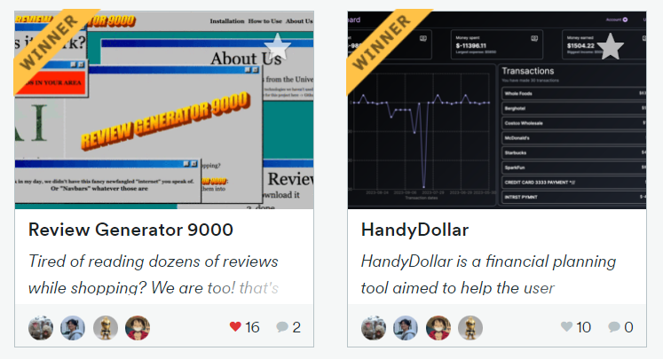
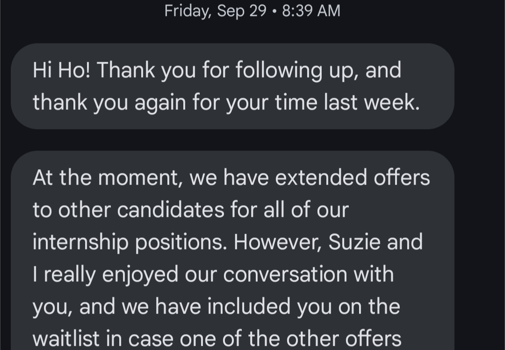
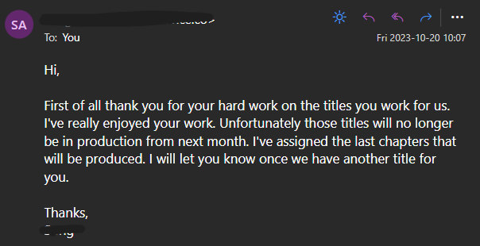

> _In 2023, I'll meet more people with similar interests and find opportunities to gain real developer experience. I'll make content sharing what I think and learn. I'll finish building my projects and truly prove what I am capable of._

\- Me, at the start of 2023

## 2023 Reflection

> _Meet more people... and find opportunities to gain real developer experience._

### Education

I completed my Associate's Degree this year and finally started my Bachelor's this August. A lot changed very quickly after I started my Bachelor's in Computer Science.

To learn how I got to this point in life, read [How Did I Get Here?](../How%20Did%20I%20Get%20Here.md)

### Hackathons

I participated in two largest Hackathons in Florida and secured winning positions! In ShellHacks, my team placed second in Google's challenge, and in KnightHacks, first place in RBC & Microsoft's challenge. I was very fortunate to have friends that resonated with my ideas and worked hard to bring them to life. I never meant to, but I learned I'm pretty comfortable taking the role of a leader when it comes to software development.

### Team Software Development

Right after, I started volunteering as a developer for a [research lab in my school](https://mae.ucf.edu/joonpark/) to build software for a wearable device. This was the first time I started working with a team long term. I quickly understood the codebase and practically took over the development. This experience verified my understanding and knowledge of software development and project management. It also helped me get up to date with React Native development (the last time I tried was [2 years ago](https://github.com/SimHoZebs/react-native-alarm-app) ) and learn how complicated it can be to work with Bluetooth connectivity. It's been a good experience for improving clear communication of ideas and managing safe, incremental enhancement/migration of codebase.

### Career development

I also spoke with dozens of recruiters and people within the industry throughout my internship search. There were a lot of scuffed moments, but ultimately, this helped me get much better speaking to strangers than I was before.

Did I learn anything meaningful from recruiters and employees? To be honest, _not really_. I already knew these big corporations gave great benefits, and of course their company has a great culture. I'd ask about what they do, but they are either a recruiter that vaguely know about what software developers are actually doing in their company or a person working in an area so different that I have nothing to go off of. If I manage to meet an actual software developer, they describe their projects way too vague for me to gain meaningful insight. The only memorable conversation I had through these employer events was when I questioned a Google employee about the contradiction of Google's mission to organize the world's information while killing off Google Podcast, and my privacy concerns with proprietary LLMs.

Unexpectedly, the most meaningful conversation was with a senior dev at my marriage brunch. His perspective of how software development changed over time (why Java and C# exists at all, how languages had proprietary compilers) and security and efficiency considerations he has when building software was insightful.

---

> _\...sharing what I think and learn._

That's why I built this website. This is the space that displays all my social links, projects I built, and the thoughts I want to share. I published a [Rust made me rethink everything](../Rust%20made%20me%20rethink%20everything.md) by the end of the year, so I consider this goal sufficiently achieved.

---

> _I'll finish building my projects..._

The developer version of, "I'll start working out from next year". While I have built new projects through the hackathons, I still haven't built a personal project to completion. It takes a lot of time and effort, which has been hard to find amongst my investment to do well in school.

## Unexpected achievements

I have way better understanding of Data Structures and Algorithms. Even though I had experience with DSA prior to my school's DSA course, it taught me how to utilize them better and improve my overall understanding significantly. Learning C and Rust alongside it truly opened my eyes to how programs really work.

## Unexpected loss

Last email I received from my freelance translation gig.

I lost my primary source of income. I've been unemployed ever since and mostly living off my student loans. I tried to search for other gigs and have landed a few, but it hasn't been great. I'm hoping to find a part time job at school and/or invest more time to offer variety of skills for my freelance work.

## 2024 Goals

It's way too late to have a goal statement for the year, but if I pretended today was the anywhere close to the start of the year:

I will land a software engineering internship and find a more stable source of income. I want to continue sharing my ideas and knowledge through my blog posts. I want to complete my projects and keep building to enhance personal data control.
