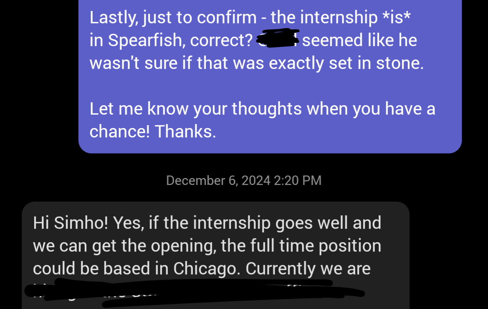

> [!Note]
> Even though I am publishing this 3 months into 2025, this post ONLY reflects my experiences and feelings up to the end of 2024. Things may have changed already.
>
> I am going to avoid detailing activities and experiences to focus the post on my feelings, growth and lessons learned. This means some claims will be missing justification.

First, I'd like to make it clear that I hate overly positive posts such as those on LinkedIn. They sound fake as hell - I bet at least half of them are. Everyone sounds like they are forcing a smile to look good to their future employer. It irks me so much that I feel the need to express it explicitly.

However, this year _has_ been one of the most successful years of my life. I thought 2023 was great, but 2024 beat it like it's nothing. Here are my brutally honest feelings and thoughts about the main events of the year.

Going in chronological order...

## Foundation Exam

In the University of Central Florida, Computer Science students must pass **the Foundation Exam** to progress through the degree. It's considered to be a challenging exam - around half the examinees fail the test on average. You get maximum of three tries, and after that, you're forced to drop the program. I've met a handful of students who switched to IT or Computer Engineering for that reason, so naturally, I got a little nervous about it.

Instead of waiting until the last day to study, I gave myself about 2 weeks to solve two older exam papers. Then I scored 92 out of 100.

The test statistics. 46.5% was an all-time low, meaning we either had the hardest exam, or we are the dumbest set of students to have taken the exam.

Our Associate Dean gave me a smile of approval when I brought this up in a meeting with him, so I think it's safe to be proud of myself. Not to brag, but I genuinely didn't think the exam was that hard. The DSA course I took before it was harder.

## Biggest Failure

Last year, [I shared that I joined a research lab to do volunteer software development](2023%20Reflection%20&%202024%20Goals.md#Team%20Software%20Development). It was quite a frustrating experience that ultimately led to failure due to terrible team dynamics. Having taken the leading role for the project's development, I learned that it's easy to provide support, but challenging to inspire motivation. No matter what I offered, it didn't matter if no one cared to take them. My efforts to ensure everyone learns something from this experience ultimately delayed progress significantly.

Near the end of the project, the professor overseeing the project recognized this issue and cut the team to just the previous lead and me. But by then, I was too busy with my new job to continue contributing.

Oh yeah, I got a new job.

## My Very First Software Development Job

Rewinding to 2023 briefly - before my first semester in UCF, I applied for a position called **Techranger**, a part-time software developer role for students at UCF's Center for Distributed Learning. Some of their work involves building apps and extensions for the school's learning management system, and maintaining several digital systems that support the school's diverse set of students and instructors. Frankly, I didn't understand what any of that meant back then and just applied so I can make some money with code, especially since [I had lost my only source of income at this time](2023%20Reflection%20&%202024%20Goals.md#Unexpected%20loss).

https://techrangers.cdl.ucf.edu/past-techrangers.html

I was rejected back then, but this year, I got it! This was my first experience working with people who are actually paid to do software development, not some unmotivated students looking to gain contribution points with minimal effort. The team was a gathering of talented people who truly cared about making education more accessible and seamless for all kinds of students.

I had a wonderful experience there, and even now, I wish I could've continued working with them. The people were super friendly and fun to talk to, all with diverse experiences to learn from. I know this sounds fake, but it's true. My only complaint is that both the students and full-time employees are not paid enough.

## My Very First Corporate Job

Thanks to a friend I made through [previous Hackathons](2023%20Reflection%20&%202024%20Goals.md#Hackathons), I was referred to a software engineering internship at SRAM for the Summer. This was the level up I was looking for, even before securing my position as a Techranger. Unlike LS&T - which functions under a non-profit public school and doesn't directly generate revenue - SRAM is a financially driven organization of a much bigger size. I was very curious of the kind of work environment that entailed from such a difference.

I have so much to share - in fact, I decided to make it [its own blog post](../My%20Experience%20as%20a%20SWE%20Intern%20at%20SRAM.md)! But to summarize, it was a very interesting experience being in a team that was important, but not the main money-maker like the mechanical/design engineers were. SRAM is a bike company at the core, regardless of how technological advanced they were. As a result, while I understood that the software development work was foundational, this support/behind-the-scenes role didn't quite feel like the right for me in the long term. I learned that I appreciate software-centric, customer-facing work more than I thought.

I really feel like I grew a lot as a software developer, tackling problems I've never even imagined before. I thought A LOT about ensuring my contribution was compatible with how others worked so it's maintainable, scalable, and doesn't break anyone's existing workflow. For example, I _really_ wanted to migrate their frontend to use tailwindCSS instead of Bootstrap 4 (which isn't even the latest version!), but the best I could justify was replacing jQuery code with JavaScript.

By the end of it, not only did I receive positive feedback, I was also offered to extend my time with SRAM through the next year! This was a confidence boost of the year. Chicago was really cool too! In conclusion, it was one of the best times I had since I came to the US.

You can read the full blog post about my summer internship at SRAM [here](../My%20Experience%20as%20a%20SWE%20Intern%20at%20SRAM.md).

The remote work experience after the summer has been quite challenging. It's not like I was pressured to push out features or improvements; it would've been strange if there was. But for some reason, I felt like I was underperforming and less satisfied with my work. Of course, it was harder to ask questions without my mentor sitting right behind me, and much harder to get a lot done working half the hours. But these didn't feel like the only reasons.

This blog about [a 28 Year Old Staff Engineer @ Google](https://www.developing.dev/p/28-year-old-staff-engineer-google) actually gave me some insights to why I felt this way: I didn't have a clear enough understanding of the organization and the work I was doing. I understood the scope of my tasks, but the bigger picture was muddier than I'd like it to be. I needed to talk more with the engineers that actually use the tools I work on. I needed to ask more questions without feeling like it's too late. I needed to improve my autonomy by understanding the goal and aligning myself to it, which makes me sound like a corporate-shill now that I write it in words, but that seems like the right thing to do to feel more satisfied with my job.

## Health

Then we also had to go back

I've been skinny for most of my life, but there have been two instances where I put on a healthy amount of weight along with some muscle. The first was in the army, back in 2020/2021. This is the second instance. Pairing high calorie, protein rich food with daily weight lifting session throughout the summer was the key. I'm happy about the result, but I still have ways to go and need to be consistent.

I also started caring about nutrients a bit more. I never had a sweet tooth, but I took extra steps to avoid sugar, like sticking to diet/zero variants of soda. I started taking Omega-3, magnesium, and multi vitamins supplements. Healthy balanced meals are still challenging to me, but I started following YouTube content relevant to healthy living so I can remind myself of the quality I should be treating my body. It's important to know healthy habits shouldn't start when you're sick, but before you're sick.

## Family

I've only discussed personal and career growth in my previous reflection posts, but I'm including family this time. Perhaps this is a sign that I'm getting old?

I'm aware some find this use of AI offensive; this is to keep others anonymous.

My siblings visited me in the U.S. and had an awesome time together. This was my sister, Subin's first visit to America (second for my brother, John), and sharing this experience brought us closer as a family. This trip was a reminder of the importance of nurturing family bonds, especially considering the time zone difference and frequency we see each other. The Twenty One Pilots concert was unforgettable. It was great to see my family so excited and happy.

## Projects

My goal was to complete [Nedon](../../projects/Nedon.md) by the end of the year, but I still haven’t finished it. Balancing time between this project and other priorities, like grinding Leetcode, school assignments, and part-time internship, has been difficult. Sometimes, I wonder if I’m just slow at building features, fixing bugs, or if the project is genuinely complex. The biggest takeaway from this is recognizing my struggle to distribute effort across everything I want and need to do. I learned that I need to build a habit of scheduling my tasks, sticking to that schedule, and regularly reflecting on my progress. This is something I still need to work on.

I did, however, build a [home server](../../projects/Digital%20Independence.md). It has taught me a ton when it comes to networking and system administration, and there's still more to learn and fix.

And after falling into a rabbit hole of ergonomic keyboards, I built a custom keyboard. It's not creamy or thocky as most prebuilt premium keyboards, but its functionally perfect. I'll make a blog post about it some day.

## 2025 Plans & Goals

Unlike before, I not only have goals, but relevant plans for the coming year.

First, I'm going to stay consistent in improving my health. I need to start quantifying my health with measurements and set some targets, but currently, I want to focus on improving my cardiovascular health. I want to lower my resting heart rate and be able to maintain peak heart rate for longer.

Second, progressing my professional career. I have an internship lined up with SRAM for the Summer again, but this time, it'll be as a mobile application developer. This is in a completely separate team, and - at least for the internship - a different office in a different state! As I said, I prefer to work closer to the product, and this role reflects that desire closer than my current role. Plus, the manager sounded relatively positive about reserving a full-time position if I perform well. I'll be honest - that's what I need more than anything.

With my graduation planned for August, I'll have to start searching for other new grad positions pretty soon. The SRAM offer is great, but I should secure multiple offers for negotiating power and increase the likelihood of doing what I really like to do. I want to do frontend development, but I can't be picky until I have some guarantee.

Since I have no concrete idea of where I'll be, I don't really have a plan for the last quarter of the year. I may be job searching or have settled down somewhere and adapting to my new life. We'll see.

---

Little side note - Amazon invited me to take their Online Assessment. It feels like an achievement because this is the first time I’m hearing back after all the applications I’ve been submitting to them in the past 2 years. It feels like I'm finally recognized for my experiences. But at the same time, I’ve solved several OAs from many companies with perfect/near-perfect score, only to be told that I’m somehow a great candidate yet not the best fit at this very moment.

Even if I do get through it and get an interview, it'll most likely end up being a really good learning experience, knowing my Leetcode skills and limited interview experience. I don't mean to be pessimistic - I just know where I stand. I'll still keep climbing.
