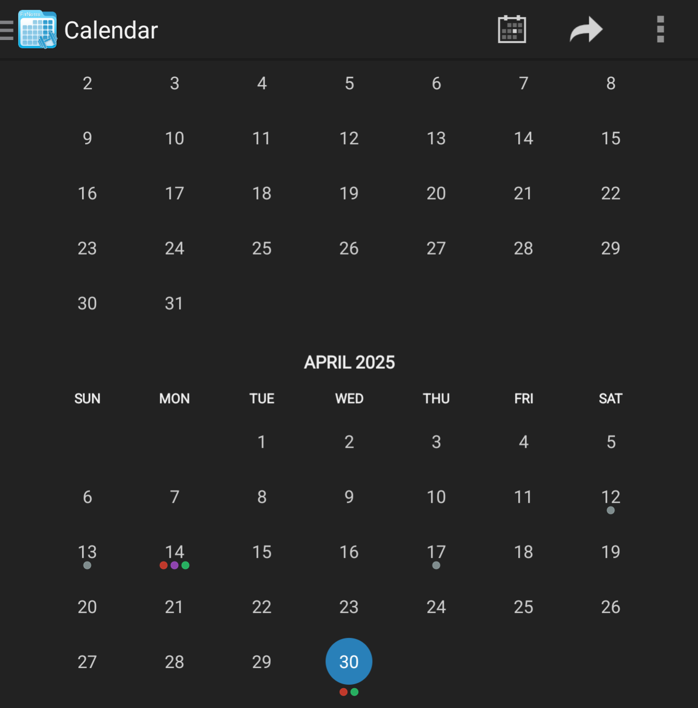
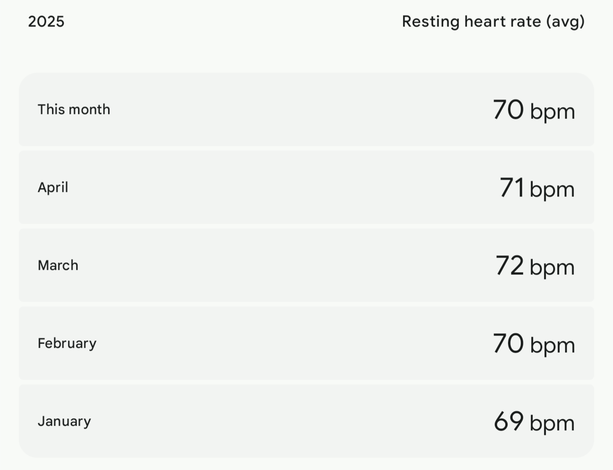
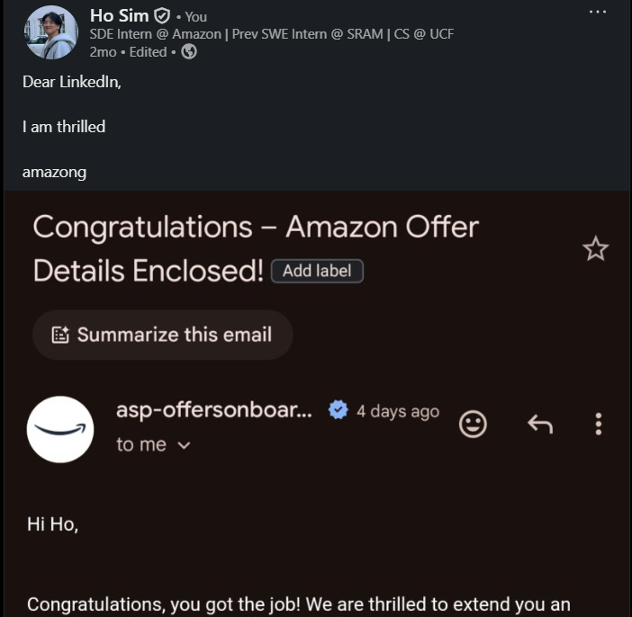
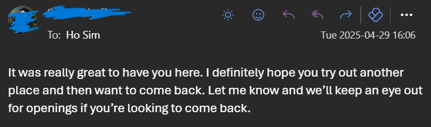
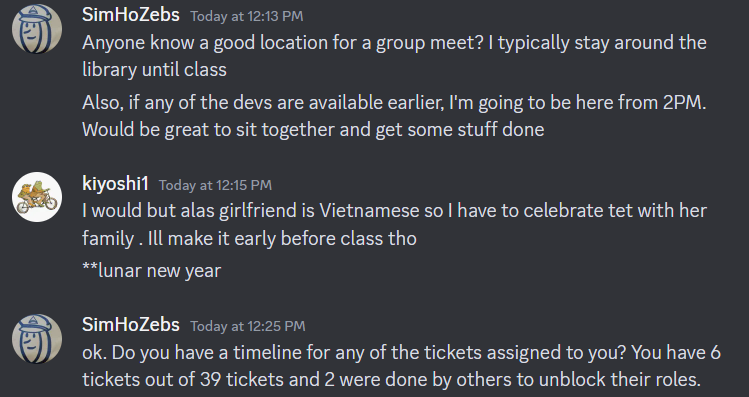

One of the first things I learned this year is that it's very important to conduct retrospections frequently. In fact, I think the leading cause of poor/unsatisfactory life decisions is the lack of reviews.

Because I'm still a student, a [12 Week Year](https://12weekyear.com/) doesn't align with my schedule. I've instead adapted it into a 4 Month Year, making this January to April the one of the three *Thirds* of the Year.

## Health

I was never consistent with going to the gym, but I wanted to change that this time. With that, I decided to actually track the frequency to reflect on.

March - April gym frequency

*Aaand* I did terribly. I visited the gym 14 times this Third. That's like, less than once a week. I have my excuses, like Senior Design and other classes adding extra strain on my free time and lacking a motivated partner, but the real culprit is lackluster time management. Had I intentionally scheduled my activities throughout the days and weeks, effectively distributing my efforts to various priorities, I would've visited the gym more than 14 times.

Regardless, I'm still gonna claim some wins here. 14 is more than 0. And considering my wife was part of most of it, I've maintained not just my health, but hers as well. Making her more motivated has been a challenge, but I learned near the end of the Third that its much easier to make her agree to a short cardio than an hour long weight lifting session.

Speaking of cardio - resting heart rate was another thing I tracked after learning about how important it is to have a healthy heart. I mean, it's an obviously obvious fact, but it's not something that's I kept in my conscious until recently.

Not much has changed. If anything, it's gone *up*. Not good. Again, I need to go to the gym more and make sure I include some cardio.

Something else I got interested in are in supplements. I'm not going to go deep on my research, but I've essentially categorized some under three tiers. The first is for supplements with sufficient studies of their effects and have shown measurable benefits. Tier 2s are ones under active research and have shown benefits under some respectable sample sizes, but not robust enough to claim tier 1. Tier 3 are the more experimental stuff.

Given those tiers, my interests have been in:
1. Magnesium-zinc complex, Omega-3 (DHA, ALA), Potassium, Fiber, Creatine Monohydrate
2. Curcumin-Bioperin
3. Cognizin, NMN

And from this tier list, I've been taking Omega-3s and magnesium over this Third. I recently bought Curcumin-Bioperin as well. Cognizin and NMN are very interesting. I like the idea of enhancing my cognitive abilities, but I'm going to wait for more robust studies and solidify ways for me to measure its effects before trying them.

## Career

Last year was the most important year of my life career-wise. My goal for this year was to shine even brighter, but getting an offer at Amazon for a software engineering internship was not something I had in mind.

That's right - the online assessment I took last year led to an interview about a month and a half after. I was **SHOCKED** when they asked for my interview date preference. Like every other OA I took, I just assumed I failed it. I stopped solving Leetcode since then! I grinded once more for the 2 weeks, annoying my wife about how it's all doomed regardless. I just couldn't see myself getting the internship when I had less than 30 Leetcode questions solved in my lifetime. Still, I told myself I'll do my best and learn what it's like to interview with Big Tech.

But when I ended the call with the interviewer, I couldn't see myself *not* getting the offer. It just went so well! I solved the DSA question perfectly and none of my behavioral questions had any hiccups. The only *issue*, if there ever was one, was that the experiences I shared were somewhat mediocre. I answered them according to Amazon's Leadership Principles, but they weren't particularly *eye-opening*. I couldn't see such a minor thing hindering me. Now my worry was getting unlucky with headcount limit or something I couldn't control. Regardless, I was proud of my performance and felt that it was a very good interview practice.

The LinkedIn post

I eventually emailed Amazon on the 6th day, and they sent me the offer within few hours. This was the most exciting news I had to share with everyone in a long time. Well, the second most.

### Finalizing my internship at SRAM
This means I reneged the mobile software engineering internship with SRAM. Not the kind of bridge I wanted to burn, especially considering the potential full time offer, but the potential career boost through Amazon is worth the risk. Besides, not all bridges were burnt.

The team I worked with for nearly a year was happy to have me back.

And of course, I *have* to talk about my final semester with SRAM. It was super challenging to juggle between it and school, but I managed to make significant performance and maintainability improvements to the project that I was contributing to. As always, I wish I could've done more. There was this major refactor that I was tackling since early last year, and just as I thought I completed it around March, I learned that I had misunderstood the direction and scope of the work the whole time. I didn't have to scrap everything, but I did have to get rid of my approach and come up with something more fitting. It was frustrating that this was somehow never caught throughout the code reviews and stand ups.

## School

This has been the busiest semester of all time. The combination of Senior Design (our final, two semester long graduation project course) and Process of Object Oriented Software Design (another software development course) was brutal, especially while keeping up with the demands of my job. The problem wasn't because it was a lot of work, but because working with a bunch of unmotivated students with no passion for software engineering in a course with near zero-risk of failing is god awful.

He did nothing

Senior Design's been awful as well. I greatly regret not preparing a custom project proposal before the course began, let alone find out that's even a thing, because I ended up being assigned a project that I do not care for with members who's presence in Computer Science major is questionable. Except one member - thankfully, they've been fairly motivated to collaborate on the project closely while the remaining members put their energy into deferring all important critical thinking processes to others.
## Personal Projects

During the course, I built a journaling app for Process for Object Oriented System Design. The original idea was to let me write about my day and have an AI preprocess the entries to extract information about people I interact with, building profiles that summarize my relationships and interactions. This way, instead of digging through old entries to find patterns or recall details about someone, the AI-generated profiles serve as a one-stop overview.

It makes reviewing relationships and patterns much easier and more efficient.

Since then, I've been expanding the app's functionality. Now, I'm working on integrating voice recordings—converting them into journal entries so I don't lose thoughts or experiences. This also makes it easier for both myself and AI to review and analyze my data, since text is much more accessible than audio. The goal is to generalize the app beyond just profiles, making it a more comprehensive tool for capturing and reflecting on my life.

