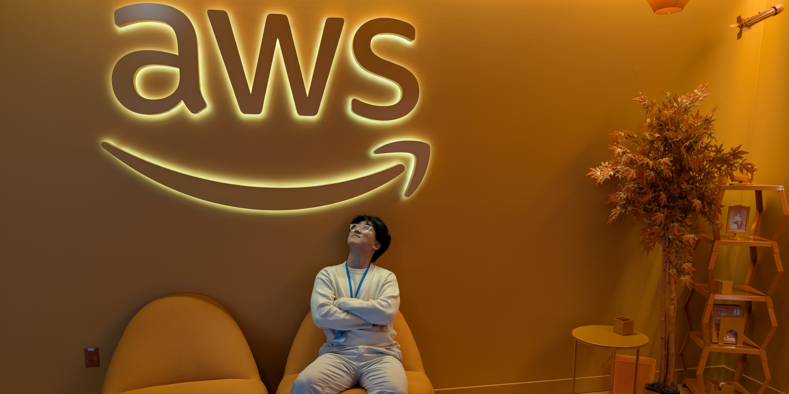
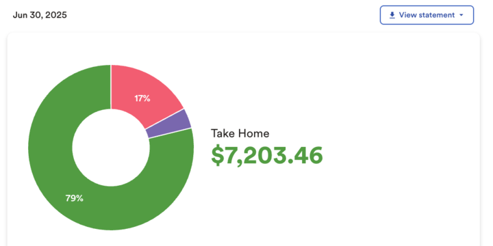

T2 is a period of time from May 1st to August 31st. As with all Review & Planning, the post primarily details learnings, achievements, and feelings. I'm not here to share specific events and experiences unless they're critical for context. Such detail can be found in their own respective posts. 

# Review

## SDE Internship @ AWS

It goes without saying that this internship is the biggest success I've had so far. It not only adds a few more shiny lines on [my resume](../../../src/pages/cv.md) to boost my ego, but it also helped me grow as a software engineer. It feels like I got a new pair of glasses for seeing scalable and maintainable code, thanks to my team's insistence on high-quality code. I always wanted more people to look at my code and give me feedback, and getting so much of that was the best thing I got out of this internship. AWS' document-centric culture significantly improved my writing skills as well. Writing was something I always wanted to get better at, but felt like it was such a time sink because of how often I would be rewriting my own journal. Now, I feel more comfortable writing these posts and just documenting anything I work with. 

I'm also quite happy with my performance. I didn't feel as much of an impostor syndrome as I did in [my first internship](../My%20Experience%20as%20a%20SWE%20Intern%20at%20SRAM.md) - though I definitely did at times. I felt much more confident asking questions on things I felt clueless on, and even set up meetings to get more focused help! Such things are so easy to say than do as an intern - especially getting pointlessly worried about bothering others too much - but getting over it is as simple as, "Well, if I'm getting in their way, they should tell me. Otherwise, I'm gonna do my best to make progress." My project ended up getting scheduled for production deployment in the coming weeks, and my manager told me that his manager (my skip) had complimented my work, which is apparently rare. I'm proud to share that I received "inclined" on my full-time conversion evaluation. 

you learn through failures

I programmed in Java professionally for the first time and learned several patterns specific to OOP, and I still don't really get it. Mainly, I'm not sure why we don't use Go instead. Java just feels bloated and verbose. There's nothing inherently wrong about OOP, as far as I can tell, but [considering some of its harmful design patterns](https://youtu.be/wo84LFzx5nI), and my firm confidence that functional programming is as scalable, I see no reason to continue using Java. I get that we don't want to add more maintenance overhead on the team and lean on the infinitely larger Java community, but it just hurts me to see how much compute and memory JVM uses to run simple lambda functions.

And that leads to another minor complaint - there is a desire for engineers to learn new technologies and try ideas that may fail, but the pressure to hit deadlines for existing projects makes it much easier to lean on tried & tested tools without knowing if there could've been a better way to do things. Without dedicating a decent amount of work time to keeping up with modern tech trends, there is a real danger of falling behind and limiting innovation. I do not want to be someone who only knows how to get things done the way Amazon does things, and I learned that there will be some effort necessary for that.

My project carried more weight than the [work I did for SRAM](../My%20Experience%20as%20a%20SWE%20Intern%20at%20SRAM.md), but the service I built is internal-facing nonetheless. It's missing the impact of a customer-facing service and the thrill of fighting within a competitive market. I kind of wanted to do frontend development. I think there's just something very exciting about working with browsers and the web's rapidly evolving ecosystem.

This is something I felt last summer too, but man, there's a certain gloom over the idea of investing a majority of the day in an office. After that, I headed to the gym, came back home, ate dinner, *maybe* do something meaningful for another 2 ~ 3 hours, before going to sleep and repeating the cycle. Don't get me wrong - I enjoy software engineering regardless of the mission, but I would much rather work on something that resonates with my soul, like my personal projects. I'm reminded once more that this isn't the end goal and I need to keep working hard to earn my ideal life. Startup? 

can't complain about money

It's hard to share that kind of complaint while also being bombarded by Big Tech money, which was an experience all on its own. I didn't spend a lot to save for the remainder of this year, but I did buy the majority of meals instead of cooking to save time for more meaningful activities. **I was essentially buying time, and for the first time, it was sustainable**. So many inconveniences could be bought away - which is something I already knew, but this time, I got a 12-week trial of such reality. Money may not buy happiness, but it absolutely buys more room for it.

To hear more specifically about the internship, read [My Experience as a SDE Intern at AWS](../_draft/My%20Experience%20as%20a%20SDE%20Intern%20at%20AWS.md).

## Education

Continuing from [last semester](../Reviews&Planning/2025%20T1%20Review.md#School), my Senior Design team and I completed the largest project I've worked on outside of internships. I built a service that handles several automations helpful for the process of converting geoJSONs to IMDF files, along with a web-based frontend to interact with the features intuitively. We roughly estimate that my contribution automates ~30% of the conversion workflow, bringing significant time savings and laying a solid foundation for our project sponsor to streamline the conversion processes even further.

It's hard not to start with complaints. I worked my ass off for the sake of my graduation, **not** passion. I had little to no interest in the mission or the problem we were solving. And doing this over my final, most important internship was the worst decision I made throughout my undergrad years. I was handcuffed to this project instead of using that free time to explore Washington and its nature, network with other interns, work on projects that I'm actually excited for - or just anything else that I _wanted_ to do.

Look at all the contributions over the semesters!

And the poor team dynamic didn't make it any better. The project only had its success thanks to me and another team member, who spearheaded the mobile application development, while the two other members cluelessly dumped LLM-generated code into the codebase. One of them proudly shared that they did not enjoy software engineering and had no plans to pursue it as a career, which was really great to hear from someone who needed to do software engineering in the team 🙂. We ended up serving him a graduation degree that he didn't deserve.

With that said, I still learned a few things from the project. The progressive growth of the codebase naturally taught me to architect components more consistent with the SOLID principles. This wasn't the first time I learned the principles, of course, but pairing the development with my internship meant I could immediately apply the things I learned from them. There were several instances where I thought, "The codebase I'm working with in AWS does this part much better... I should apply that pattern here."
## Health

Estimated 1RM for dumbbell bench press

I'm quite happy with the significant improvements I made to maintaining good health. I nearly doubled gym frequency, consistently consumed ~150g of protein on a caloric surplus, and hey, sleeping mask really helps improve sleep quality. I feel better about my body and feel like I have found a good strategy I can stick to.

The biggest change I made is tracking my diet. Google's Gemini has been a great companion to make estimates for my meals based on images and descriptions, especially paired with its ability to search. It helps me figure out a good estimate with minimal effort. Would be great if there was an app for it... 🤔

But to be frank, *doubling* my gym frequency still means a bit less than 2 times a week on average, which isn't impressive at all. My diet wasn't clean either - I ate out most of the time and enjoyed Shake Shack and Domino's a little too much. Still, achievements are still achievements. 

## Personal Productivity

It's been [5 years](../Software%20Dev%20Log/Software%20Dev%20Log%205.md) since I started looking into this and I'm still trying to figure out how to make it work. Specifically, figuring out:
1. a system for logging information
2. a system for organizing information for optimal retrieval 
3. my goals and the habits/actions to actually achieve them

The biggest challenge was figuring out what my problems even were. For example, I couldn't tell if the concept of daily notes was problematic for my philosophy, or if not having a proper system to support the evolution of temporal knowledge was the problem. I chatted with LLMs *a lot* about potential solutions, and while they offered great strategies, they never quite hit the mark.

One of the things I learned throughout this journey was the value of note-taking via voice. I started a consistent routine of dumping my brain into a voice recorder > transcribing it with Whisper > cleaning up errors with Gemini and manual reviews > and then asking for a structured summary with personalized feedback. This helped me gain clarity in what I want and should do, while simplifying the process of logging my thoughts without adding too much noise. I'm looking into ways to tap into this potential for my Second Brain setup.

I also started to see value in bringing ceremonies and practices done in businesses into personal life to a certain extent. It sounds cringe at first, but you realize companies do them because it helps them reach their goals effectively. I'm not saying that you should implement agile to your chores nor write a design document for getting groceries, but dedicate time to reflect and outline work that needs to be done to improve your life.

After a lot of documents and organizing ideas, and making incremental improvements to my solutions, I finally switched over to a system that seems to work. It's a manual, step-by-step system that relies heavily on my grit to follow it regularly and there's still room to reduce friction, but it's the best one yet. Specifics of my system and strategy are more fitting as a blog of its own, but I took tons of inspiration from productivity books, such as The PARA Method, Get Things Done, Atomic Habits, and The 12 Week Year. While I haven't read all of them (since their core philosophies are easily found online), I highly recommend you do and create a system that works for you. 

## Personal projects

With the internship and school taking up most of my time, I had little to no time to work on any personal project other than my Second Brain. I was completely free since the start of August, so I got a few things done for a few projects.

Personal website has a new look - I find it to give much more of an *elegant*, *premium* feeling compared to my initial design. I took inspiration from [Anthropic's sleek blog UI](https://www.anthropic.com/news/claude-opus-4-1) and the feel [Daylight Computer's guides](https://daylightcomputer.com/guides/screen-flicker-101) gives off.

My home server is now tracked by git and [publicly viewable](https://github.com/SimHoZebs/home-server). The documentation should be fairly comprehensive to give you a good idea as to what services it supports and how. I still have so much I want to do for it - including work that would cost me a pretty penny.

## AI

Quite an unavoidable technology as a software developer and a college student.

My senior design project this semester was not only the largest project I've done outside of a professional role, but also the largest AI-driven project I worked on. The internship was also heavily aided by Claude 4 Sonnet through Q CLI and Cline. I can't believe I'm saying this, but neither would've been as successful without AI. It's exceptionally helpful scanning through the codebase and finding the exact information I need to build on top of, build unit tests, and provide feedback to improve code architecture and performance. With web search tools, it can even find exact lines in relevant documentation for me. I often just had it figure out the cause of build and runtime errors and fix them while I focused on something else.

I can't believe I actually spent money on LLMs

But that's when it works. The biggest problem with AI is that I don't know when it's suitable and why it didn't work for this problem but not the other. We are told that AI is merely a tool, but it actually goes against everything I expect from a tool. 

When I use a tool, I expect consistent results, regardless of whether it works or not. When a tool doesn't give me the result I want, I know either I'm using the tool wrong, or the tool wasn't built for the job I'm making it do. With enough experience and knowledge about a tool, I expect to know exactly when I should be using it and when I shouldn't. When I use a tool, I say that I used a tool to get a job done, not that the tool did the job for me. 

But that's not how I feel about coding agents. I don't know when it can successfully generate functional code, and when it does, I don't know what made it work. "Sufficient context" is such a vague answer - how am I supposed to know whether it knows enough to do the job? "No complex tasks" is also vague - how do you quantify complexity?

AI have feelings

People tell me to "always verify its output", but that solves half the problem. It's so easy to read and think, "Yep, that looks correct", only to later find a flawed logic that you _know_ wouldn't exist if you had written it yourself. It's not easy to know if the generated code is exactly what I would've written. I find it hard to have the confidence to say "I used the tool" instead of "AI wrote this code for me". 

There's a saying that you learn better by writing your own notes instead of reading a textbook; do I really understand and form connections with my codebase with generated code as well as handwritten ones? Am I becoming a stranger to my own project? Coding agents make it so easy to defer critical thinking to a mindless generative transformer, only to get suboptimal results half the time without me knowing. It's so hard to tell if I'm accidentally stunting my growth as a software developer.

What I'm gathering is that everyone pretty much feels this way about AI; It certainly brings benefits, but hard to work around its downfalls. I expect the solution to simply be the development of more consistent and accurate AI tools.

# Plan

## Career

Being in my last semester of my Bachelor's Degree, the remainder of the year will primarily be focused on securing a full-time software engineering role by the end of the year. That means actively applying online, going to career fairs, and solving Leetcode (*ugh*). I'm hoping to receive a return offer from AWS, but until then, I will be actively searching. This is also a chance to join organizations that align more with [my philosophy](https://simho.xyz/me), so I'll see what my chances are with them throughout the year.

**Habits:**
- Apply to full-time software engineering positions daily
- Solve at least 1 medium+ difficulty Leetcode problem daily
- Participate in career fairs & hackathons

## Personal productivity

While I have a system to log information, I still don't have a good task management system outside of Notion. That's a problem, because I want to keep my personal data locally so I have full control over data persistence and access between different software. I'll be migrating out of Notion and trying to find a way it can work with Obsidian. At the same time, I'm eyeing [Anytype](https://anytype.io/) as a potential upgrade in data visualization. The other, more important goal is to build a habit to utilize the system and extensively test how well it works. By the end of the year, I want to have solid documentation for the whole process so I can begin automating it.

**Habits:** Engage with the system daily
## Personal Projects

I know I've been saying this for a while, but I really plan to complete [Nedon](https://simho.xyz/projects/nedon) this time. I'm going to upgrade all the packages, list all the bugs and missing features, and then bring it to a state that it's stable enough to demo. I don't want to invest too much time and make it the greatest finance app like I meant to, but I want to finally say I completed a project.

I also want to make video content at least once a month. I don't mean for [my gaming channel](https://www.youtube.com/@simhozebsgaming), but a completely new one where I share my learnings and feelings on tech throughout my journey as a software engineer. While these blog posts serve the same purpose, YouTube would have a far better reach than a website that barely gets indexed by Google. I have a list of video ideas that I plan to work on for the remainder of the year.

## Misc

- Visit the gym 3 times a week on average.
- Finish Elden Ring DLC
- Beat all Elden Ring: Nightreign bosses, including Everdark variants
- Play Witcher 3
