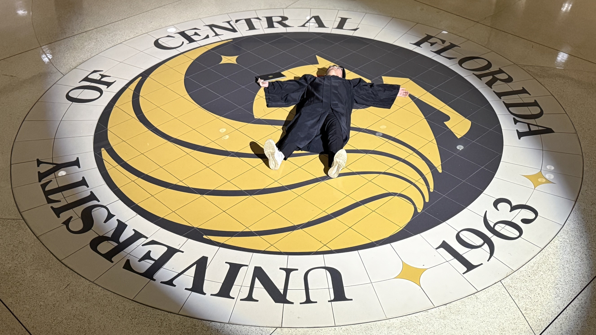
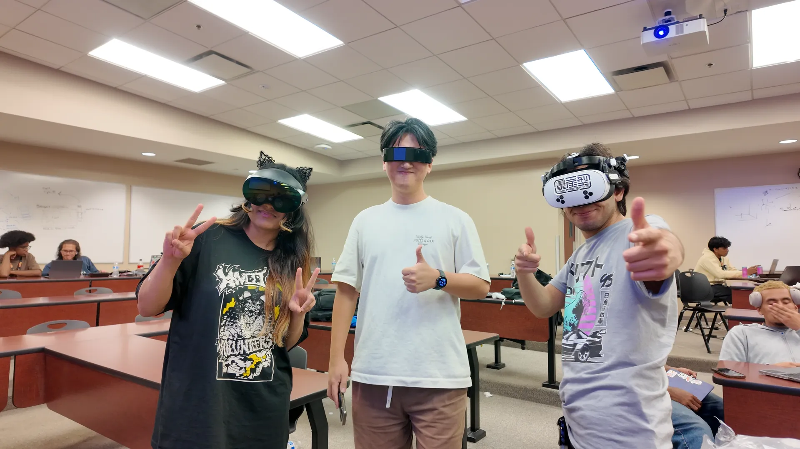
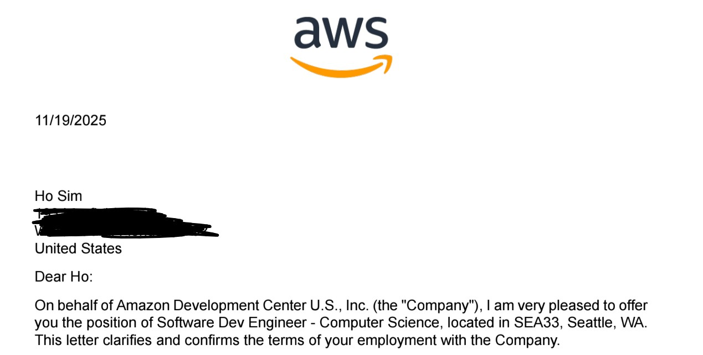
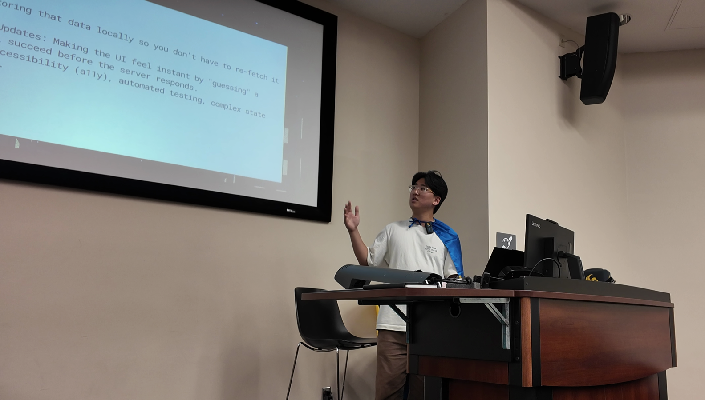
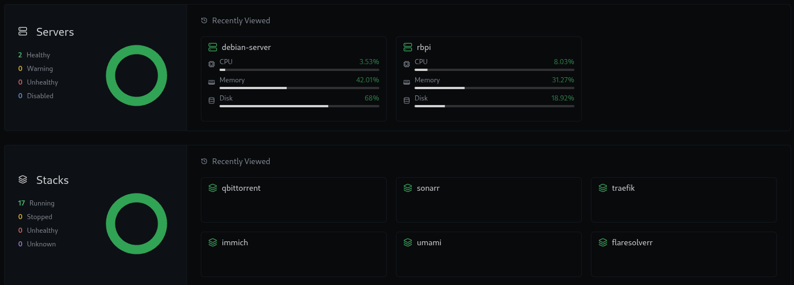
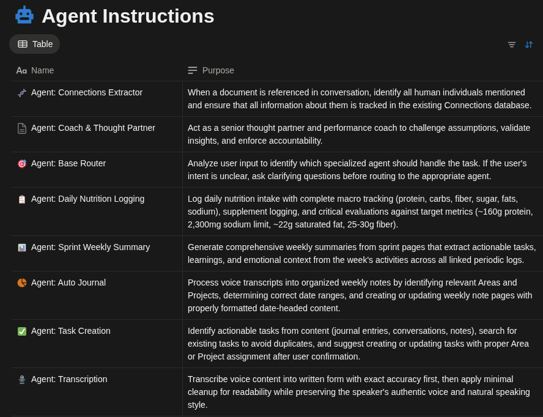
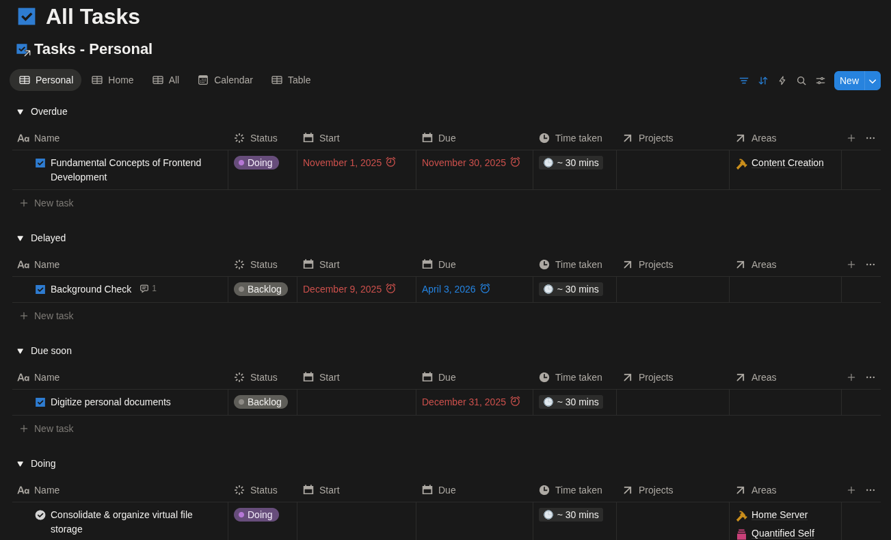
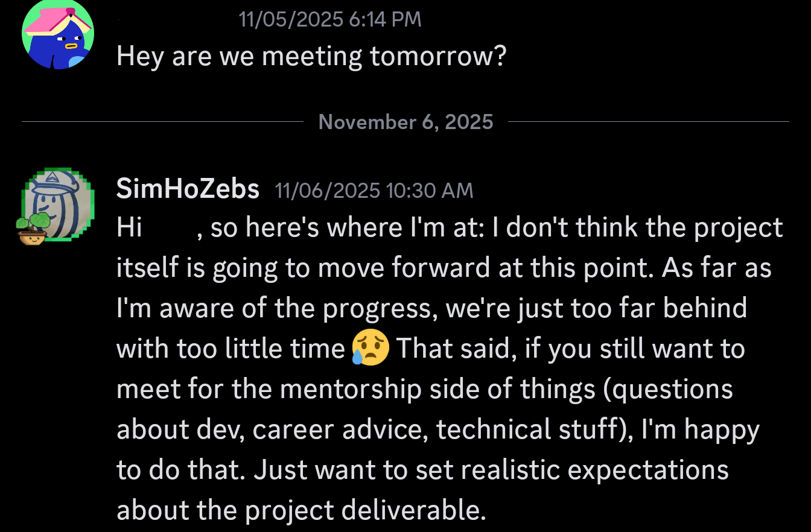
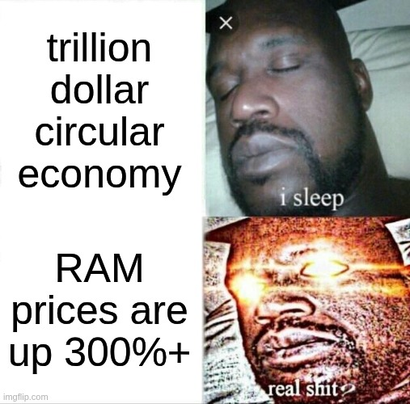

> [!Note]
> T3 is a period of time from September 1st to December 31st. As with all Review & Plans, the post primarily details learnings, achievements, and feelings. I'm not here to share specific events and experiences unless they're critical for context.
>
> Additionally, starting in 2026, I'll be using a quarterly system instead of trimesters.

## Education

After 26 years of becoming, I am finally done with formal education. Goodbye Canvas, goodbye Handshake, and goodbye Sheets/Docs/Slides. You will not be missed.

Part of me is proud of my achievements here at UCF. I passed the Foundation Exam [with the second highest score despite its historically low pass rate](content/blogs/Reviews&Planning/2024%20Reflection%20&%202025%20Goals.md). I consistently made it to the Dean's/President's List, and I didn't even put special effort for that.

I'm not trying to boast that I'm smarter than others or whatever. Because I'm no one exceptional. I also never had major complications or events that hindered my education, and I recognize that privilege. But still, I think the standard for an average student is too low. At least for god sake, I shouldn't be teaching seniors how to generate SSH keys to authenticate to GitHub. With AI already being competent enough to one-shot assignments, I'm afraid that things are going to get worse.

I'm a bit frustrated at how pointless the education felt. I only truly enjoyed three classes: data structures and algorithms, intro to cyber security, and computer architecture. They genuinely opened my eyes to new concepts, entertained me through the lectures, and pushed me put in good effort to understand them better. The rest, however, were slow-paced studies of concepts I already knew. I rarely felt the need to go to class because, even for concepts that were new to me, I learned them much faster just by reading/watching videos online. They would typically cover substantial number of concepts, which I appreciated, yet the exams rarely tested your ability to implement them into scenarios, but instead your ability to memorize them.

KnightHacks 2025

I'm not surprised that I feel this way. I knew from the start that the true value of college comes from the connections you make and doing activities with the people in the campus. Smart and motivated people find ways to learn more and achieve incredible things, and that's certainly happening in University of Central Florida. I regret not working with them enough.

I'm never going to be an undergrad student again; I feel like I missed out on experiences and connections that could've made big differences in my life. I wish I involved myself with clubs more. I wish I tried serious undergrad research. I wish I formed strong relationships with people with similar interests. I wish there was something to miss about leaving school.

To be clear, I _did_ involve myself with a club for around two years: [KnightHacks](https://club.knighthacks.org/). I served as a mentor for their programs and hackathons. I just wish I tried to join their dev team, or pick up an officer role, or do more workshops. [I did participate in undergrad research](content/blogs/Reviews&Planning/2023%20Reflection%20&%202024%20Goals.md). But I wish I worked on something where I really learned something; work in a really cool problem space, like in computer architecture or embedded systems. And yes, I did make friends and acquaintances that heavily impacted my career and brought joy throughout college. They just never became someone whom I could comfortably chat up on Discord and play games with.

Alright, I'm done with the negative sentiment. Even if the education itself felt lackluster, I am very, very proud of my achievements _during_ my education. My successful translation freelance business that kept me afloat since 2022; Two wins at hackathons in 2023; two different entry-level professional software engineering positions in 2024; and a successful internship at Big Tech this year. Luck has played a significant role, but these opportunities and successes wouldn't have existed without my time and passion. 

While I have no plans to pursue a Master's degree yet, *learning* never stops as a software engineer. Part of my hobby is reading technical blogs/articles already, where I continue to learn insights from others' experience. There are [a handful of Computer Science books](https://teachyourselfcs.com/) I want to read over time, starting with Designing Data-Intensive Applications. No particular reason other than the fact that I have a physical copy.
## Career

I'm happy to announce that I'll be returning to my team at AWS!

This wasn't a given, **especially** with recent layoffs from the company. The job market is clearly not in its best shape, and honestly, the full-time search wasn't going great. I've heard back from **zero** companies, excluding OAs. The only company I was moving forward with was the one I interned for previously. I can't believe I had to [boof them](2025%20T1%20Review.md#Finalizing%20my%20internship%20at%20SRAM) a second time.

To be clear, I don't attribute the lackluster job search on the economy. I haven't done enough to feel that way. I submitted fewer than 200 applications over the 3 months, and I did not study LeetCode enough to pass potential OAs. I even straight up missed some deadlines because I pushed them aside for too long. I missed my school's career fair for a driver's license test. I competed in ShellHacks, focusing too much on the project but barely any time interacting with the sponsors. Same for KnightHacks. I somehow actively betted on getting this return offer while knowing that I shouldn't.

There have been minor achievements, like getting on Walmart's SWE hire priority list, and I'm not discounting past efforts that led to this successful outcome. But I can't proudly say that I have done enough this trimester to make a difference. In fact, it is quite embarrassing knowing the dire situation I was in without matching it with equivalent action.

With that said, the end result is still worth celebrating. I'm in a position that I could only dream of 4 years ago. Not specifically working for AWS or building Java microservices, but being recognized for my software engineering talent and being sufficiently compensated for a skill I learned out of love. It's a massive privilege, and I'm happy to have earned it.

What's more amazing than all of this is how much I'm going to make. $185,000 total compensation; I can't even put into words how life-changing that is for me. There's a little part of me worried that something is going to happen and keep me in poverty like I always have been. I'm not here lay out a sob story on how poor I grew up, but there's a reason why I love Korea's social benefits system. I have a long way to go before I reach financial independence, let alone support my family, but this is an absolutely amazing start.

I won't be starting until the 2026 Q2, so there's not much to plan career-wise for Q1. I'll be focusing on identifying a place to live and moving my belongings there. Start of a new life!

## Personal Projects

### Building Apps

My ShellHacks team built [LazyFood](content/projects/LazyFood.mdx) based on my [experience tracking my diet last trimester](content/blogs/Reviews&Planning/2025%20T2%20Review%20&%20T3%20Plans.md#Health). We didn't win anything, but it validated the idea enough for me to start building it into a fully fledged mobile application on my own. I made more conscious architectural and technological decisions, including a shift from a Python backend into Go. This was to learn the language in the process and, out of everything I've been doing for the project, that's been the most successful part so far. I learned a lot about the language and more reasons to believe that it is a superior to many other languages in terms of its design.

I made significant improvements to [Nedon](../../projects/Nedon.md) without adding major features. Upgrading all packages and missing environment variables bombarded me with over 200 errors, so I modernized the codebase, made the components more modular and resilient, and identified better patterns to enforce the strict type safety without using a zod schema generator. It was a satisfying cleanup after a long break from web development.

But after that, I deliberately put it on hold to focus on LazyFood (now called Mugo). Mugo's scope was just way smaller and manageable to create an MVP by the end of the trimester. Unfortunately, the little work I've done doesn't even match the features of the hackathon version.

These lackluster results still do no good to prove that I can complete a project outside of a hackathon. I'm more disappointment than usual, as I didn't have a major time investment like a job or school work. This and the coming quarter are the only time frame where I'll have the most free time to build something cool completely - and I can't keep wasting it. 

For 2026 Q1, my major focus will be on creating an MVP of Mugo and publishing it on the Play Store.

### Content Creation

[Intro to Frontend Workshop](https://youtu.be/7Sc1IWrQQys)

I made one video this trimester - 3 short of my plan. And it wasn't really planned either; I just happened to record the workshop I gave during KnightHacks 2025. This just didn't get prioritized over the job search, building something, and writing a blog. I find it difficult to balance the justification between actively building with my talent and creating content to share the the talent directly. Both contribute to my desire to prove my intellectual value, but the former tends to feel like the more meaningful way to achieve it. The problem with software development is that it takes much more time to get a result and the growing fear that I'm not actually capable of completing a project doesn't help. Content creation kind of feels like trying to be a Biology teacher because I couldn't handle advanced research. No shade to Bio teachers, you guys are great.

And yeah, I know. I just need to organize my schedule in such a way that allows me to pursue both. I have to figure out what that looks like for next year.

I also tried to make my website actually appear on search results. That involved 1. making Google Search Console happy and 2. convincing people to click on my links from other websites. My [first Hacker News post](https://news.ycombinator.com/item?id=45808100) got nowhere. Not a priority and it'll grow naturally as I make more useful content.

For 2026 Q1, I plan to make one video, possibly this very blog post. I'm deliberately avoiding to commit to more videos as I want to focus on building Mugo and other plans.

### Home Server

Komodo dashboard

One of T3's successful projects was with Home Server improvements. I completely overhauled its architecture with new services, like Komodo, Traefik (replacing NGINX), Infisical, and a few more, including a handful of \*Arr services. I got a new router with OpenWRT, and upgraded my media encoder to Intel's ARC A380! Amazon S3 is now part of the stack, as it has become the core to the disaster recovery strategy for all the images and videos stored by my family and me.

The primary goal behind all this work was to improve maintainability, reliability, and catastrophe resilience. I experienced an accidental "data loss" at the start of this trimester, throwing me into panic at the idea that all of the priceless data were gone forever. Thankfully, it turned out that my services simply detached from their previous volumes when I renamed their folders, as I hadn't explicitly named my docker compose project name. So while I didn't lose anything, it was a wake up call to set up measures before it really happens in the future.

The only thing that's recoverable at all are images and videos at the moment; no services have a back up. I have plans to make my system even more resilient in the future, but they will not be for 2026 Q1.

## Workspace

I am now dual-booting Fedora alongside Windows with the goal to replace Windows entirely. This wasn't my first attempt, but it was the first with the help of AI chatbots, which made the process significantly easier. Bazzite, CachyOS, Linux Mint, Pop!\_OS, or other more user friendly flavors may have given me an easier time, I wanted to start somewhere in the middle: not too minimal that setting up my OS is the project (looking at Gentoo, Arch, Nix), but also avoid unnecessary drivers and packages for my specific system.

I ran into problems that were universal to Linux. To list a few:
- KakaoTalk (Korea's major chat platform) runs through Wine, but its notifications don't pass through very well. 
- I used Outlook Desktop was because it was the only desktop email reader that supported my school email, but I guess now I can use ThunderBird.
- There's no replacement for Figma Desktop or Notion Calendar. I have to use their webapp instead. Blows my fucking mind, considering their desktop app is literally built on a framework for **CROSS PLATFORM DEVELOPMENT**
- Davinci Resolve doesn't support major codecs on free tier.
- I'm still struggling to make Brave Browser use WebGPU without breaking hardware acceleration for decoding HEVC.
- NetworkManager gets confused when I have wired internet access and wifi at the same time. I don't understand why it doesn't prioritize wired by default.
- Gaming experience is a mix of "holy shit that just works?" and "Linux gaming is not there yet".

But despite these issues, this migration made me incredibly appreciate the amount of thankless work people have put into everything to make the experience more and more user friendly and seamless coming from Windows. The amount of engineering that's gone into making Wayland work, translate Windows calls to Linux, make universal apps through AppImages and Flatpaks, and all the desktop environments and flavors, is beyond my comprehension. We really are standing on the shoulders of giants.

### Second Brain

I ended T2 with a disconnected system based on Notion and Obsidian. I appreciated the privacy benefits of Obsidian, but it was nowhere close to the automations and data visualization possible with Notion. Unfortunately, AnyType did not qualify as a meaningful replacement for any of the two after thorough testing. I also looked into other projects, like AppFlowy and Plane, but they lacked critical features that's been a staple in Notion. It _is_ possible to use specific tools and build glues to make them interoperate, instead of trying to find an all-in-one tool, but I didn't want to do such work before having a system I know that works over a long term.

With that, I'm back to running the system completely through Notion. Yes, I am sacrificing privacy on the most personal aspects, but the convenience is just unmatched.

So what changed? This system is definitely due for its own blog post, but the key improvement is in automation. AI helps me stay on track with my tasks by making it remind me every *review* session. I now simply brain dump with speech-to-text and let the agent do its thing. It gets things correct 80% of the time and significantly lowers the hurdle to interact with the system. This allows me to semi-automatically create & update tasks, notes, and other set of databases I maintain, such as my network/relationships, and books. I also use it to generate summaries for some pages for future me to refer to, instead of having to read the entire thing.

I'm not trying to sell you on Notion AI; it just so happens that the best use case for large language models are for, unsurprisingly, processing language, and a Second Brain system revolves around it.

Another improvement is in visualization. My task database now tells me when a task is overdue, delayed, due soon, doing, planned, and blocked based on a set of rules. I can also see if I made any updates to specific projects and other areas of responsibility to make sure that I address them before the end of the week. 

So far, this is the most I've engaged with the system, and I'm optimistic that there won't be any major changes in the near future. I still struggle to actually engage with the tasks as the work was never a solution to procrastination and lack of motivation (it's good at exposing it, though). Making calls and convincing my weird cats to the vet isn't as easy as writing a blog post. I'm not exactly sure how I'll improve myself to do better there.

## Health

A new enemy was recognized in T3: sodium and trans/saturated fats. Its only now come to my attention I've been consuming way too much of them. There's little benefit to hitting 150g+ protein daily if I'm slowly, but irreversibly, clogging my blood vessels at the same time.

It's a hard battle, though. There's rarely any restaurant that doesn't douse your food in some kind of cheese, salt, or some other sauce. If they don't, it's sliced up unseasoned chicken with rice and veggies. Something I could just cook at home if I wasn't so damn lazy! There's been a few weeks where I've let myself loose because I found it too annoying. Buying a meal is much simpler than realizing I should've defrosted the chicken breast overnight or to preheat the oven before baking for 35 minutes. In fact, I've gone the last two weeks eating on average 2 meals a day; I don't remember the last time I've done that.

I'm still trying to figure out a good set of meals that makes it easier for me to eat healthy. I really need to get into the habit of meal prepping. In fact, I plan to have an average of 5 meals planned per week by getting into the habit of planning the day before.

Me over a year

I am the heaviest I've ever been: 88 kg (194 lbs). I can't believe I've reached a point in life where I have to actually watch my weight. I don't know if I'm making it up, but my knee feels weaker than it should be. I added tibialis raises to my workout routine.

I went to the gym 20 times this trimester. That's just over once a week, which is better than 2025 T1, but worse than T2. The key difference is in having an equally motivated partner - sorry Jen, but it's true. For 2026 Q1, I plan to bring it back up to an average of two visits a week by being more independent and proactive.

## Family

T3 has been one of the best time frames for my family. I got to fly my mom out to a country - a continent - she's never been to. I was happy my siblings got to experience a very different city in the US and seeing all of them very much enjoy the international tourist attractions like Disney World and Kennedy Space Center, and another Twenty One Pilots concert that happened much sooner than any of us expected. I finally can check off "Lead an overseas family trip" from my bucket list.

Gaming has become an even more important medium for connecting with my family ever since I moved out of the country over 3 years ago, and that's been going strong as well. We continue to play PEAK time to time, and I've been playing ARC Raiders and Build 42 of Project Zomboid with my brother. He and I have beaten all everdark variants in Nightreign except Equilibrious Beast, which feels impossible as a duo. I hope to set something up for the four of us to play Baldur's Gate 3 next year.

In 2026 Q1, I plan to establish a more regular call schedule with my family and provide anything I can to make the experience seamless. I'm eyeing once a week as a group. They're annoyingly terrible at this, so it's up to me to convince them to a similar level of expectations.

## Dreams vs. Reality

I have a complex relationship with entertainment - I know it's integral to my wellbeing, but it's difficult to justify spending time on it when I could be building something meaningful instead. I beat myself up, thinking that the only reason I'm even considering entertainment is because I don't have it hard enough. It feels like I'm proving the mismatch between my desire to make the world a better place and the immense effort required to make that a reality. I say I don't want to end up as nothing but a dreamer, but at the same time, I'm sitting here wondering if I should queue up for another game of League.

I want to say there's a balance in all things, and to a certain extent, that's true. But whenever I see someone making a difference, it typically comes from immense effort. Look at Jarred Sumners. 10+ hours a day for a year? I'm not saying anyone has to be like him. I'm saying we can't even *be* him if we tried, because effort doesn't always lead to success. And yet, I'm not even putting 50% of my free time to make something happen. Forget being like Jarred Sumners - I can't even be slightly above average.

On the other hand, I do recognize that I've been rightfully prioritizing financial stability. Yes, I agree [people should take risks when they're young](https://blog.nateliason.com/p/dont-waste-your-20s-not-taking-big), but unlike the writer, failure doesn't mean coming back to where I started. I don't have that kind of safety net and I'm headed to build a strong one quickly.

## Being an influence

I'm not talking about being a social media influencer in the generally understood definition. This is a reflection of my ability to convince and motivate people around me.

I enjoy taking leadership roles. In many situations, I'm confident that I'm the most knowledgeable person in the room, and even if I'm not, I want to be the one orchestrates the flow of information into correct decisions. Just like everyone, I want to know what is right, do what I think is right, and I want the power to do so. I do not like being a cog in a wheel.

This is why I volunteered as a mentor at KnightHacks this semester as well. It is also why I do what I do within my family, especially providing support in career development and health.

But honestly, I'm quite frustrated with my experiences in such roles. I lack the charisma, it seems. Whether it is with my family or with designated mentees, I fail to motivate others to do their part like it's what they want to do. I can micromanage them to get things done, but it's so hard to get over that threshold where they believe in the idea and act first. What am I supposed to do? What am I doing wrong? How much is it the fault of working with the wrong people?

I want to be better at this. I want to make people do what I want them to do, without them feeling like I'm forcing them. Not brainwash them, but make them believe in the mission. Convince others to lead with me.

## World Events

### AI

I believe that the AI Bubble is real. Some say otherwise, that these insane investments have genuine return, but I don't buy it. People always overestimate or underestimate; they're never just right. This means, yes, I'm also worried about how it's going to impact me financially. I have no idea if my offer will be rescinded [before I even start](https://www.reddit.com/r/amazonemployees/comments/1ptkojn/why_january_layoffs/), or find myself kicked into the job market within the year.

I've been feeling like billionaires are trying *really* hard to make us believe we must be reliant on AI technologies. Like they want us to forget how to function without AI. They tried to build something to replace workers, realized it's nowhere close, and now telling us that work can't be productive without one.

Towards the end of my internship at Amazon, I felt more productive *not* using AI for generating code. Learning Go and Google's ADK? I used AI to aid search, not as the source of truth. I felt more confident and connected to the codebase than the lines of code I generated with AI. **AI feels good as a helper, not the worker, as long as humans are still involved in the loop**.

Contrary to above, I'm not anti-AI. In fact, I always saw myself working with AI in some capacity [since 2020](../Software%20Dev%20Log/Software%20Dev%20Log%204.md#D.%20The%20Rest) - years before the ChatGPT moment. AI agents have enabled me to get things done much faster. I'm just not buying the delusions and the products being shoved at our face.

### Consumer Goods

It feels like it gets more challenging every day to find a product that provides genuine value without constantly siphoning every drop of value they can extract out of me. When I bought Blu-Rays of a movie, I owned it. When I buy a physical copy of a book, I own it. But god forbid I can own my games, my car, my Nintendo Switch, and the fucking camera I paid for. 

So many software and technology seem to provide bare minimum functionality with little stability so they can serve their true purpose: data collection. I'm so sick of it. I'm gonna build my own shit sooner or later.

### Reality vs. Belief

More and more, I think there is a gap between what people want to believe and what reality is. People like trusting people more than facts because the former finds you and comforts you whereas the latter must be discovered and may be uncomfortable and boring. I'll talk more about this in the future, but I'm starting to realize some major problems that arise within social media that I think I have the solution for.

---

If you reached here, congrats, you've read the longest Review & Plan to date. Please let me know and I'll buy you two candies of your choosing.