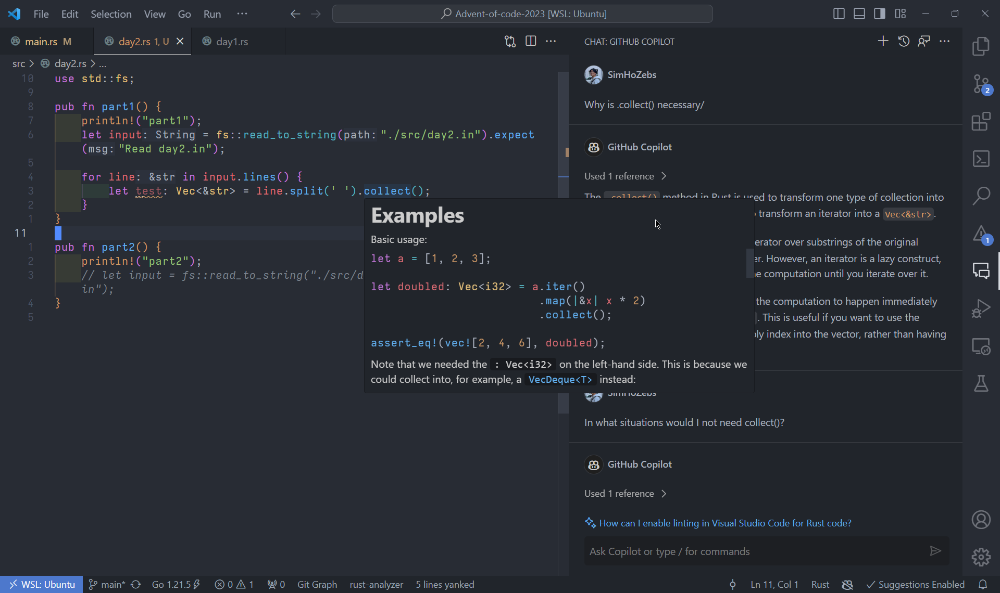

Alternate title: JS dev shocked to learn Rust is indeed a low-level language

Rust is the 5th language I'm learning seriously. First was Python, then C#, JavaScript/TypeScript, and C. I've dabbled with Java, and wrote a bit of Lua, but not enough to say I know them. But throughout all these years, no language has blown my mind as much as Rust has, and I'm just getting started.

## Why am I learning Rust?

Go was a consideration. I heard a lot about its simplicity and great performance despite being a garbage-collector language. It's also a very popular language for backend development, meaning there are clear ways to implement it in my existing and/or future projects. I read about its concurrency model, and comparing it to JS's Promises, it's quite attractive.


Alas, Rust is admired much more than Go.

But ultimately, I'm learning Rust because it seems fun! TypeScript made me realize how important types are, but C made me REALLY realize how important types are, and how satisfying it is to have control over my code. It now kind of pains me to know that the 257 item array I created in JS is a linked list with 512 nodes instead of a fixed length, integer array. _Yes_, it doesn't really matter in the real world, and JS provides far superior iteration speed in most cases. But that doesn't change the fact that I like to have control when I can.

I'd hate to shoot myself in the foot with C with memory leaks as much as I already did in school programming assignments. Since there is no memory management in Rust, I _should_ be able to enjoy all the things I enjoy!

But of course, I'm aware the language isn't without flaws. I know that the ownership-borrow architecture is a struggle on its own and that its iteration speed is considered to be slower compared to simpler languages. And as someone who's mainly building personal web applications, Rust doesn't significantly improve my tech stack.

Still, I'm learning Rust instead of Go because I think it'll take longer to learn Rust. Based on popular opinions, I should be able to pick up Go quite quickly if I ever want to.

I also have some projects in mind that would make use of it as well. I'm expecting to get a Raspberry Pi 4B for Christmas, which I'll use to build a home server. I know we are going to have less than 5 people accessing it at a time, but building it to be efficient would help me learn a lot.

With the intro out of the way, here's a growing list of things that I learned in Rust and have comments on.

> [!Note]
> All the features I'm talking about may exist in other languages or in the languages I think I know very well, but unaware of. I'd love to know them, so feel free to contact me [@SimHoZebs](https://twitter.com/SimHoZebs) about it.

## The Great
### rust-analyzer



This isn't exactly about the language itself, but language support on editors is now a basic expectations in modern-day programming languages. But Rust sets itself apart from others with thorough, ultra-specific messages. As a learner, I feel gifted whenever I hover over a new method and see incredible examples. Paired with ChatGPT and coding problems, I don't need to watch hour-long tutorials to learn the language. This isn't something you easily find in JS/TS, nor Python.

Oh, and the error messages. Rust compiler doesn't just tell you what and where the error is - it tells you what you might want to do to fix it too. Why can't we have this for every language?

### `Result<T>` and `Option<T>`

File systems can crash. Type conversion may fail, and not all `char` can convert to an integer. JS/TS doesn't care whether that happens; it's up to you to wrap it with a `try/catch` clause.

```js
let char = "k";

//this crashes the program. Up to the dev to recognize it, which is unnecessary cognitive load.
parseInt(char, 10);

try {
  let intValue = parseInt(char, 10);
  if (isNaN(intValue)) {
    throw new Error("Conversion failed: Not a number");
  }
  return intValue;
} catch (error) {
  console.error("Error:", error.message);
  return null;
}
```

With `Result<T>` and `Option<T>`, you can't access the outcome of a function without handling the error it might return.

```rust
let char = 'k';

// MUST unwrap the type and handle potential error. This defaults to 0 on error.
let foo = char.parse::<u32>().unwrap_or(0);
```

I love that Rust makes me handle errors when they may happen, instead of being weirdly optimistic like JS/TS.
### `string.split()`

`.split()` doesn't create an array.

Yeah, `let foo = string.split(' ')`, doesn't make `foo` an array of char or substrings. `.split()` makes `string` an iterator which allows the program to walk through the string only **as much as you need to**.

That might not make much sense, so let's consider the following string:

```rust
string = "Hey guys what's going on and welcome to my minecraft video and today we are going to build a cobblestone generator"
```

In JS, `string.split(' ')` would create an array of strings as so:

```js
const array = string.split(' ');

//array
["Hey", "guys", "what's", "going", "on", "and", "welcome", "to", "my", "minecraft", "video", ..., "generator"]
```

If our goal is to _solely_ find the word "minecraft", we don't necessarily want this array taking up space in our memory. What we want is to simply iterate over the words on the original string until we hit the word "minecraft". We don't need the rest of the string to split. In this scenario, Javascript does unnecessary computation.

> [!note]
> This is intentionally a bad example to explain how `split()` works in Rust - I am aware that you can do the same with Javascript.

With Rust, you can iterate over string without creating a new array, only until you need to:

```rust
for word in string.split(' '){
	if word == "minecraft"{
		println!("found the word!");
		break;
	}
}
```

You can explicitly split everything with `split().collect()`, but unlike JS/TS, the returned array does not contain new copies of these strings. The array simply stores references (pointers) to the start of each substring. This means the following is impossible:

```rust
let array = string.replace("guys", "people").split(' ');
//the above doesn't work because the string the split occurred on no longer exists after the operation.
```

### `String`

C taught me that a string is a contiguous array of `char`s, where a `char` is a 1 byte ASCII character. Since the size of each character is fixed, the program can pinpoint exactly where a character is located in the memory; the string is **iterable**.

```js
//JS
let string = "Hello World!";
let character = string[0]; //"H"
```

Not in Rust! Here, characters are encoded in UTF-8, meaning they may be 1 to 4 bytes in size. This variability makes it impossible to locate a specific character's position in a string in memory. Instead, the string must be decoded to have each character as a fixed size of 4 bytes before they can be accessed by index. This converts `String` to a `Vec<char>` - a data type we are more familiar with.

```rust
//Rust
let string = "Hello World!";
let character = string[0];   //Error!

let character = string.chars().collect::<Vec<char>>()[0];    //"H";
```

This got me wondering: how does Rust know where a character starts in memory, then? Turns out, each character stores information about their size in the leading bits of the first byte.

> - Single-byte character: The letter 'A' is represented as `0x41` in hexadecimal or `01000001` in binary.
> - Multi-byte character: The Greek letter 'Ω' (Omega) is represented as `0xCE 0xA9` in hexadecimal or `11001110 10101001` in binary. This is a two-byte character. The first byte `11001110` indicates that it's a two-byte character (since it starts with `110`), and the second byte `10101001` is a continuation byte (since it starts with `10`).

\- ChatGPT

In a sense, Rust _could_ technically iterate over a string with the information above, but I'm guessing doing that on function call might be less performant than jumping a fixed number of bytes.

## The Weird
## Implicit return

```rust
fn why(){
	some_fn_that_returns_smth()
}
```

Running `why()` returns the value of `some_fn_that_returns_smth()`.

```rust
fn why(){
	some_fn_that_returns_smth();
}
```

Here, `why()` returns nothing.

Who in the right mind thought this was necessary?

### `if let`

```rust
let char = 'k';

let foo = if let Some(digit) = char.to_digit(10) {
	digit
} else {
	//more logic here
	0
};
```

When I first saw this syntax, I was like, "How the hell does this even make sense?"

`if let` is a statement that assigns a variable a value if the condition is true; and when the condition is true, run the lines in its curly brace.

Functionally, it's the same as the `unwarp_or()` snippet I showed previously, but this syntax allows a more complex logic to be implemented in the process of assigning a fallback value. But to translate the steps in English, it's:

- `let foo =`: `foo` should be a value. What should the value be?
- `char.to_digit(10)`: Well, let's look ahead. The function call `char.to_digit()` returns `Option<Some<u32>, None>` (It's either some value that's an unsigned 32bit integer or None). 
- `if let Some(digit) = char.to_digit(10)`: Let's call the return value `digit`. Check if it is a of type `Some` with `Some()` If it is, then the value is true, running the `if` block of the code (implicitly returning `digit`) Otherwise, return `0`.

It's a lot and kind of confusing, but I guess being able to conditionally initialize a variable is useful? I would never use it for error handling, at the least, because there are better options.
## Error handling shenanigans

We just covered two ways we can implement fallback values; `unwrap_or()`, and for more complex logic, with the `if let` pattern. While I absolutely adore explicit error handling, I feel like Rust makes it easy for beginners to implement unnecessarily verbose and less readable approach.

Let's use File System as an example. We are going to build a function that accepts a path as a string and return all files within the directory as a list of strings (`Vec<String>`). This is actually something I was trying to build for a project, so I asked some LLMs for help, since - unlike the integer conversion examples we looked at earlier - when a file doesn't exist at a given path, there isn't really a *fallback* value to use.

```rust
use std::fs;

//Generated by GPT-4.1
fn list_files_in_directory(path: String) -> Result<Vec<String>, String> {
    let entries = fs::read_dir(&path)
        .map_err(|e| e.to_string())?
        .filter_map(|entry| entry.ok())
        .filter_map(|entry| {
            let file_type = entry.file_type().ok()?;
            if file_type.is_file() {
                Some(entry.file_name().to_string_lossy().to_string())
            } else {
                None
            }
        })
        .collect();
    Ok(entries)
}
```

Let's walk through the code.
- `fs::read_dir(&path)` Pretty straight forward. Read the contents of the directory in the given path. This can error, since the path could be invalid, restricted privileges, etc. Hence, this function returns `Result<T,E>`.
- `.map_err(|e| e.to_string())?` Well, what should we do with the error? Let's just call it `e`, convert it to a string. Have the function throw an error and exit (the `?` syntax).

In this case, this works fine. The function will return `Result` instead of a value and require the consumer to handle the error. Quite similar to `throw`. It doesn't hide the error cases from the consumer and provides them the flexibility to behave however it seems fit.

But what if I'm modifying a function that never returned `Result`? Adding `?` requires every consumer to change their implementation to handle the error. What if its an error that you shouldn't be deferring to the consumer and should handle within the function?


```rust
use std::fs;
use std::path::Path;

fn list_files_in_directory(path: String) -> Result<Vec<String>, String> {
	let path = Path::new(&path);  //convert string input to Path
    let mut files = Vec::new();  //Store for file names

    match fs::read_dir(path) {
        Ok(entries) => {
            for entry in entries {
                match entry {
                    Ok(dir_entry) => {
                        if let Ok(file_type) = dir_entry.file_type() {
                            if file_type.is_file() {
                                files.push(dir_entry.file_name().to_string_lossy().to_string());
                            }
                        }
                    }
                    Err(e) => return Err(format!("Error reading entry: {}", e)),
                }
            }
            Ok(files)
        }
        Err(e) => Err(format!("Error reading directory: {}", e)),
    }
}
```

## Small things I learned from ChatGPT

#### `usize`

> `u32` and `usize` are both unsigned integer types in Rust, but they have different uses and sizes.
>
> `u32` is a 32-bit unsigned integer type. It can represent values from 0 to 4,294,967,295.
>
> `usize`, on the other hand, is an unsigned integer type whose size is determined by the architecture of the machine the program is running on. On a 32-bit architecture, `usize` is 32 bits, and on a 64-bit architecture, `usize` is 64 bits.

So on a 64bit architecture, it would be more efficient to use `u32` if we know that the variable's value is going to fit under 32 bits, correct?

> In terms of memory usage, a `u32` will indeed use less memory than a `usize` on a 64-bit architecture, because a `u32` is always 32 bits, while a `usize` is 64 bits on a 64-bit architecture.
>
> However, in terms of performance, the difference is usually negligible. Modern CPUs are optimized for their native word sizes (32 bits on a 32-bit CPU, 64 bits on a 64-bit CPU), so operations on `usize` can be faster than operations on `u32` on a 64-bit CPU, even though `usize` uses more memory.
>
> In general, you should use `usize` for sizes, lengths, and indices, because these need to be able to address the entire memory space. For other numbers that have a known range, you can use `u32`, `u16`, `u8`, etc. to save memory.

And that is all I have to say so far! This post will continue to update as I continue learning Rust (by solving [Advent of Code 2023](https://adventofcode.com)). Please feel free to share your thoughts by reaching out to me on [Twitter](https://twitter.com/simhozebs)