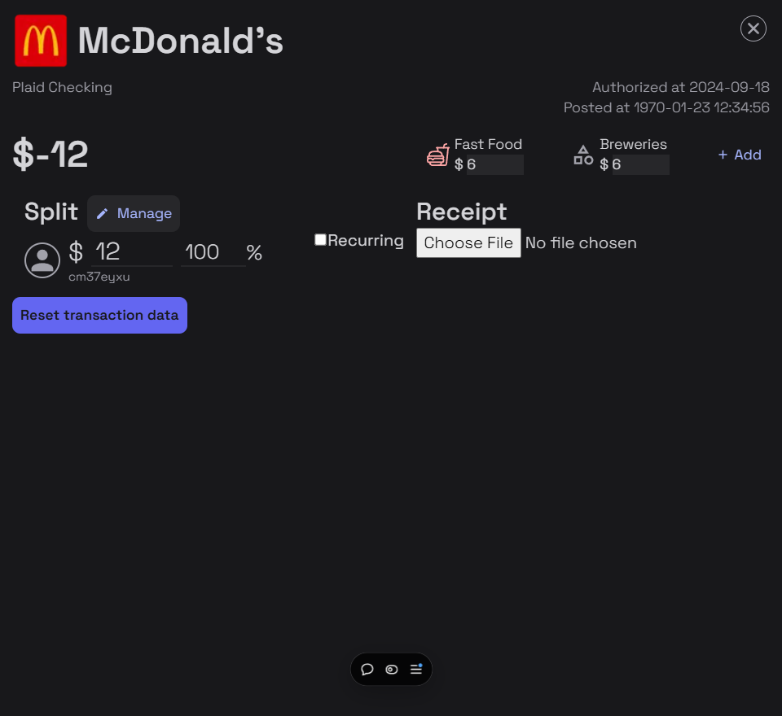
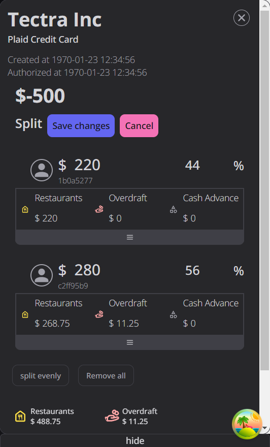
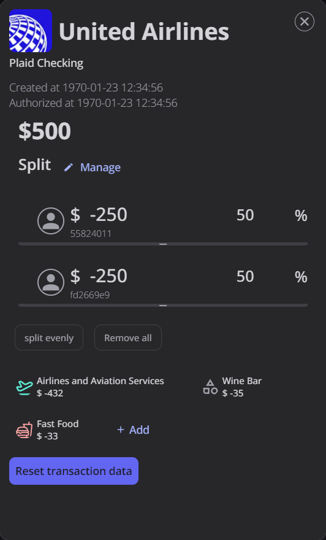

I often leave the store with more than just groceries. Perhaps a bit of toiletries, and sometimes school supplies. So when my budgeting app simply tells me my transaction is 'Grocery', the bar graphs and numbers they give me about my budget becomes useless.



[Nedon](../projects/Nedon.md), the financial budgeting app I've been building, lets users assign multiple categories to transactions to solve that exact problem. The above is a poor example, but you get the idea.

On the surface, the data structure implementation seems quite straight forward. Just have an array of category objects, and validate their sum based on the total spent.

```json
total: 12,
categories: [
	{
		name: "Fast Food",
		amount: 6
	},
	{
		name: "Breweries",
		amount: 6
	}
]
```

Cool! Now, let me introduce you to 'Splits'. This is another feature that let's users assign multiple users to a transaction so they can keep track of how much of the transaction is actually theirs.

Let's simply expand on the data structure we just made to accommodate Splits:

```json
total: 12,
categories: [
	{
		name: "Fast Food",
		amount: 6
	},
	{
		name: "Breweries",
		amount: 6
	}
]
splits: [
	{
		name: 'Jake',
		amount: 5
	},
	{
		name: 'Mike',
		amount: 7
	}
]
```

That works, right? But here's the question: how much did Jake spend on "Breweries"?

The only reasonable deduction that's possible from this data structure is that Jake spent \$$6 \times \frac{5}{12}$. But what if spent all $5 on it? What if Jake didn't spend on Fast Food in a fast food restaurant? _What if Jake was that insane?_

Because of this, Splits can't be separate from categories. We either need categories for each user, or splits for each category. For now, let's nest categories under split and see how that looks:

```js
total: 12,
splits: [
	{
		name: 'Jake',
		categories: [
			{
				name: "Fast Food",
				amount: 0
			},
			{
				name: "Breweries",
				amount: 5
			}
		]
	},
	{
		name: 'Mike',
		categories: [
			{
				name: "Fast Food",
				amount: 6
			},
			{
				name: "Breweries",
				amount: 1
			}
		]
	}
]
```

This way the data structure supports more accurate representation of a transaction. It's only slightly more work to find the total of each category, but it's nothing complicated at all.

## UI/UX

We know the problem and think we have a solution. How do we build the UI/UX of the feature stupidly intuitive?

Let's say Jake paid for this transaction. On Nedon, he would see $12 assigned all to himself and would intend to assign $6 to Mike and modify categories accordingly.

What's **very** important to note here is that the intent does that include 'adjusting my transaction to be $6' as well. That is expected

Just like every feature built in Nedon, it is important to understand the user intent at a given context.

Let's go back to Splits and Categories. We already covered why it makes sense to assign categories to each split instead of the transaction as a whole. But would the users care about that? Who is Nedon designed for?

First and foremost, Nedon is built **for me**. It's an expression of my frustration of budgeting apps that don't seem to account for sharing and splitting transactions. It's my shot at adding budgeting features that actually make sense to me. This app is my idea of the best personal finance management application.

Focus on the 'personal' finance management; My primary target isn't families who wants to track their budget together (it is on the roadmap) or for friend that share a home. The app simply _considers_ those aspects to accurately represent your **own** finance.

Why does this distinction matter? Well, let's build a UI based on the data structure we came up with above:


A toggle button under each user expands category values assigned to each split

It's not the best looking UI, but this lets users expand a box, see their categories, and modify them too! At first glance, there doesn't seem to be any critical UI/UX issue with this approach.

Now, imagine you are user `1b0a5277`. You decide user `c2ff95b9` actually spent $27 less on Restaurants. This may be because:

- They spent less in total, meaning you spent more either in
  - Restaurant
  - Overdraft
  - Cash Advance
  - Some combination of the above.
- They spent the same amount in total, but more on
  - Overdraft
  - Cash Advance
  - Some combination of the above.

We want to build app aims to identify the difference in these intentions to a certain extent because we want to make your life easier. For But it is impossible to tell which is their intention. Knowing it is important or we leave a lot manual work to the users (we will get into this later).
In the first case - which is what our example is about - we adjust every category's value based on the amount changed. If user `fd2` now has $27 less, we assign $27 less across both categories and $27 more for user `558`.

For the second case, we have to offer a UI that enables users to specifically adjust categories' values. In Nedon, you can pull a drop-down menu from each user to see how much they spent in each category and adjust them accordingly.

A different example transaction than previous screenshot because I reset the DB midway writing this post

Understanding users' intentions and expectations, and figuring out the most intuitive UI that compliments them was, and still is, an extreme challenge. We glossed over the simplest example, but now imagine what happens when a new category is added for the total transaction. What's that supposed to mean?

This leads us to one of the most challenging UX problem:

### Automatic value adjustment

When we changed the spending amount from $250 to $223 for user `fd2`, we expect user `558`'s amount to increase by $27 automatically.

This is very easy to implement as long as you know the user's intention. We already covered the intentions behind changing the total value, but we

Intuitively, you divide the amount reduced to the number of categories and reduce each category's value. Since there are two categories, $\$27 \div 2 =\$17.5$... so `fd2` now has $451.5 in Airline Services, and $21.5 in Wine Bar. Thank god 27 is divisible to within two decimal places!

But wait, we forgot to add another category! We actually spent $33 in a restaurant, giving this transaction a total of 3 categories. No worries, I'll manually reduce the value assigned in Airline Services by the amount. $\$465 - 33 = \$432$, leave Wine Bar category alone... and ta-da!



But wait, then how much did each user spend in each category? What happens when we add another user?
