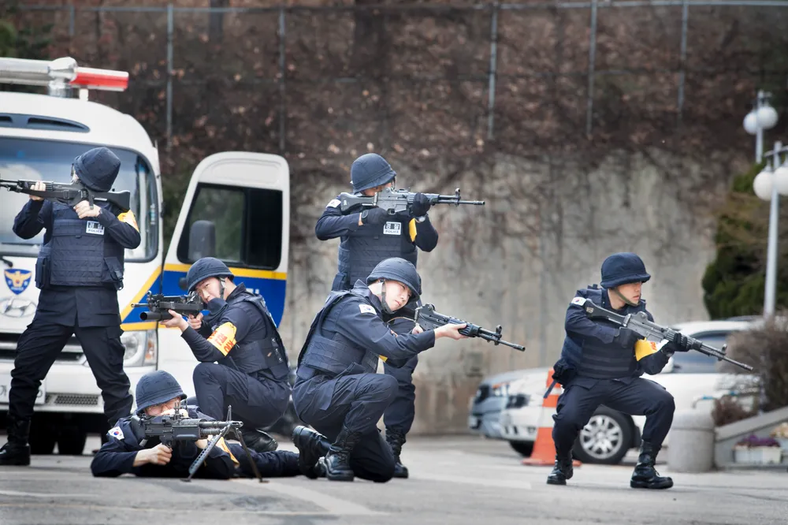

I served the South Korean Army through the Korean Augmentation to US Army (KATUSA) program as a 42A, G1, 19th Expeditionary Sustainment Command from February 11th 2020 to August 23rd 2021. Its been over 4 years since I walked out of the camp for the last time and my memories before it are getting less accurate every day. Alas, military service is something that lingers in your memory for a life time, especially when it also functionally serves as a prison.

I'm not going to act like I suffered through the most traumatic experiences nor made honorable sacrifice in my service. My time in the army was more relaxing, more comfortable, and more free than what majority of Koreans experienced. In fact, I feel alienated from most Koreans when they speak of their experience. It's also **NOTHING** close to what the heroes in modern war are experiencing. Most of us sit oceans and walls away from danger with enough freedom to complain about the lunch menu for the day.

But I'm also not going to act like I've made no sacrifice. 2 years is enough time for one to get through half a Bachelor's. In 2 years, I won awards in 2 hackathons, worked in 3 different organizations as a software engineer. I made more money in two months than I did throughout those 2 years - which wasn't hard, considering the Korean Army paid less than 50 cents an hour. My service hasn't changed anyone's life and nothing noone else could've done, but just as we thank firefighters for sitting in their post, I sure as *hell* sacrificed one of the most precious things to me in the name of national security.

With that said, let me share with you how my service was like. Well, before that, I *have* to talk about how we all got here, starting with the basis for mandatory military service.

The reason why all Korean men must serve the military is pretty simple: South Korea is technically still at war. It's been in an indefinite pause for the past 60 years, and this status enables my country to conscript civilians. There's a debate as to whether women should be included, especially considering the freefall of our population, but we are NOT going to discuss that here.

Conscripted policemen | [source](https://namu.wiki/w/%EA%B2%BD%EC%B0%B0%EC%B2%AD%20%EC%9D%98%EB%AC%B4%EA%B2%BD%EC%B0%B0)

Men are given some freedom to choose the type of service they'll serve for their given duration. One of the most popular choices is "conscripted policemen", mostly because they look like civilians and function directly within civilian areas instead of a military camp. However, our then president was progressively eliminating these 'auxiliary military services', and I had a much better choice: KATUSA.
 
Korean Augmentation to the United States Army program essentially provides the US Army with Korean soldiers they don't have to pay salaries and benefits to while treating them like US soldiers (with few key exceptions). To us, this means getting to sleep and eat the same meals, work and train in the same environment and same schedule as soldiers from a nation that spends 30% more on Defense than 144 nations combined.

Now, really think about how the work environment & living conditions would compare between the Korean military and of a nation that spends 30% more on Defense than 144 nations combined.

Naturally, the competition is quite fierce.

The army service has historically been 3 to 4 years long, but recent presidency pushed to gradually shortened it to be a year and a half (other branches have different service duration). For me, the first 5 weeks were training with the Korean Army, and another 4 weeks with the US Army before spending the rest within a US military base with KATUSA involvement.

- I don't remember the training duration
- Training was awful
	- Guns are so FUCKING LOUD
	- Holding grenades are the closest we would've come to death
- Bullying
- My mistakes (wearing parka)
- KATUSA training, and how I never felt closer to dying of suffocation

- meeting an old friend
- gym
- guard duty sucked so much
	- I got caught using my phone but my officer let me go lol
- Overnight duty was chill, I did some of them getting paid
- 
- conflict with roommate
	- I don't handle them very well
- conflict with those who wanted to enforce strictness vs. friendliness
- Long distance relationship
- Expected to excel, delivery mediocre results
- 6am workout every day. Only our team did this!
	- I would lie about having meetings to attend in the morning
- Office senior annoying
	- I don't remember what he did to annoy me so much, actually. It was something about pushing work to me and taking credit for it?
- Studying CS degree
	- Printed books secretly
- 