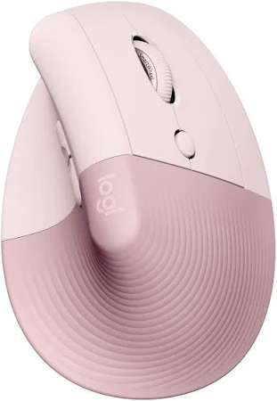
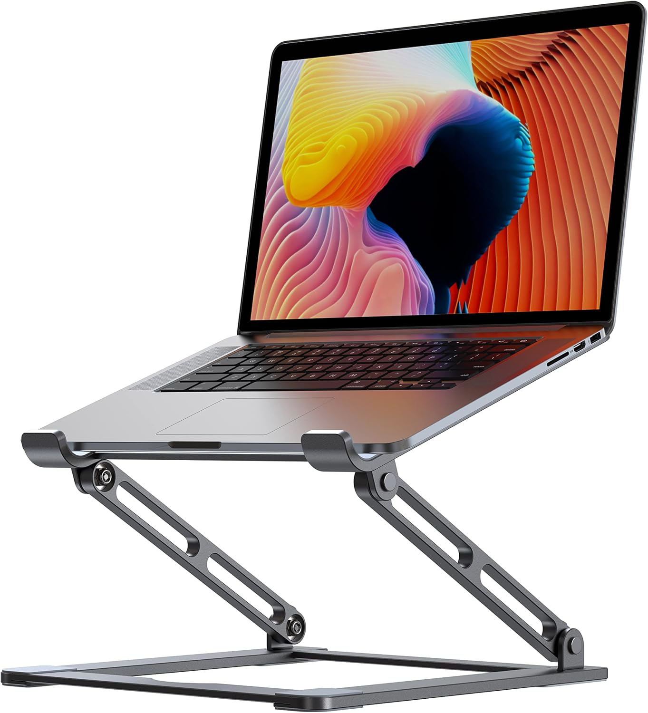
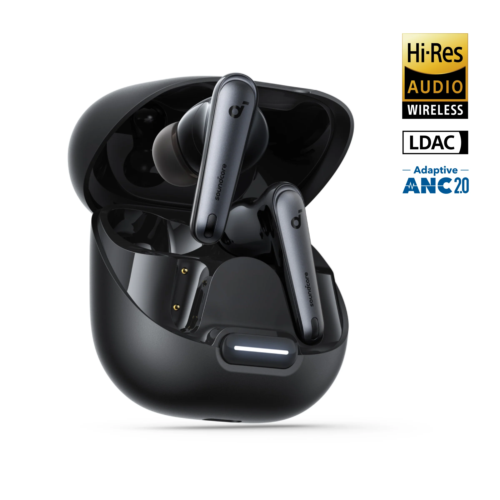

> [!Note]
> This is a script for a vlog. It's very much readable, but you may find some areas that flow awkwardly in writing.

Hi. I'm Simho, and this is what I carry to school and work.

## The Bag

The bag is _the_ backpack from Linus Tech Tips, costing around $250. That not the kind of money I would spend on a bag, but a certain lovely person got it for me as a Christmas gift back in 2023, and I've been loving it since. It has tons of features, for example, the laptop doesn't actually touch the physical bottom of the bag so it doesn't hit the ground as hard when you drop your bag down. It also has so many compartments and spacious

There are many other features as well, but one that I love the most is how comfortable it is on my shoulders. I don't know what science is behind this. It somehow sits comfortably and doesn't pull me down as much as other bags. I would give a more in-depth review, but there are other channels that has done them better than I can, so I highly recommend you check them out.

## The Laptop

The most important item in my bag is my laptop. It's the ASUS TUF Gaming A16 Advantage Edition. It's not the most portable thing in the world, but considering I don't have a separate desktop, this had to be a very capable machine. On top of its decent GPU and CPU, I upgraded it to have 3TB of storage with 32GBs of RAM so I can do pretty much all kinds of gaming, school work, and software development I need to do.

However, this is NOT a laptop I would recommend. The hinge is designed so poorly, many have reported it snapping, like mine did. I superglued mine together, because not only did ASUS Support implied that it isn't covered under warranty, but the day I contacted them, Gamer's Nexus exposed how terrible their warranty service is. They may have improved since then, but I don't trust them enough to contact support again.

I also have hardware issues with this computer. It fails to stay in sleep mode half the time and overheat inside my bag, draining all the battery. Sometimes it wouldn't boot for over thirty minutes, only then to ask for my BitLocker key. Sometimes it would freeze up during a gaming session. And sometimes, my GPU just goes undetected. Please do not buy this and share my suffering.

## The charger

For charging the laptop, I have UGREEN's 100W charger. My laptop supports up to 270W of charging through the barrel charging port, but it only supports up to 100W of USB-C charging. Being a Gallium-Nitride charger, this is much smaller than the laptop charger and perfect for on-the-go.

## Power bank

Now, there are many cases where I don't have a wall to plug into. This wouldn't be a concern if I had a Macbook, but until I make that switch, I carry this 92.5Wh power bank from INIU. That's right - 92.5Wh. That's enough to charge my laptop to completion and multiple phones several times. On top of that, it has a maximum output of 65W, which makes it perfect for charging my laptop during use.

## Mouse & Keyboard

With that, I have these two ergonomic peripherals. Or, three, if you consider the split.

The mouse is Lift Vertical Ergonomic Mouse from Logitech. This kind of mouse never occurred to me until I started feeling slight wrist strain from hours of playing Divinity Original Sin 2 and I've never gone back since then. I'm not a great FPS player, but I haven't felt any accuracy issues when compared to a classic mouse. It also supports quick switch between three devices, support low latency dongle connection and bluetooth connection, and the clicks are silent. There's actually nothing else I want more from it!

The keyboard is a self-assembled Lily58. I bought all the parts through Typeractive, which cost over $300 in total. Now, many enthusiasts might yell at me that I could've built it for MUCH cheaper. I'll make a video about this in the future, but my quick answer is, "No, this is the cheapest I could've built reasonably".

For those who've never seen this kind of keyboard before, here are the speedrun on the keyboard's feature: it's tented, split, supports wired and wireless connection, connects up to 5 devices via bluetooth, hot swappable linear low profile key switches, and ortholinear layout with just 58 keys. The only thing I'd change about it is the texture of the keycaps, lubing the switches, and getting a heavier base for a better typing feel and sound.

## Tablet

This is Xiaomi Mi Pad 5. It's not available in the US - I bought it in Korea a few years ago to stop using paper for note taking. It runs Android and its hardware specs are similar to the Samsung Galaxy Tab A9 despite being years older. It's not _amazing_ like the iPad - the pen latency is higher, doesn't support GPS, and doesn't have the best screen nor sound quality. But I bought this as a digital notebook, not to watch Netflix. I can do that on my phone or my laptop.

## Headset

Now, to the carry compartment. Here, there's the Arctis Nova 7P. This headset has a retractable microphone, which comes handy when I need to have meetings outdoors. It's not the best quality, but it's better than using earbuds and it's seamless when I'm not using it! The headset doesn't come with active noise cancellation, but I like to know what's going around my surroundings anyway and find tight seals uncomfortable. The audio quality is still pretty great, the ear cups are soft, and most importantly, the headset stretches enough to fit my big, wide head. Its connectivity is also amazing - it supports wired connection via USB-C and audio jack, wireless via its low-latency dongle and Bluetooth as well! I can't recommend this enough for this budget range.

## Laptop stand

The next thing I'm going to show you is the item that people ask about the most. And I'm serious: I'd be in the library using this, and I'd have a link ready to share with people because of how frequently I'm asked. It's a laptop stand from [VIGLT](https://www.amazon.com/dp/B08VWL78N4?ref_=ppx_hzsearch_conn_dt_b_fed_asin_title_16), and I bought it solely because it was the first one I found with usable space under it. A lot of others either don't or aren't foldable. This structure lets me to put a keyboard and a mouse under it, taking up minimal space in a cafe table while keeping my set up in a way that doesn't hurt my neck after a few hours. It's not quite portable - it takes up most of the carry compartment's space, but that's not a deal breaker.

## Miscellaneous

There are several, smaller things that fit into this compartment.

- This tiny bag contains toiletries: my toothbrush, toothpaste, a small towel, mouthwash, and a hand sanitizer. I'm in school for more than 8 hours a day - 14 hours maximum - so this is essential for staying hygienic!
- I also carry some mint flavored Mentos to quickly refresh my mouth,
- and some nuts as a healthy snack.
- I also have some painkillers, tissue and wet wipes.

## Water bottle

The final big item I have in the carry compartment is my insulated water bottle. It stores just above a liter so it's not enough for the whole day, but it's keeps me hydrated until the next source of water. The only issue I have with it is the straw. I can't figure out what's wrong with it, but it makes these noise that lets everyone in the vicinity know I'm drinking out of it. Sometimes, it squirts a bunch of water, so I have to make sure it faces away from electronics when I open the bottle. Kinda annoying, but does its job of keeping my water cold for a long time.

## Sunglasses compartment

This compartment is designed for a sunglasses to fit, but I use it to carry my wallet and my earbuds. The wallet isn't anything special - it's just a cheap fake leather wallet my mom got me years ago. I used to carry Esker's, but I lost it at the cinema a few months ago and I've never bothered spending that much on a wallet again.

The earbuds is the Soundcore Liberty 4 noise-canceling earbuds. Despite the name, its ANC is terrible. I forgot that it even has ANC until I looked up its full product name for this video. The audio quality is decent, though, and it can connect to my phone and my laptop at the same time, making the switch between the devices pretty quick. The only problem I have with it is that they are terrible for calling, seemingly due to how phones handle bluetooth bandwidth distribution. I typically use these over the headset unless I need to be on a call because I don't like the feeling of something sitting on top of my head for a long period of time.

## Tool compartment

The tool compartment isn't that interesting. I have a pencil and a pencil sharpener because some professors swear off mechanical pencils. Then I have a pen, and a Tide-to-Go instant stain remover. It says Lumen because I got it at a career fair.

And that's it! I don't really carry a lot of tools because I'm not really a hardware person, especially if outdoors.

## Side compartment

I am, however, a software person, so I carry a 128GB USB stick in case I need to flash my laptop or install an operating system into my servers. I also have an SD Card reader and a micro SD card adapter.

## On body

This doesn't go in my bag, but I do take the Pixel Watch with me everywhere. It's the least cost effective technology I own because I really just use it for sleep tracking and this watch face so I can see all information at a glance. Other apps and heart rate tracking aren't that useful unless I'm trying to stay in the zone during cardio.

As for my phone, I have the Pixel 9 Pro XL. It was just the upgrade I needed from Pixel 6a, especially considering how poorly the camera performed on that older phone.

---

And with that, I have shown you everything I carry to school. If there's anything you'd like to hear about in detail, let me know in the comments. Thanks for watching, and I will see you in the next video. Bye!
