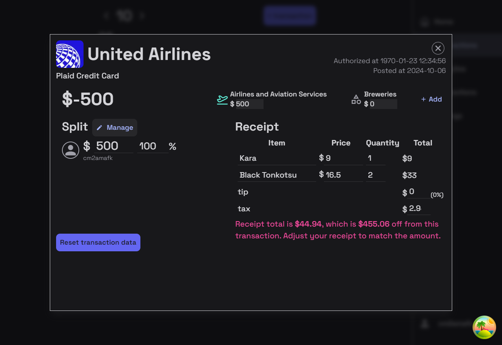

<h3 align="center">Finance tracker that actually tracks properly.</h3>

 Preview build with sandbox data: <a href="https://nedon.vercel.app">https://nedon.vercel.app</a>

## The problem

You spend $230 at Walmart. Your banking app assigns it a category: 'Groceries'. But that's not right. The other $50 were supplies for the bathrooms.

Budgeting apps lets you know you hit your budget. It gives you little to nothing to help you stay in your budget or adjust if needed.

And if you have some transactions that's mixed with another person - good luck excluding their portion from it.

**Your banking app is useless. The solution? Nedon.** Or Excel. That's pretty good too.

## Alternatives comparison

| Features/Apps                  | Nedon   | Cashew | RocketMoney | GPay | SplitWise | Honeydue       |
| ------------------------------ | ------- | ------ | ----------- | ---- | --------- | -------------- |
| Automatic transaction import   | O       | X      | O           | O    | Paid      | O              |
| Recurring payment/subscription | Planned | O      | O           |      | X         | X              |
| Custom budget period           | Planned | O      | X           |      | X         | X              |
| AI receipt scan                | O       | X      | X           | X    | X         | X              |
| Manual transaction entry       | Planned | O      | X           | X    | O         | X              |
| Split payment with others      | O       | O      | Paid        | O    | O         | 1 member limit |
| Custom categories              | Planned | X      | O           | X    | X         | X              |
| Assign multiple categories     | O       | X      | X           | X    | X         | O              |
| Assign cost to categories      | O       | X      | X           | X    | X         | O              |
| Group spending overview        | Planned | X      | X           | X    | Paid      | O              |
| Individual spending overview   | O       | O      | O           | O    | X         | X              |
| Net worth tracking             | O       | O      | Paid        | X    | X         | X              |
| Web view                       | O       | O      | X           | X    | X         | X              |
| Mobile app                     | Planned | O      | O           | O    | O         | O              |
| Open source                    | O       | O      | X           | X    | X         | X              |

More features planned and coming soon
