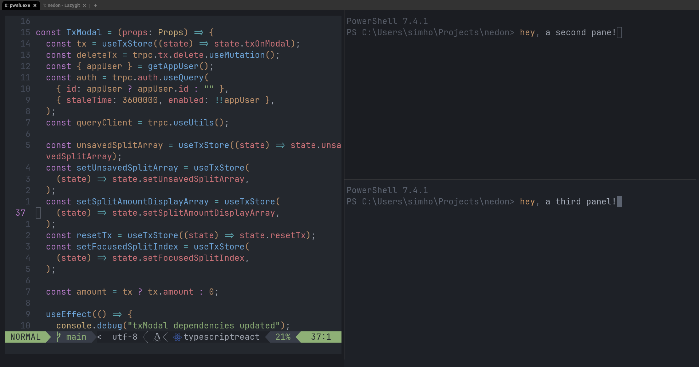
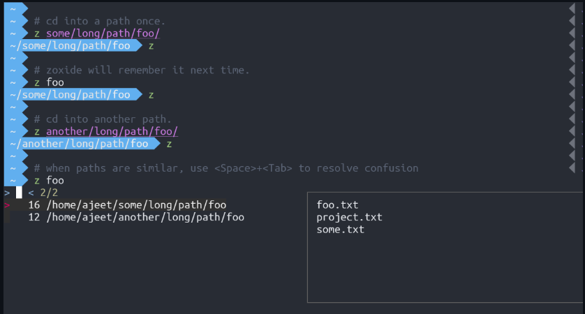
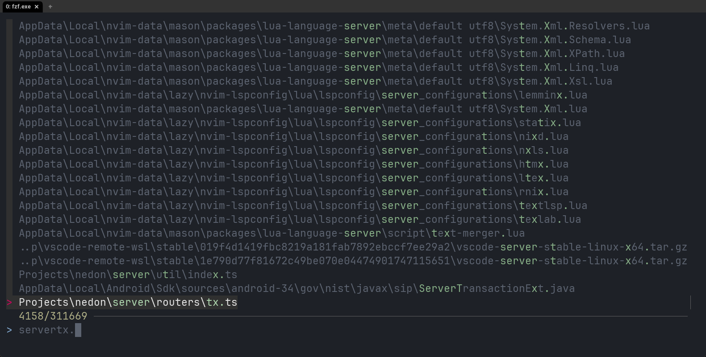
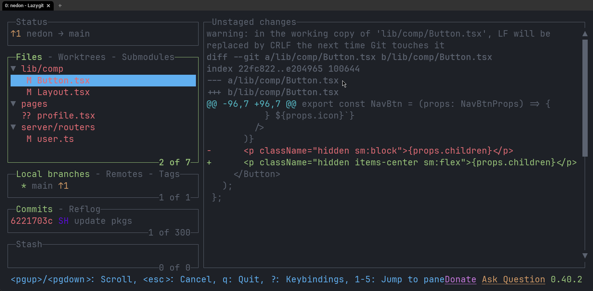

I think all software developers can agree on spending hours on eliminating the smallest inconveniences for the sake of efficiency (although whether you became more efficient is an afterthought). This is my collection of tools that I use for just that - with some of them being ones I can't live without.

Before that, I have to explain why I work with Windows instead of a Linux-based OS. The short answer is **simplicity** - Windows is what my laptop is built around, have the tools I need, etc. Did I spend many hours trying to migrate my workflow to Linux? Yes. Do I want to spend additional hours figuring out why my screen freezes *sometimes* specifically from mouse input? No.

Another thing to point out is that these tools are mostly useful for those who work mainly in the terminal. If you mainly use the terminal to simply type `npm run dev` or use an IDE that already provides these features, some of these tools may not be as useful to you.

With that said, here we go:
## [wezterm](https://github.com/wez/wezterm)
*A GPU-accelerated cross-platform terminal emulator and multiplexer written by [@wez](https://github.com/wez) and implemented in Rust*

Ever since I learned about tmux during my efforts to avoid Windows, terminal mutiplexing has become essential to my workflow. Powershell isn't blessed with such tool, unfortunately, leaving me with Windows Terminal's multiplexing support. There's nothing particularly wrong with it; it's jsut missing one thing: `<leader>` key support.

For those who don't know what a `<leader>` key is:
>A leader key sequence is a kind of "escape" sequence that places the input handler into a mode where additional key combinations can be recognized. 
>
\- Wez

So instead of twisting my fingers trying to do `shift + alt + k`, I can just press `<leader>` key sequence (I set it as `ctrl + a`) and `k` without having to hold them together at the same time. Much easier on the fingers!

wezterm also comes with extensive customizability and one default that I find neat: when a new shell is spawned, it sets its directory to the **directory the first shell was in**. It's nothing life changing, but I like not having to `cd` all the way into my project directory again just to run some git commands.

Of course, with the next tool, I never have to `cd` too far...
## [Zoxide](https://github.com/ajeetdsouza/zoxide)
*zoxide is a smarter cd command, inspired by z and autojump.*

It feels like I'm traveling half way across the world when typing `cd ~/AppData/Local/nvim/lua` (`cd ~/.config/nvim/lua` is not any better) just to make some quick changes. Sure, I can set an alias for it, but that's such a chore.

One of the things I really like is its smart conflict resolution. Each path has some weight based on current location, usage frequency, usage recency and many other factors, ultimately choosing the directory you meant to change to 90% of the time.

They also have an option to map the key to `cd` instead, saving your pinkie from pressing `z` too much.

## [fzf](https://github.com/junegunn/fzf), [ripgrep](https://github.com/BurntSushi/ripgrep), and [PsFzf](https://github.com/kelleyma49/PSFzf)
*fzf is a general-purpose command-line fuzzy finder.*  
*ripgrep recursively searches directories for a regex pattern while respecting your gitignore*  
*PsFzf: A PowerShell wrapper around the fuzzy finder fzf* 

I don't always remember which directory to go to, or even know where the file is. Sometimes I want to look through my command history to get a clue. These three tools enable that superpower.[^1]

These infinity stones singlehandedly solve file searching on Windows. It blows my mind how Microsoft still fails to properly index my files.

## Lazygit
*simple terminal UI for git commands*

On one hand, I think it's important to know your common git commands. On the other hand, I think anyone should be able to do the common workflows without knowing the commands at all. Lazygit supports the latter.

Something that I wasn't able to do in VSCode's built-in git management was staging individual lines. I didn't even know that was possible!

## [ni](https://github.com/antfu/ni)
`npm i` *in a yarn project, again? F\*\*k!*  
*ni - use the right package manager*

As a web developer, I simply don't feel like typing ~~`pnpn`~~ ~~`pmpn`~~ ~~`pmpm`~~ `pnpm` everytime nor tell my team that it's superior to `npm`. 

Use it. you'll be happy.

---
That's it!

[^1]: Sure, you can still navigate through command history with PowerShell. But you can't fuzzy search through them.