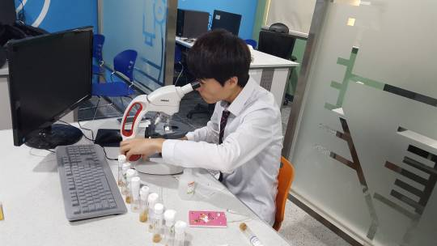

## Day 7

I reported the results I got on Day 6 to my teammates, and asked for their help on this day. We spent the day cleaning all tubes clean of food and maggots, and placing fruits in them. A BentWing Type and a Wild Type was found dead, or at least not awake till this morning, so we replace them too.

We have abundance of leftover fruit flies so it's not a problem if some die. The problem, in fact, is that there are too many left over. If we don't complete our experiment soon, we won't be able to release these fruit flies. The leftover flies will reproduce exponentially, eventually run out of food in the tube and experience holocaust. It's not a problem in terms of science, but it just sounds cruel.

---

## Day 8

Clean tubes with adequate meal, each with all possible mix of mutated fruit flies of different sex. It sounded like we were finally done with preparation, and that the only thing we have left to do is observer and calculate our results.

And it still does, except that we found fungus growing on top of some fruits. This was bad news. I asked my teacher to order us a bag of yeast and sugar so that I can make food for the flies, but as of today, there is nothing we could do but remove the visible fungus. I know they don't go away like that, but that's as much we can do.

---

## Day 14

Due to miscommunication and personal mistakes, I could not and did not visit the lab till today. I guess I can say I gave some time for the fruit flies to really do their thing and for them to settle down for 6 days.

I thoroughly checked through each tubes, and I hate to tell you that 6 tubes have failed. 4 tubes seems to have maggots crawling around, but I was unable to find any for the other 6. 2 or 3 tubes seems to contain two fruit flies of the same sex, meaning one of our teammates, including me, have messed up in the differentiation process. The other 3 or 4 have a mate dead.

To add to our failure, fungus have covered huge portions of the fruits. The ones we stored for later use is so contaminated, it's hard to tell the difference between it and a green sponge. Yeast and sugar are still not here, so all I can is post the situation. I have to discuss future plans with my teammates and teacher about ways to prevent this situation of not having a fruit fly to mate with. The solution I currently came up with is to have 3 fruit flies of the same sex in to each tubes, rather than 1, so that if one dies, there will be another to carry the experiment out. The only problem with this solution is that we are likely to fail differentiating again, and have different sex of the same type in a tube. This would make the results hard to calculate.
