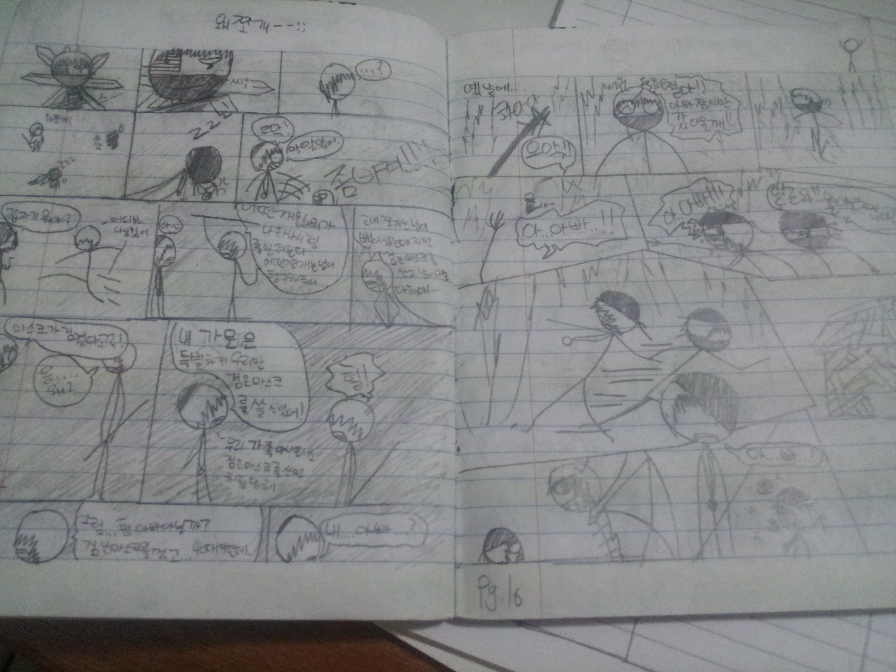
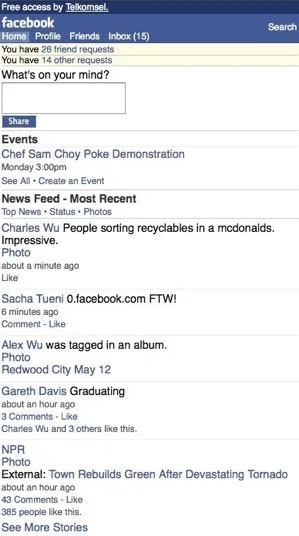
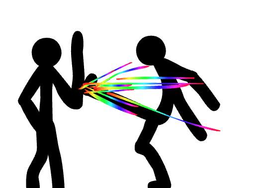
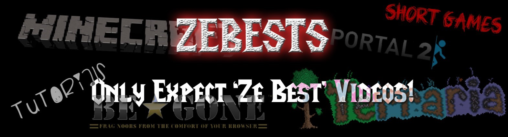
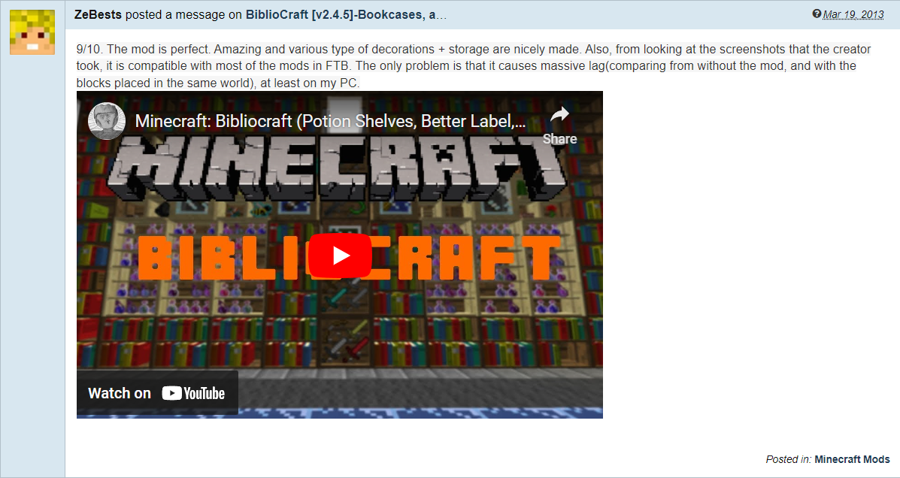
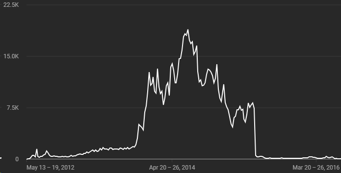
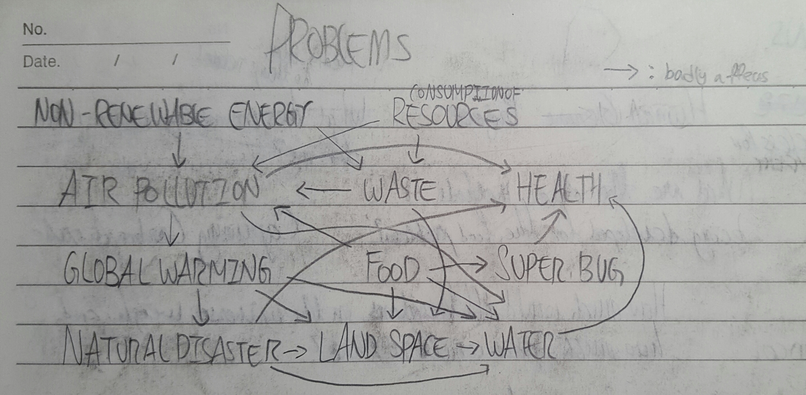
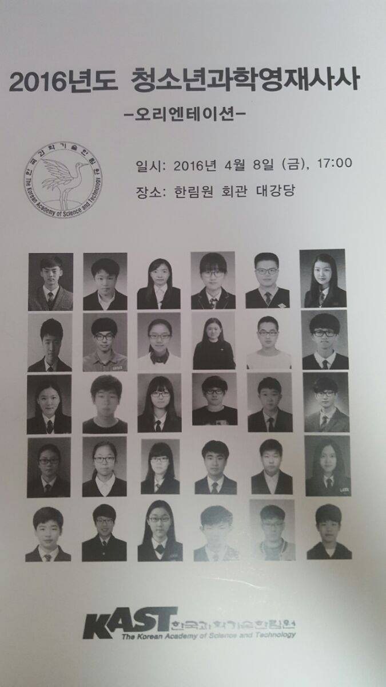
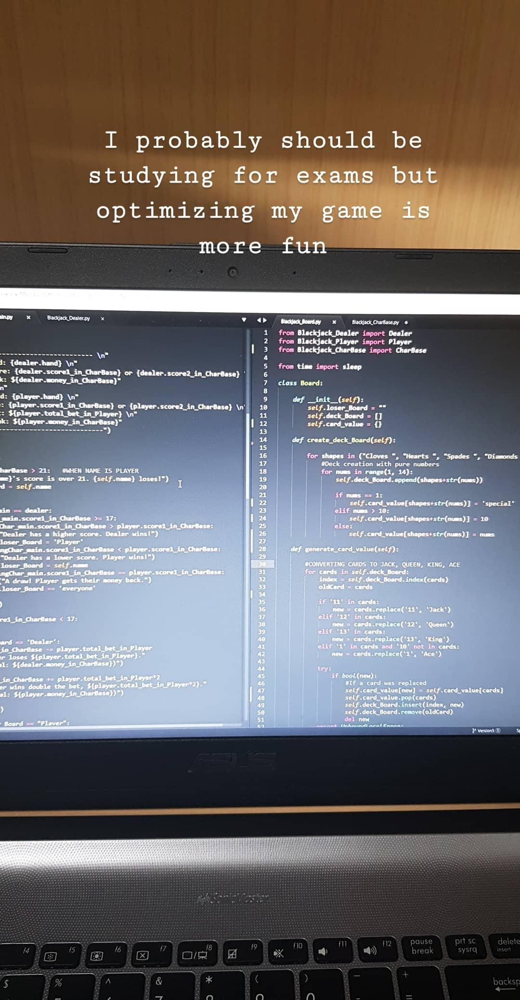

> Finally after all these years, I have a job I am very sure to strive for (at least, I think it is. I'm still 17, so you never know if a thunder would strike me one day and change my goal completely): Biotechnology researcher.

\- Me, in my 2018 post [(2) My Goals and Plans](blogs/archive/Goals.md#(2)%20My%20Goals%20and%20Plans)

I guess thunders do strike.

I lived most of my life without a thought of pursuing computer science. In fact, most of my childhood went by without thinking much at all. I just entertained myself with whatever I enjoyed whether I was good at them or not. When I grew old enough to start considering my future career, I was certain I wanted to become a mechatronics engineer and build cool robots. That abruptly changed at the age of 17 as I realized there was so much I could contribute to humanity through cellular agriculture research. And just as I was confident my goals wouldn't change, I decided to drop everything and pursue computer science.

How did I get here?
## Before the Internet
Like most 8-year-olds, I found ways to do anything but pay attention to the class. When I wasn't sending secret notes or throwing balls of eraser dusts with friends, we passed around a sheet of paper or an empty exercise book after drawing a panel or two. Most of them concluded by the end of the class, but some went on for days with an unpredictable, chaotic, and random story - exactly what we enjoyed.

I eventually took this more seriously and started a long-term comic called Cure For a Devil. Like in previous comics, my classmates represented all the characters, with each having a special power/unique concept. There was not much of a story, but it still featured good-ol' randomness and cool fights, which was good enough for my friends to beg for more.

My first comic, 악마치료법(Cure For a Devil)

I know this has nothing to do with engineering, biology, or computer science, but it is one of many arcs of my life where I dedicated creativity and effort to making something I was proud of. I worked on the comic for just under two years, where at some point, our standard for story-telling rose higher than what I could output. I became more conscious of the comic's shallow storyline and my poor drawing skills. I eventually scraped the whole thing and started a redraw with a better foundation, but ultimately lost interest in continuing it. I still do a bit of world-building whenever it comes up in my mind, but the comic was never finished and now exists only in my memories.

As my comic dwindled in popularity, "Book-RPGs" started getting popular among my friend group. It was somewhat like DnD (if my understanding of DnD is correct) - the game creator would set up a book with pages of UI for player stats and inventory, in-game shops, combat areas, and so on. The creator would repeatedly erase and draw on top of these pages to indicate gameplay while players made their decisions verbally. No two games were the same, but they were all inspired by some computer games or TV shows we enjoyed.

Mine was a sandbox game where you start on an island, build your base, and invade other islands with the army you build along the way; kind of like a mix of RimWorld and Minecraft, except much shittier. This game got so popular among my friends, that I killed the player base of other games and even made money for the first time through microtransactions![^money] But this, too, eventually faded from fame by other interests.

## Welcome to the Internet

Facebook Zero: text-only version of Facebook for the early days of mobile internet.

Once my age hit double digits, I read cringey romance novels shared among my friends' Facebook groups. They were either popular ones from Korea shared as .txt files or fanfics my friends wrote on Facebook Notes (a feature that no longer exists). I tried writing my own, but I gave up after writing about two chapters.

Then there was this rising entertainment platform called YouTube. By then, my mom had an iPhone 3GS where I watched my first anime[^anime] and skits from channels like Smosh. I tried making the latter as well with a friend and my 7-year-old brother, solely relying on the pause/resume button on my phone camera. If even one thing went wrong, we were back to recording the first scene. It was quite an unfortunate time to be oblivious to video editor software. Again, I gave up after a few tries.

My first and only animation stored on my computer.

Then I found [Pencilmation](https://www.youtube.com/@pencilmation). Again, I *had* to create my own. I worked with the pause/resume button to make stop-motion animations for a while before I found a [tutorial on animating using Microsoft PowerPoint](https://www.youtube.com/watch?v=5HyZN0yhrkI). I started learning Macromedia Flash after discovering animators like [Hyun](https://www.youtube.com/@Hyun/), [MondoMedia](https://www.youtube.com/@MondoMedia), and [FlashDeckAnimations](https://www.youtube.com/@flashdeckanimations), where I spent a decent amount of time learning keyframe interpolation and various animation techniques. I ended up creating several short animations and even planned to make a YouTube channel for it.

## What's up, YouTube?

It didn't take long for me to discover the [first Minecraft video](https://www.youtube.com/watch?v=LxzwaJmpYwc) I ever watched, which I weirdly remember to this day. That led to discovering AntVenom, YogsCast, Sky, EditZP, and many others that I don't even remember anymore. Soon, Minecraft not only became the only game I played but also the game that brought together the friends I still chat with to this day.

As I religiously watched Minecraft content and learned about the game, I started to get slightly frustrated with people's gameplay. They were either missing the 1obvious or lacking game knowledge; they could be playing better! I believed I could play better than them. To prove it, I started my own YouTube channel and show people how you truly play Minecraft. The best player.

Hence the name.

I started my channel with nothing but my handed-down laptop that could barely play Minecraft, let alone record. Its spec was so terrible that I had to compress my recordings overnight so my video editor functioned with reasonable performance. I didn't have the money to buy the game or recording software (OBS did not exist yet), so I pirated them (I jumped between FRAPS, Bandicam, and Playclaw) while acting confused when skins didn't work properly.

That wasn't all. Back then, videos weren't as easy to discover as it is now. Advertising on other platforms was essential, and for Minecraft, it was on MinecraftForum and PlanetMinecraft. I looked for maps and mods that weren't already shared by prominent YouTubers and contacted the developers whenever I made videos on them. They'd then post my video on their main post as a showcase of what they built, and I'd get some publicity and grow my channel.

It probably took more than a year to reach 20, 30 subscribers. But by the time I tried to make a "Thank You" video for 50 subscribers, I was already at a hundred. When I tried to make one for 500, I was at 1000. My channel peaked at around 5000 subscribers by 2014. I was a partner of a content network called TGN, which allowed me to receive revenue through PayPal (while YouTube limited to physical checks with a minimum $100 withdrawal). I didn't make much, of course, but it was enough to buy games for friends who had cash in their hands but couldn't ask their parents. I eventually bought myself Minecraft, too. It was also the first time I went to a bank, pulled out a check from Google, and handed it to my mom.

Weekly view count, peaking at 18,960 views/week (Jul 6-12th, 2014)

YouTube was an incredible experience; it was the first time I actively tried to make something for the world to see and successfully managed to do so... Well, sort of. I uploaded over 150 videos throughout 4 years, but only a handful of them got more than 100 views. At some point, I began to think most of my videos were not entertaining.

The moment this realization really hit was when I left TGN. At some point in my career, I decided to pursue a better partnership network; and despite TGN offering a larger revenue cut, I ended my contract. Soon after, most of my best-performing videos were taken down for _having too many tags_. I was furious at first, but I gradually realized that the real issue was how most videos performed poorly. Being funny was hard, and I wasn't good at it.

## My True Passion

Despite how integral YouTube was to my childhood, I never considered it as a professional career. Instead, I always knew I wanted to do something with science when I grew older.

I don't know what got me so interested. I just was. One of my dream careers was to become an astronaut so I could see things most people could never see in their lifetime. When I made my Book-RPG, I studied specifically for players to filter seawater to drinkable water, make paper, fertilize plants, and so on, based on real science. By 6th grade, I wrote a list of questions I hoped to answer one day:

- How would it feel to reach the end of the universe?
- How does CPR even help?
- How does jumping help you grow taller?
- How do energies convert from one to another?

My curiosity only grew bigger over time, but leaned towards Physics. I frequently read articles from sites like IFuckingLoveScience (which turned out to be controversial) and Phys.org[^physorg]. MinutePhysics, SciShow, PBS Space Time, and SmarterEveryday were some of my favorite channels to learn easier stuff. On breaks between classes, I studied Physics with my friends, discussing whether light was a particle or a wave, the Big Bang and the universe's expansion, and so on. 

I learned new things in classes for sure, but a lot seemed terribly simplified and sometimes contradictory. When I proved how Bohr's atomic model made no sense, I quickly became the guy that "asks more than what we need to know for the exams".

Thankfully, some thought otherwise. (Reddit)

Once my tiny brain got stuck on quantum mechanics, engineering won over a significant portion of my interests. I participated in a nationwide engineering competition at 14, being one of two in our school to get through the written assessment and make it through the quarterfinals[^masmo]. 'Physics of the Impossible' by Michio Kaku became my most influential book - I learned that nothing was impossible if we tried hard enough.

By 2015, I had a clear goal in mind for the first time in my life. I wanted to build remotely controllable humanoid robots, similar to the ones seen in Iron Man 3 (though my inspiration came elsewhere). I believed that would allow people to work in or explore areas too dangerous for real humans to exist in. Imagine if we could conduct lunar missions from Earth, remotely controlling a humanoid robot sitting on the Moon! Or imagine going on a trip to the other side of the planet without the hassle of physical travel. You could remote into one of the robots and explore the world as if you were actually there. This technology would not only benefit the physical world, but serve as a stepping stone to our inevitable future - virtual reality[^1].

## Unexpected Shift

Around 2015, my parents could no longer support my education in Malaysia and I was forced to restart everything in Korea. In the same year, my homeroom teacher recommended I apply for a program hosted by the Korean Academy of Science and Technology called 청소년과학영재사사 (Program for Science-Gifted Youth). It was a year-long program where the top 30 students around the nation were selected to link with a professor within their field of interest and gain valuable experiences. Considering the small selection, I wasn't sure if I had the chance, but I took this opportunity to look back at my goals and forge an attractive self-statement out of it.

I began by listing the technological advancements that would be required to make remotely controllable humanoid robots a reality. First, ultra-low latency communication was necessary. I knew there was around 300ms of delay from Malaysia to the US when it came to games - that needed to be close to 10, or even 1ms if I wanted people to use my exoskeletons for Moon missions. Second, multiple leaps in battery density; this machine would hog power, and we can't let massive batteries hinder usability. And third...

While individual technological improvements necessary for my exoskeleton robot to come to life were useful in many applications, I started to question the value of the goal itself. In a world with countless other problems, it didn't seem like something of high priority. Nothing matters if our society isn't around to use it. That's when I had the epiphany: **The world must be sustainable before I can build fun things.**

I went back to the drawing board and wrote down all the major global issues I was aware of. I drew a diagram showing the relationship between land pollution & scarcity, water pollution & scarcity, world hunger, air pollution, excess waste and lack of management, etc. This short reflection resulted in a shocking conclusion: agriculture needs a revolution. I say "shocking", because it never occurred to me that producing food was unsustainable. I mean, haven't we been doing that since existence?

The most attractive solution to all this seemed to lie in cellular agriculture research - nothing close to the kind of study I did for the 16 years of my life. In fact, for a long time, Biology was just a boring subject that I happened to score better than Physics. I even claimed that it was a pointless study explaining what Physics already covered. Despite all this, it felt like it was my duty to pursue it.

Even though I had some distaste for Biology, it quickly became the most fascinating subject. YouTube videos, /r/transhumanism, and random articles helped me realize that Physics was never sufficient to explain the complexities of life and start appreciating the ways biologists figure out explanations and predictions for things that always seem unpredictable. While Physics helped me understand the world around me, Biology helped me understand how *I* - everyone - worked.

I'm on the second row from the top, all the way to the right end.

This was the first time I drastically changed my goals, but I was proud and excited. I applied for the program for Science-Gifted Youth with Biology as my field of interest and was fortunate enough to be selected. I learned a lot from the biomedical lab, struggling to pipet samples into the agar properly and gruesomely (but ethically) killing mice with genetic markers. I kept building my portfolio of biology-related activities like the [Fruit Fly Genome Mapping Project](FFGM/Fruit%20Fly%20Genome%20Mapping-%20Day%201.md) and [studied super hard](https://www.youtube.com/watch?v=CSszchMt6N8&list=PLgeX8ilKjqWNvKqiv9PVU987QJKS-VA9y&index=3) to get into one of the best biotechnology schools in Korea. *I fucking did it*.

...So why am I studying Computer Science now?
## Conflict of Interest

I always had an interest in programming. When I learned how to animate in Flash, I also tried to learn how to make games with it. When I played Minecraft, I tried to bring my book-RPG 'Search for Land' to life. When I pushed my younger brother to study computer science, I was doing so because I wanted him to do something that I felt like I had no time to do.

I [tried to learn programming in the past](https://youtu.be/wIrc13w1sMY?list=PLgeX8ilKjqWMtTOPXkB09YX2mL9mex4Kh), but I never had the motivation to dedicate enough time. I was mostly busy playing games, but I was also confident I'd pursue mechanical engineering (it never occurred to me that programming skills were necessary). By the time I was in high school, I was too busy focusing my energy on studying for college entrance exams and building an attractive biology-related portfolio.

Funnily enough, university admission was what freed me to learn Python. I decided to self-study the language before my first semester started to prepare for the programming course I had to take in my freshman year. I purchased a Zero-to-Hero course on Udemy, never imagining that I would wake up **every day purely excited to learn it.**

I put a pause on programming once my freshman year started and went back to being fascinated by Biology. I always saw it as a study of reverse engineering extremely complicated machines, and that was more apparent than ever before. I joined a club and participated in group research projects, which were some of the most fun activities throughout the semester. There was some disparity between my interests and others; I was the only one who cared about making meat without cows, while most were focused on medical/pharmaceutical/cosmetic purposes of stem cell research. Regardless, I still enjoyed Biology. Nothing was more meaningful than contributing to humanity's prosperity.

December 11th, 2019

The second semester was when things started to get confusing. Once the first semester was over, I immediately returned to studying software development. But unlike last time, I didn't stop learning by the start of the semester. I was physically present at every lecture while my eyes and hands were working on my [first project](https://github.com/SimHoZebs/Blackjack). I was solving questions on [Project Euler](https://projecteuler.net/), studying PyQt5, solidifying my understanding of object-oriented programming, learning how Git worked, reading articles on how commits and pull requests should be done, etc. My friends started to joke that I was a Computer Science student in the wrong major as my participation in club research projects dwindled. 

I started to think, "Maybe I'm in the wrong major."

This was terrifying. Throughout high school, I woke up at 6 AM and studied in the school library till 10 PM every day - including all public holidays - so I could stand a chance against others trying to take one of the ~40 spots available to major in Stem cell and Regenerative Biotechnology. I failed once, so I spent another excruciating year studying for the entrance exam. After years of effort, I joined one of the top universities in Korea for biotechnology, just to find something else much more enjoyable.

And how was I going to justify ditching cellular agriculture? I had planned my education in the path that would eventually contribute to solving problems endangering humanity's survival. Software development, on the other hand, was purely entertaining. It was fun seeing my work come to life immediately, and that was all there was to it. I had to pick between personal joy and the greater good.

Speaking of the greater good...

I joined the army right after my freshman year to serve Korea's mandatory military service. It was the perfect excuse to pause my education and spend some time figuring out whether this love for software development would be short-lived, something to pursue alongside my biotech degree, or something worth giving up everything. There wasn't *a lot* of time to study, considering I had to -  you know - serve the military before anything, but I made progress every day, learning game and web development on the way. Along the way, I wrote the [Software Dev Log series](Software%20Dev%20Log/Software%20Dev%20Log%201.md) and weekly [#MyDevWeek](https://twitter.com/SimHoZebs/status/1463492277393756164) updates, and eventually, made the choice to transfer to Computer Science.

It was a difficult decision, but it felt right. All this time I tried to find how my talents could be better utilized in software development than cellular agriculture research, but I realized that wasn't the only thing that mattered. My happiness mattered more - in fact - it mattered above all else. I have to enjoy the process to a certain degree before finding motivation in its altruistic significance. While I enjoyed *learning* Biology, I wasn't confident that I would enjoy *discovering* Biology. Research demands patience and a heart of steel to push through countless failures, especially in the biotech field. Software development, on the other hand, delivers results pretty much instantaneously the moment the code is compiled. The quicker feedback loop felt much more rewarding and the sense of control.

Above all, I always had an inherent passion for creating things. Going back to the beginning, I drew comics because I wanted to _create_ my own comic. I went ahead and _created_ my own web novel, Book-RPG, YouTube skits, Minecraft videos, and so on. That was why engineering felt like the natural choice. Even my path to cellular agriculture was because I wanted to design and *create* systems that would grow meat without cows. And now, I just happened to discover the best tool to express this love for creation; software development. There's a quote that goes along the lines of, "Programming is as close as you can get to becoming God himself". 

## Now
Once I completed my military service, I transferred to Valencia College, and now, University of Central Florida, to pursue a degree in computer science. For the first time, I'm surrounded by people who care about the same things I do. I got to build cool projects at hackathons with friends and win top spots in sponsor categories, boast my skills in Vim motion, and discuss cool progress revolving around software decentralization. I got to learn interesting things from many people, ranging from students simply interested in different things, to professionals with years - decades - of experience in the software industry. I couldn't have made a better decision for my future.

Over the last two years, I discovered a *purpose* to pursue software development. I believe there's a reasonable concern for democracy as technology improves. For example, data about a person is more abundant than ever before, but not only are they mostly hidden, they're owned and controlled by centralized organizations. Companies know more about us than we know about ourselves. I want to improve data security and reclaim data authority, ultimately preserving privacy and control over oneself.

There are many other aspects of the world I'm interested in contributing to with software - but in conclusion, I am no longer fueled solely by the joy of software development. I can, and will, change the world for the better as well.

[^money]: I didn't make a lot of money, of course. I made one or two sales on cosmetic upgrades. Making money wasn't the point anyway - all I was doing was copying the cosmetic shops from Maplestory. With few friends actually buying them, I had officially invented microtransactions in 2009.
[^The-best]: Hence the channel: https://youtube.com/@BestsGameplay
[^1]: In a world where we strive for maximum efficiency, virtual reality will be the only reality in the future. I'll make a post about this later.
[^masmo]: I'm still proud of the mechanical arm I built back then; it was impressive, considering I was never taught how to build one.
[^korea]: Financial constraints forced our family to return to Korea and finish high school there instead.
[^physorg]: Of course, I never understood the majority of the articles posted on Phys.org. But it gave me a place to start and eventually learn many things.
[^java]: I also lacked motivation. 