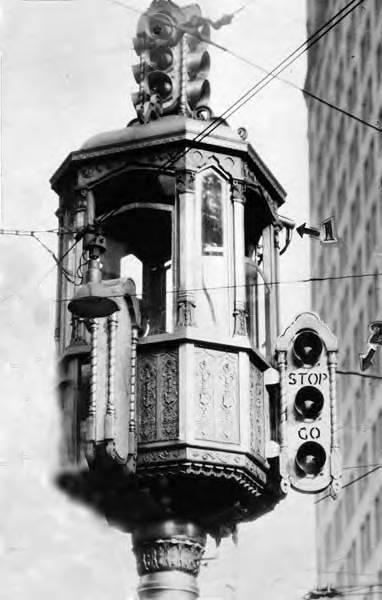

Think about it. Biomedical researchers don't plan to research cure to cancer for the rest of humanity. City planners don't plan to build infinite number of cities, and washing machine manufacturers don't plan to make infinite iterations of their product. At some point, we'll have cured every known illness, come up with the best city design that adapts perfectly to every possible situation, and a washing machine that can also dry your clothes. These 'progressive' jobs are designed to eliminate themselves.

Then there are maintenance jobs. Farming tools improve over time, but the act of farming simply maintains the foundation of society, rather than move it forward. Most hospital doctors cure patients of known illnesses using known methods and tools, but do not discover new ones. Cooks, taxi drivers, lawyers, cashiers - all primarily exist to support existing infrastructure rather than build it. These jobs don't eliminate themselves.

Traffic light as a job

However, these jobs only exist because we haven't found an economical way to automate them yet. We already replaced cashiers with Kiosks and self-checkout machines. We avoid interacting with bank employees by using apps and websites. We don't need paperboys to deliver the latest news, and we don't need librarians to have a doctorate degree because who needs them to attain such high level education for their tasks when you have the god damn internet???

Eventually, Waymo and Tesla will perfect self driving cars and eliminate Uber drivers, drone networks will be established and drop our packages via air and robotics will take over health care. It will be extremely challenging, but it will happen. Not to just spite maintenance jobs, but because that's what progress does. Requirements and patterns of a procedure gets identified and automated.

And we all know that we can't stop progress. Even if someone does give up, someone else will pick it up and perfect it at some point. Humans are perfectionists - we have always made progress, are making progress, and will keep making even more progress until we disappear from the universe. That is how we are wired.

## Okay, so what?

The problem is, we need jobs to survive. Work is how most people get money, and money is how people get their needs. It's a paradox; Humanity actively work to eliminate labor, yet their survival relies on it.

The solution isn't to resist artificial intelligence and prevent automation from taking our jobs. That does nothing but hinder progress and delay the inevitable.

We live in a time where technology is advancing faster than ever before. We need societies to make use of it to bring down cost of necessities instead of deeming inflation as a natural order of economy. Governments should actively take part in providing needs like food and shelter for close to no cost. That's part of their main mission - gather individual efforts to make it easier for everyone to be self-sufficient. Automation should be used to get us there.

---

As a side note, there are great questions relevant to this post that I may or may not answer further in a different post:

Q. How do we live without work? Wouldn't life be so boring?
- We would do whatever we find entertaining for the sake of entertainment instead of **needing** a financial incentive.

Q. Making everything cost near nothing will destroy economy!
- Good. The economy merely exists as one of many points of incentive for progress. Let's remove the need for financial incentive and return our focus to the actual incentive: the improvement of our lives.

Q. We can't have the government invest in automated systems like this! They'll grow too powerful and allow even more control over the people!
- Valid concern, but I don't know any alternative non-profit organization designed solely to gather funds for movements such as this.

Q. You don't know shit!
- Who said I did?