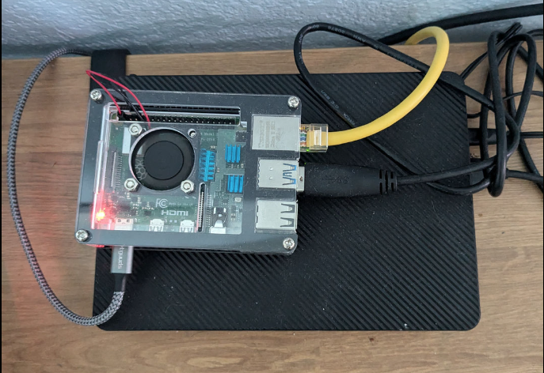
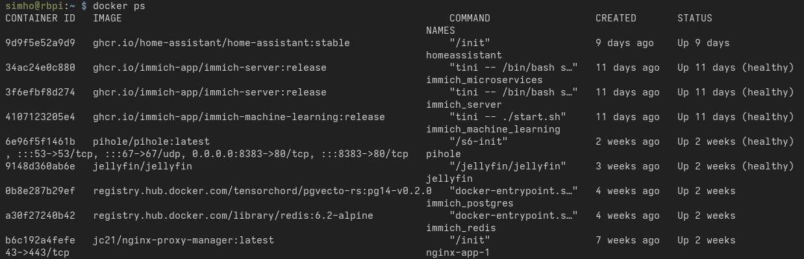

This is my Raspberry Pi 4B with a 6TB external hard disk attached. It currently functions as a photo and video viewer for my family, host of very legally owned movies and TV shows, and home assistant to control all my smart home devices with more granular control.

I learned a lot throughout the weeks I spent fiddling with this tiny computer. This was the first time I created a Docker container and did any sort of network administration. This post will go over the challenges and requirements of a home server and give an overview of the solutions and concepts I learned on the way.

## Docker/Containers

Home servers are nothing without the services running on them. The most handy way to run them is via a 'container' - a minimal virtualization of an operating system that provides an environment for applications to run on. It's like having a small, stripped down version of a computer run inside your computer! ([but isn't that a VM?](https://www.atlassian.com/microservices/cloud-computing/containers-vs-vms))

That sounds a lot like a virtual machine, but the key difference is that containers still share resources such as memory, storage, and processing power with the host, while VMs require them to be allocated for their own use from the start. The container engine is responsible for flexibly allocating resources on the fly and ensuring just enough resources to be taken up by an application.

The blueprint of containers, known as Dockerfile, makes it super easy to set up complex environments with a single command. Users never have to know how to set up a Postgresql database or worry about using the wrong version of a specific dependency.


all containers in my home server

You don't necessarily have to *learn* Docker to set up services on your home server. As long as you know how to access the command line and install Docker, it usually takes just one or two commands to set one up. At the very least, there is always a YouTube tutorial for it.
## Ports

Naturally, all these services communicate with its network. How do they uniquely identify themselves on the device and the network?

```
127.0.0.0.1:3000     <-- port 3000
```

I introduce you: ports. These are numbers that follow after an IP address to identify a process communicating under the IP address. If you've done any basic web development or opened a Minecraft server, you've seen them a lot of times.

Many home server services will demand a handful of ports for themselves so you and other processes can communicate with it. Only one service may control a port - you can't have multiple containers use the same port! Docker gives you a great way to reassign ports.

You'll want to avoid default ports unless you know what you are doing. Here are some default ports:
- 22; this is for SSH.
- 53; DNS.
- 80; HTTP.
- 443; HTTPS.
- [and many more](https://en.wikipedia.org/wiki/List_of_TCP_and_UDP_port_numbers)
I tend to avoid anything under 10000 and assign unexpected numbers, like 19827.

## DNS

You'll quickly realize it's annoying to connect to home applications by their IP address and port. You'll also quickly memorize all of them without even trying, but it's still useful to learn how to make custom URLs for each of them.

But what does it even mean to make a URL? Think of a URL as making a nickname for a physical address. For example, "University of Central Florida" or "the Starbucks near me" don't actually mean anything on their own, but they are very meaningful when associated with physical locations via a record - in other words, my memories. Likewise, Google.com and many other links are simply identifiers that a Domain Name Server recognizes and *routes* to specific devices that actually return meaningful information.


Me when I learned routers do routing

If you never messed with your router, your DNS is most likely your ISP's. This means that when you search Google.com, your ISP is in charge of taking you to the right place. Theoretically, they can take you wherever they want. They can choose to take you nowhere, which is how some links get blocked. And if you use your own DNS, you decide where links take you.

You see where this is going?

Pi-Hole can turn your Raspberry Pi into a DNS, allowing you to intercept a request to immich.home and direct it to the device serving as your home server. Now we can set any URL for our server!

## Dynamic & Static IP Address and DHCP

This is only an issue if you ever restart your home server.

Whenever you connect a device to a network, you are assigned an IP address. Whenever you restart your device, it is likely going to be assigned an IP address different from the one before. This is known as a dynamic IP address. Why is this the case?

Imagine you walk into a classroom without any specific seat assignment. Everyone sits wherever they want, wherever they can. The next day, everyone sits somewhere different because they arrived in a slightly different order, or their preference changed, and whatnot. What's important to take away from this analogy, is that there is no system here that specifies anyone to sit anywhere, just like how there is no specific IP address designated for a device in a network. Hence, you can never guarantee the same IP address will be available for it.

Unless, of course, you set up a static IP address for the device through your Dynamic Host Configuration Protocol (DHCP) server. It is responsible for keeping track of which IP addresses are available and what address to assign to a device.

Again, your router probably also functions as one, so you should easily be able to access it and set up a static IP address for your home server. If you have a more highly configurable router, you can set up a PiHole as a DHCP server as well!

## Reverse Proxy

You probably only have a single device running as your home server. This slightly complicates setting up custom URLs for each service, since DNS can only map IP addresses to a machine - it doesn't include ports.

A reverse proxy solves this. Here's how:

1. You type `movies.home` in your browser.
2. Your custom DNS resolves this to your home server's IP (192.168.1.100).
3. The request goes to the reverse proxy running on port 80 or 443.
4. The reverse proxy sees the hostname `movies.home` and forwards the request to your movie service running on, say, port 8096.

Yay!

The reverse proxy solution I use is NGINX. Reverse proxy isn't the *only* thing it can do, but that's all we have to know for the purpose of this section.

## SSH with key

> Secure Shell Protocol is a method for securely sending commands to a computer over an unsecured network.

This is a little extra that I learned trying to avoid typing in my password to access my home server while making sure it was still secure.

I always knew how to _"SSH into a server"_. Our school has a Ubuntu server for students to test their programming assignments so students can avoid complaining that their program worked on their specific environment, but not on the TAs. What was new to me, though, was using an RSA key pair for authentication instead of a password.

SSH, by default, requests the username, IP address, and password to authenticate connections. As we all know, passwords aren't particularly secure or convenient. The latter was what bothered me more than anything - having to type my password every time I wanted to connect was one of the most minuscule aspects I wanted to eliminate in my workflow.

Thankfully, there is a more secure way to authenticate yourself using [SSH keypairs](https://www.digitalocean.com/community/tutorials/understanding-the-ssh-encryption-and-connection-process#authenticating-the-user-s-access-to-the-server). The gist is that you generate a unique key pair and store each on the server and the client. The two then communicate via some smart algorithm that they hold each other's pair **without ever sharing the actual keys**. Typically, developers use this as a two-factor authentication, requiring a user to know their password AND use the hardware holding the key. For me, it's a handy password replacement.

The problem is that you have a new thing to protect - your key. After all, an RSA key is really no different from a password other than being quite challenging to memorize. You can lock SSH key access with another password, but that would defeat the whole purpose.

(What puts the 'Secure' in SSH is also a [great read](https://www.digitalocean.com/community/tutorials/understanding-the-ssh-encryption-and-connection-process))

---
I have more things to talk about but I've left this in draft for too long:
## Exposing an IP address to the public
## NAT Loopback
## Tunnels
## Security measures
- Geofencing
- HTTPS, Let's Encrypt, SSL Certs
- Cloudflare
- fail2ban
- VPN