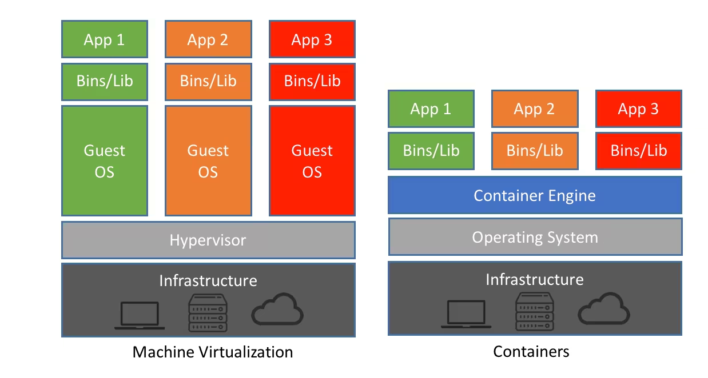

This is my Raspberry Pi 4B with a 6TB external hard disk attached. It currently functions as a photo and video viewer for my family, host of very legally owned movies and TV shows, and home assistant to control all my smart home devices with more granular control.

I learned a lot throughout the weeks I spent fiddling with this tiny computer. This was the first time I created a Docker container and did any sort of network administration. This post will go over the challenges and requirements of a home server and give an overview of the solutions and concepts I learned on the way.

## Docker/Containers

Home servers are nothing without the services running on them. The most handy way to run them is via a 'container' - a minimal virtualization of an operating system that provides an environment for applications to run on. It's like having a small, stripped down version of a computer run inside your computer!


[source](https://www.netapp.com/blog/containers-vs-vms/)

That sounds a lot like a virtual machine, but there are [many ways they differ from each other](https://www.atlassian.com/microservices/cloud-computing/containers-vs-vms). Most notably, containers share resources - such as memory, storage, and compute - with the host instead of pre-allocating them at initialization. The container's engine is responsible for flexibly allocating just enough resources required by its containers on the fly.


[source](https://medium.com/swlh/understand-dockerfile-dd11746ed183)

This post isn't the place to give a whole lecture on containers, so I highly recommend reading all the sources I linked, along with [this 100-second video on Docker](https://www.youtube.com/watch?v=Gjnup-PuquQ). 

Ultimately, Docker simplifies distributing large applications, especially ones with several microservices. As a user, I don't have to figure out how to set up a Postgresql database or manage various configurations for the app to work and worry about installing the wrong package version or having the wrong operating system.


all containers in my home server

This might sound like a lot if you've never touched Docker before, but you don't necessarily have to *learn* all of the concepts to set up services on your home server. As long as you know how to access the command line, install Docker, and run `docker compose pull && docker compose up -d`, you should be able to set up most applications with ease.
## Ports

Naturally, all these services (containers) communicate with its network to function. How do they uniquely identify themselves on the device and the network?

```
127.0.0.0.1:3000     <-- port 3000
```

I introduce you: ports. These are numbers that follow after an IP address that identifies a process communicating under the IP address. If you've done any basic web development or opened a Minecraft server, you've probably seen them a lot.

Many home server services will demand a handful of ports for themselves so you and/or other processes can communicate with each other. It is important to know that **only one service may control a port - you can't have multiple containers use the same port!** 

Why is that an issue? Well, a lot of services with a web interface ask for port 80 and/or 443, but only one service can have each one. To get around this issue, you have to *remap* ports through Docker.

For example, let's say your movie service is asking for port 5353. Remap it to port 8080, and it will think it is accessing `ipaddress:80`, while it actually has access to `ipaddress:8080` in reality. This way, you ensure every process has access to a port while having no idea that they've been reassigned. 

You have to be careful with this, though. Your movie service could've been asking for port 5353 because its database expects to communicate with it through that port. Make sure to remap that port on the database's container's configuration as well so it knows that the port has been changed. 

You'll want to avoid default ports unless you know what you are doing. Here are some default ports:
- 22; this is for SSH.
- 53; DNS.
- 80; HTTP.
- 443; HTTPS.
- [and many more](https://en.wikipedia.org/wiki/List_of_TCP_and_UDP_port_numbers)

Personally, I just avoid anything under 10000 and assign unexpected numbers, like 19827.
## DNS

You'll quickly realize it's annoying to connect to home applications by their IP address and port. You'll also start memorizing them without trying, but wouldn't it be nice if you could access your movie service through a link like, `movies.home`, and your legally downloaded e-books through `legallydownloadedebooks.home`?

But first, what does it mean to make a URL? Think of a URL as making a nickname for a physical address. For example, "University of Central Florida" or "the Starbucks near me" don't actually mean anything on their own, but they are very meaningful when associated with physical locations via a record, like my memories. Likewise, Google.com and many other links are simply names that a Domain Name System server (DNS server) recognizes and *routes* to specific devices that actually return meaningful information.


Me when I learned routers do routing

If you never messed with your router, your DNS is most likely your Internet Service Provider's (ISP). Meaning, when you search Google.com, your ISP is in charge of taking you to the right place. Theoretically, they can take you wherever they want. They can choose to take you nowhere, which is how some websites get blocked. If you use your own DNS, you decide where links take you.

You see where this is going?

Apps such as [Pi-Hole](https://pi-hole.net/) and [AdGuard Home](https://github.com/AdguardTeam/AdGuardHome) can turn your home server into a DNS server, allowing you to intercept a request to custom links like `immich.home` and direct it to your home server's IP address. Now we can set any URL for our server!
## Dynamic & Static IP Address and DHCP

This is an issue you'll eventually run into after restarting your home server.

Whenever you connect a device to a network, it is assigned an IP address. Whenever it disconnects and reconnects to the network, it is likely going to be assigned an IP address different from the one before. This is known as a dynamic IP address. Why is this the case?

Imagine walking into a classroom without any specific seat assignment. Everyone sits wherever they want, wherever they can. The next day, everyone sits somewhere different because they arrived in a slightly different order, their preference changed, and whatnot. The point is, the classroom has no system that guarantees a seat to a specific person. It is no different for IP addresses.

Unless, of course, you set up such a system. Put a sign up on a seat that reads **ONLY FOR SIMHO**, and no one would dare to take the seat! The procedure is not as intimidating for IP addresses - you just reserve an address for the current device through your Dynamic Host Configuration Protocol (DHCP) server, and it will remember to always connect it to the same address.

Again, your router probably also functions as a DHCP server, so you should easily be able to access it and set up a static IP address for your home server. If you have a more highly configurable router, you can set up a Pi-Hole as a DHCP server as well.

## Reverse Proxy

You probably only have a single device running as your home server. This slightly complicates setting up custom URLs for each service, since DNS can only map IP addresses to a machine - it doesn't include ports.

A reverse proxy solves this. Here's how:

1. You type `movies.home` in your browser.
2. Your custom DNS resolves this to your home server's IP (192.168.1.100).
3. The request goes to the reverse proxy running on port 80 or 443.
4. The reverse proxy sees the hostname `movies.home` and forwards the request to your movie service running on, say, port 8096.

Yay!

The reverse proxy solution I use is [NGINX](https://nginx.org/en/). Reverse proxy isn't the *only* thing it can do, but that's all we have to know for the purpose of this section.

## SSH with key

> Secure Shell Protocol is a method for securely sending commands to a computer over an unsecured network.

This is a little extra that I learned trying to avoid typing in my password to access my home server while making sure it was still secure.

I always knew how to _"SSH into a server"_. Our school has a Ubuntu server for students to test their programming assignments so students can avoid complaining that their program worked on their specific environment, but not on the TAs. What was new to me, though, was using an RSA key pair for authentication instead of a password.

SSH, by default, requests the username, IP address, and password to authenticate connections. As we all know, passwords aren't particularly secure or convenient. The latter was what bothered me more than anything - having to type my password every time I wanted to connect was one of the most minuscule aspects I wanted to eliminate in my workflow.

Thankfully, there is a more secure way to authenticate yourself using [SSH keypairs](https://www.digitalocean.com/community/tutorials/understanding-the-ssh-encryption-and-connection-process#authenticating-the-user-s-access-to-the-server). The gist is that you generate a unique key pair and store each on the server and the client. The two then communicate via some smart algorithm that they hold each other's pair **without ever sharing the actual keys**. Typically, developers use this as a two-factor authentication, requiring a user to know their password AND use the hardware holding the key. For me, it's a handy password replacement.

The problem is that you have a new thing to protect - your key. After all, an RSA key is really no different from a password other than being quite challenging to memorize. You can lock SSH key access with another password, but that would defeat the whole purpose.

(What puts the 'Secure' in SSH is also a [great read](https://www.digitalocean.com/community/tutorials/understanding-the-ssh-encryption-and-connection-process))

---
I have more things to talk about but I've left this in draft for too long:
## Exposing an IP address to the public
## NAT Loopback
## Tunnels
## Security measures
- Geofencing
- HTTPS, Let's Encrypt, SSL Certs
- Cloudflare
- fail2ban
- VPN