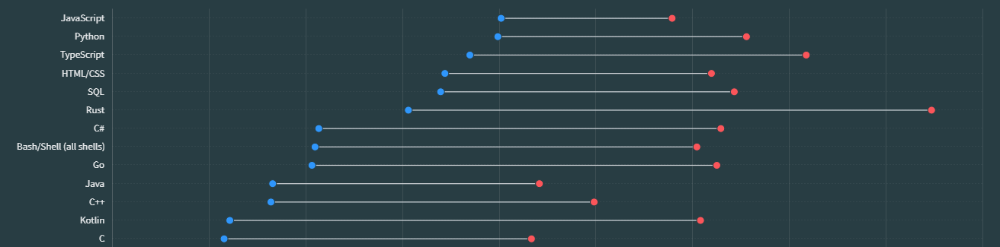
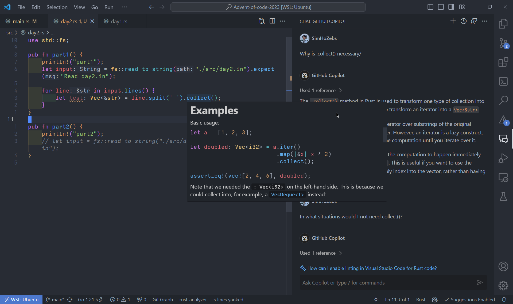

Alternate title: JS dev shocked to learn Rust is indeed a low-level language

Rust is the 5th language I'm learning seriously. First was Python, then C#, JavaScript/TypeScript, and C. I've dabbled with Java, and wrote a bit of Lua, but not enough to say I know them. But throughout all these years, no language has blown my mind as much as Rust has, and I'm just getting started. 

## Why am I learning Rust?

Go was a consideration. I heard a lot about its simplicity and great performance despite being a garbage-collector language. It's also a very popular language for backend development, meaning there are clear ways to implement it in my existing and/or future projects. I read about its concurrency model, and comparing it to JS's Promises, it's quite attractive.


Alas, Rust is admired much more than Go.

But ultimately, I'm learning Rust because it seems fun! TypeScript made me realize how important types are, but C made me REALLY realize how important types are, and how satisfying it is to have control over my code. It now kind of pains me to know that the 257 item array I created in JS is a linked list with 512 nodes instead of a fixed length, integer array. *Yes*, it doesn't really matter in the real world, and JS provides far superior iteration speed in most cases. But that doesn't change the fact that I like to have control when I can.

I'd hate to shoot myself in the foot with C with memory leaks as much as I already did in school programming assignments. Since there is no memory management in Rust, I *should* be able to enjoy all the things I enjoy!

But of course, I'm aware the language isn't without flaws. I know that the ownership-borrow architecture is a struggle on its own and that its iteration speed is considered to be slower compared to simpler languages. And as someone who's mainly building personal web applications, Rust doesn't significantly improve my tech stack.

Still, I'm learning Rust instead of Go because I think it'll take longer to learn Rust. Based on popular opinions, I should be able to pick up Go quite quickly if I ever want to. 

I also have some projects in mind that would make use of it as well. I'm expecting to get a Raspberry Pi 4B for Christmas, which I'll use to build a home server. I know we are going to have less than 5 people accessing it at a time, but building it to be efficient would help me learn a lot.

With the intro out of the way, here's a growing list of things that I learned in Rust and have comments on.

> [!Note]
> All the features I'm talking about may exist in other languages or in the languages I think I know very well, but unaware of. I'd love to know them, so feel free to contact me [@SimHoZebs](https://twitter.com/SimHoZebs) about it.

## Error handling and rust-analyzer



This isn't exactly about the language itself, but language support on editors is inseparable from programming languages in modern-day programming. DX goes down the trash without basic autocomplete and linting support. 

As a learner, I feel gifted whenever I hover over a new method and see incredible examples. Paired with ChatGPT and coding problems, I don't need to watch hour-long tutorials to learn the language. JS/TS, and AFAIR, Python doesn't give examples, only descriptions.

Oh, and the error messages. You can't change how languages work, but you sure as hell can make error messages as readable as Rust does. Rust compiler doesn't just tell you what and where the error is - it tells you what you might want to do to fix it too. Why can't we have this for every language?

## `Result<T>` and `Option<T>`

File system can crash. Type conversion may fail, and not all `char` can convert to an integer. JS/TS doesn't care whether that happens; it's up to you to wrap it with a `try/catch` clause.

With `Result<T>` and `Option<T>`, you are forced to handle the error and narrow the type down. Reading a file?  Well, it may be `String` or `Error`. Using `.to_digit()`? It might be `u32` or `None`! I love that Rust makes me handle errors when they may happen, instead of being weirdly optimistic like JS/TS.

### `if let`

 ```rust
let char = '9';

let foo = if let Some(digit) = char.to_digit(10) {
	digit
} else {
	0
};
```

... what?

For those who don't know (and my future self in case I get dementia), `if let` is a statement that assigns a variable a value if the condition is true; and when the condition is true, run the lines in its curly brace.

In the snippet, I'm converting `char` to decimal using `.to_digit()`.  That function returns a value of type `Option< Some<u32> , None>`, meaning it could either be some unsigned 32bit integer or nothing.  Whichever it is, it is assigned to `digit`. If `digit` is of type `Some<T>` (which `Some<u32>` is), then the if statement is true.

Since we've assigned the value to `digit`, we can use that value to do whatever we want inside the if statement. In the snippet, I'm assigning `digit`'s value to `foo` when the if statement is true - otherwise 0. Notice how there are no semicolons within the if/else statement (line 4 and 6). I have no idea why.

It's a lot. Of course, in this specific case, I could just write this instead:

```rust
let char = '9';

let foo = char.parse::<u32>().unwrap_or(0);
```

Regardless, it's quite an interesting syntax. It's somewhat confusing to read at first, but I can see the option to conditionally initialize a variable being useful.

## `string.split()`

`split()` doesn't split on its own.

Yeah, `let foo = string.split(' ')`, doesn't make `foo` an array of substrings. `.split()` makes `string` *prepared* for split and to function as an iterator when iterated over. This allows the program to create iterables over the string only **as much as you need to**.

That probably doesn't make much sense. Consider finding the word "minecraft" in the following string:

```rust
"Hey guys what's going on and welcome to my minecraft video and today we are going to build a cobblestone generator"
```

In JS, you would split the sentence by the space character (`' '`), creating an array of strings as so:

```js
const array = string.split(' ');

//array
["Hey", "guys", "what's", "going", "on", "and", "welcome", "to", "my", "minecraft", "video", ..., "generator"]
```

But think about it - if our goal is to *solely* find the word "minecraft", we don't necessarily want this array taking up space in our memory. What we want is to simply iterate over the words on the same string until we hit the word "minecraft". We don't need the rest of the string to split. Strictly speaking, this process includes unnecessary computation.

With Rust, you can iterate over string without creating a new array, only until you need to:

```rust
for word in string.split(' '){
	if word == "minecraft"{
		println!("found the word!");
		break;
	}
}
```

You can explicitly split everything with `split().collect()`, but unlike JS/TS, the returned array does not contain new copies of these strings. The array simply stores references (pointers) to the start of each substring. This means the following is impossible:

```rust
let array = string.replace("guys", "people").split(' ');
//the above doesn't work because the string the split occurred on no longer exists after the operation.
```

ChatGPT is telling me this *is* possible with JS by making a generator function (it's pretty cool). Still, it's quite amazing to see this as the default.

