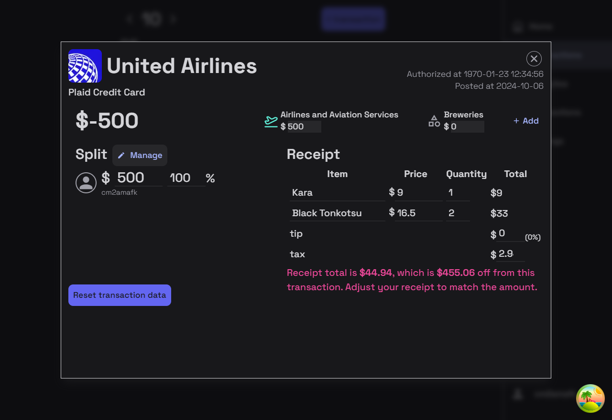

## The problem

You swipe your card for a checkout at a store. Immediately, a $230 transaction appears on your banking app, labeled 'Groceries'. "That's not right," you say, "The other $50 were supplies for the bathrooms."

You get home and divvy it up with your roommates. You rely on a calculator and a note-taking app to keep track of how much everyone owes you. *It's a labor.*

Soon after, your app warns that you are getting close to your monthly budget. In fact, you exceeded your grocery budget. You know that's not true. You know you are only responsible for $80 from that purchase. You know only $35.89 of it is groceries.

**Your banking app is useless. The solution? Nedon.**

## Alternatives comparison

| Features/Apps                      | Nedon   | Mint | RocketMoney  | GPay | SplitWise    | Honeydue        |
| ---------------------------------- | ------- | ---- | ------------ | ---- | ------------ | --------------- |
| Split with other users/groups      | O       | X    | Paid feature | O    | O            | Just one member |
| Custom categories                  | Planned | O    | O            | X    | X            | X               |
| Assign multiple categories         | O       | O    | X            | X    | X            | O               |
| Assign cost to multiple categories | O       | O    | X            | X    | X            | O               |
| Group spending overview            | O       | X    | X            | X    | Paid feature | O               |
| Individual spending overview       | O       | O    | O            | O    | X            | X               |
| Net worth tracking                 | Planned | O    | Paid feature | X    | X            | X               |
| Ad-free                            | O       | O    | O            | O    | X            | X               |
| Web view                           | O       | O    | X            | X    | X            | X               |
| Mobile app                         | Planned | O    | O            | O    | O            | O               |
| Open source                        | O       | X    | X            | X    | X            | X               |

### Nedon plans to offer/offers the following key features:

- Transactions with multiple categories
- Transactions with multiple contributors
- Visualize available budget vs. essential budget
- Receipt recognition
- Family/group spending management
- Budget limits, including roll-over budgets
- And more!
