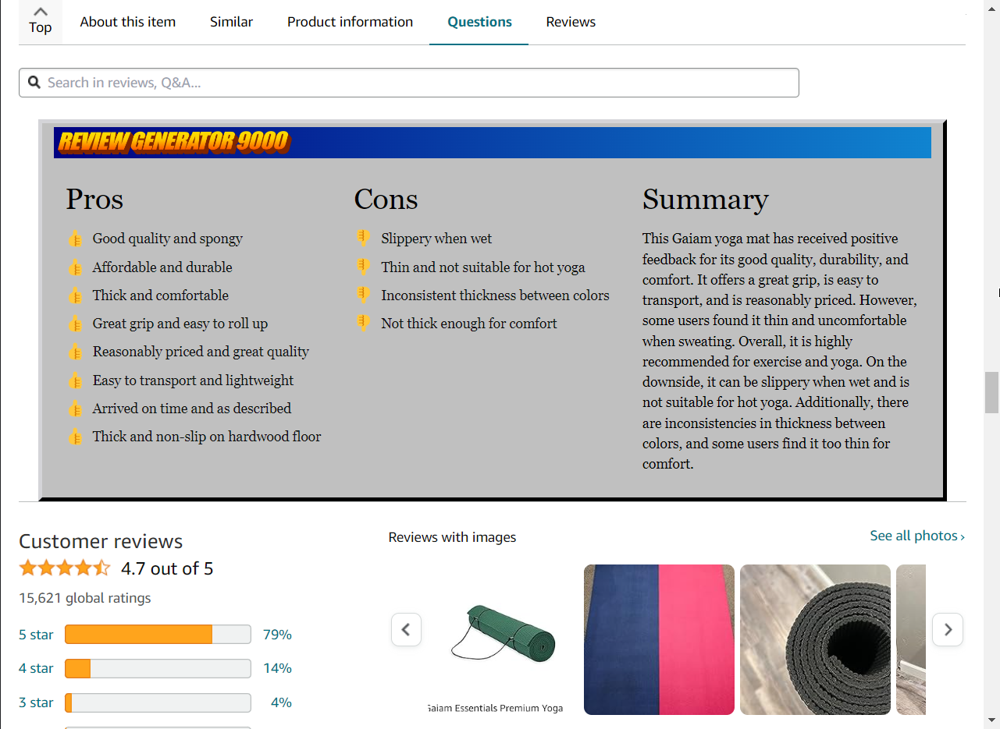

## Problem

We all read a handful of them to make educated shopping decisions, but it is a process that takes long enough to be annoying. What if we could get a summary of them right on the page?

## What it does

Review Generator 9000 scrapes top positive and critical reviews from the product page the user is currently viewing and feeds the reviews to GPT-3.5 along with an engineered prompt. GPT-3.5 then outputs a JSON, which we visualize right on top of the review page.

## How we built it

To create Review Generator 9000, we collected data by scraping customer reviews from both the top-rated and lowest-rated products on Amazon. Next, we leverage the power of GPT-3.5 to summarize and highlight the advantages and disadvantages of these products. Using the response generated by GPT-3.5, we developed a Chrome extension to inject the response onto the product page.

## We used the following Technologies:

- Node.js, Express (Backend to process reviews)
- Webpack (Transpiler)
- Manifest V3 (Extension)
- TypeScript (Full-Stack)
- React & TailwindCSS (Injected Content)
- Puppeteer (Web Scraping & Automation)
- GPT3.5 (Generative AI for Data Processing)
- Next.js (Landing/Product Page)

## Challenges we ran into

One of the challenges we faced was ensuring the smooth data flow from the web scraping backend to the GPT prompts. This required meticulous engineering to properly sanitize and manipulate the scraped data before injecting it into the GPT prompts. We had to carefully handle and transform the data to ensure its compatibility with the prompt format and guarantee accurate and meaningful results. Additionally, we had to successfully inject these prompt results into the webpage, which required careful integration and implementation to seamlessly present the generated data to users.

Another issue we encountered during web scraping was the problem of Cross-Origin Resource Sharing (CORS). This caused our requests to be blocked, effectively breaking our data pipeline.

The biggest challenge we had to deal with was successfully transpiling .ts and .tsx files into JavaScript in order to be properly loaded into Chrome using Webpack and Babel. This involved configuring the webpack build process to handle TypeScript files and ensuring that the resulting JavaScript files were compatible with the Chrome extension environment. Despite the complexities of this task, we were able to overcome the challenges and successfully compile the TypeScript files into JavaScript, allowing our extension to function as intended with extended type safety compared to vanilla JavaScript.

Another significant challenge that impacts our project is the injection of GPT-3.5-generated responses onto product pages within the browser extension. Not all websites have the same structure, also some websites employ security measures to block browser extensions from accessing their content. This posed a considerable challenge because it could potentially limit the functionality of our extension.

Overall, we overcame these challenges by leveraging our technical skills and finding creative solutions to ensure the smooth functioning of the project.

## Accomplishments that we're proud of

We managed to successfully web scrape Amazon reviews and got to inject the summaries into the Amazon website itself.

We are also proud to successfully implement a Windows 95 design to the landing page UI.

- Parallel processing
- Support for Amazon, Target, and Walmart
- Provide references to the summary to validate the summary

## What we learned

We have learned how to web scrape using Puppeteer and effectively gathered and parsed relevant data for the project's purpose.

We have also learned how to inject the finalized HTML element onto the Amazon web page itself.

## What's next for Review Generator 9000

- Using AI to scrape reviews from any website instead of "manual" scraping.
- Determine if reviews were AI-generated and give an "overall legitimacy score"
- Allow user feedback on our product

### Built With

 express.js | gpt3.5 | manifest | next.js | node.js | puppeteer | react | tailwindcss | typescript | webpack |
